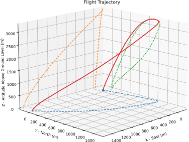

<br>

[](https://colab.research.google.com/github/RocketPy-Team/rocketpy/blob/master/docs/notebooks/getting_started_colab.ipynb)
[](https://pypi.org/project/rocketpy/)
[](https://docs.rocketpy.org/en/latest/?badge=latest)
[](https://app.travis-ci.com/RocketPy-Team/RocketPy)
[](https://github.com/RocketPy-Team/RocketPy/graphs/contributors)
[](https://discord.gg/b6xYnNh)
[](https://github.com/sponsors/RocketPy-Team)
[](https://www.linkedin.com/company/rocketpy)
[](http://dx.doi.org/10.1061/%28ASCE%29AS.1943-5525.0001331)


# RocketPy

RocketPy is the next-generation trajectory simulation solution for High-Power Rocketry. The code is written as a [Python](http://www.python.org) library and allows for a complete 6 degrees of freedom simulation of a rocket's flight trajectory, including high fidelity variable mass effects as well as descent under parachutes. Weather conditions, such as wind profile, can be imported from sophisticated datasets, allowing for realistic scenarios. Furthermore, the implementation facilitates complex simulations, such as multi-stage rockets, design and trajectory optimization and dispersion analysis.

<br>

## Main features

<details>
<summary>Nonlinear 6 degrees of freedom simulations</summary>
<ul>
  <li>Rigorous treatment of mass variation effects</li>
  <li>Solved using LSODA with adjustable error tolerances</li>
  <li>Highly optimized to run fast</li>
</ul>
</details>

<details>
<summary>Accurate weather modeling</summary>
<ul>
  <li>International Standard Atmosphere (1976)</li>
  <li>Custom atmospheric profiles</li>
  <li>Soundings (Wyoming, NOAARuc)</li>
  <li>Weather forecasts and reanalysis</li>
  <li>Weather ensembles</li>
</ul>
</details>

<details>
<summary>Aerodynamic models</summary>
<ul>
  <li>Barrowman equations for lift coefficients (optional)</li>
  <li>Drag coefficients can be easily imported from other sources (e.g. CFD simulations)</li>
</ul>
</details>

<details>
<summary>Parachutes with external trigger functions</summary>
<ul>
  <li>Test the exact code that will fly</li>
  <li>Sensor data can be augmented with noise</li>
</ul>
</details>

<details>
<summary>Solid motors models</summary>
<ul>
  <li>Burn rate and mass variation properties from thrust curve</li>
  <li>CSV and ENG file support</li>
</ul>
</details>

<details>
<summary>Monte Carlo simulations</summary>
<ul>
  <li>Dispersion analysis</li>
  <li>Global sensitivity analysis</li>
</ul>
</details>

<details>
<summary>Flexible and modular</summary>
<ul>
  <li>Straightforward engineering analysis (e.g. apogee and lifting off speed as a function of mass)</li>
  <li>Non-standard flights (e.g. parachute drop test from helicopter)</li>
  <li>Multi-stage rockets</li>
  <li>Custom continuous and discrete control laws</li>
  <li>Create new classes (e.g. other types of motors)</li>
</ul>
</details>

<details>
<summary>Integration with MATLAB®</summary>
<ul>
  <li>Straightforward way to run RocketPy from MATLAB®</li>
  <li>Convert RocketPy results to MATLAB® variables so that they can be processed by MATLAB®</li>
</ul>
</details>

<br>

## Validation

RocketPy's features have been validated in our latest [research article published in the Journal of Aerospace Engineering](http://dx.doi.org/10.1061/%28ASCE%29AS.1943-5525.0001331).

The table below shows a comparison between experimental data and the output from RocketPy.
Flight data and rocket parameters used in this comparison were kindly provided by [EPFL Rocket Team](https://github.com/EPFLRocketTeam) and [Notre Dame Rocket Team](https://ndrocketry.weebly.com/).

|         Mission         |    Result Parameter    | RocketPy  | Measured  | Relative Error  |
|:-----------------------:|:-----------------------|:---------:|:---------:|:---------------:|
|   Bella Lui Kaltbrumn   | Apogee altitude (m)    |   461.03  |   458.97  |   **0.45 %**    |
|   Bella Lui Kaltbrumn   | Apogee time (s)        |    10.61  |    10.56  |   **0.47 %**    |
|   Bella Lui Kaltbrumn   | Maximum velocity (m/s) |    86.18  |    90.00  |   **-4.24 %**   |
|   NDRT launch vehicle   | Apogee altitude (m)    | 1,310.44  | 1,320.37  |   **-0.75 %**   |
|   NDRT launch vehicle   | Apogee time (s)        |    16.77  |    17.10  |   **-1.90 %**   |
|   NDRT launch vehicle   | Maximum velocity (m/s) |   172.86  |   168.95  |   **2.31 %**    |

<br>

## Documentation

Check out documentation details using the links below:

- [User Guide](https://docs.rocketpy.org/en/latest/user/index.html)
- [Code Documentation](https://docs.rocketpy.org/en/latest/reference/index.html)
- [Development Guide](https://docs.rocketpy.org/en/latest/development/index.html)

<br>

# Join Our Community!

RocketPy is growing fast! Many university groups and rocket hobbyist have already started using it. The number of stars and forks for this repository is skyrocketing. And this is all thanks to a great community of users, engineers, developers, marketing specialists, and everyone interested in helping.

If you want to be a part of this and make RocketPy your own, join our [Discord](https://discord.gg/b6xYnNh) server today!

<br>

# Previewing

You can preview RocketPy's main functionalities by browsing through a sample notebook in [Google Colab](https://colab.research.google.com/github/RocketPy-Team/rocketpy/blob/master/docs/notebooks/getting_started_colab.ipynb).  No installation required!

When you are ready to run RocketPy locally, you can read the *Getting Started* section!

<br>

# Getting Started

## Quick Installation

To install RocketPy's latest stable version from PyPI, just open up your terminal and run:

```shell
pip install rocketpy
```

For other installation options, visit our [Installation Docs](https://docs.rocketpy.org/en/latest/user/installation.html).
To learn more about RocketPy's requirements, visit our [Requirements Docs](https://docs.rocketpy.org/en/latest/user/requirements.html).

<br>

## Running Your First Simulation

In order to run your first rocket trajectory simulation using RocketPy, you can start a Jupyter Notebook and navigate to the _nbks_ folder. Open _Getting Started - Examples.ipynb_ and you are ready to go.

Otherwise, you may want to create your own script or your own notebook using RocketPy. To do this, let's see how to use RocketPy's four main classes:

- Environment - Keeps data related to weather.
- SolidMotor - Keeps data related to solid motors. Hybrid motor support is coming in the next weeks.
- Rocket - Keeps data related to a rocket.
- Flight - Runs the simulation and keeps the results.

The following image shows how the four main classes interact with each other:


A typical workflow starts with importing these classes from RocketPy:

```python
from rocketpy import Environment, Rocket, SolidMotor, Flight
```

Then create an Environment object. To learn more about it, you can use:

```python
help(Environment)
```

A sample code is:

```python
Env = Environment(
    railLength=5.2,
    latitude=32.990254,
    longitude=-106.974998,
    elevation=1400,
    date=(2020, 3, 4, 12) # Tomorrow's date in year, month, day, hour UTC format
) 

Env.setAtmosphericModel(type='Forecast', file='GFS')
```

This can be followed up by starting a Solid Motor object. To get help on it, just use:

```python
help(SolidMotor)
```

A sample Motor object can be created by the following code:

```python
Pro75M1670 = SolidMotor(
    thrustSource="../data/motors/Cesaroni_M1670.eng",
    burnOut=3.9,
    grainNumber=5,
    grainSeparation=5/1000,
    grainDensity=1815,
    grainOuterRadius=33/1000,
    grainInitialInnerRadius=15/1000,
    grainInitialHeight=120/1000,
    nozzleRadius=33/1000,
    throatRadius=11/1000,
    interpolationMethod='linear'
)
```

With a Solid Motor defined, you are ready to create your Rocket object. As you may have guessed, to get help on it, use:

```python
help(Rocket)
```

A sample code to create a Rocket is:

```python
Calisto = Rocket(
    motor=Pro75M1670,
    radius=127/2000,
    mass=19.197-2.956,
    inertiaI=6.60,
    inertiaZ=0.0351,
    distanceRocketNozzle=-1.255,
    distanceRocketPropellant=-0.85704,
    powerOffDrag='../data/calisto/powerOffDragCurve.csv',
    powerOnDrag='../data/calisto/powerOnDragCurve.csv'
)

Calisto.setRailButtons([0.2, -0.5])

NoseCone = Calisto.addNose(length=0.55829, kind="vonKarman", distanceToCM=0.71971)

FinSet = Calisto.addTrapezoildalFins(4, span=0.100, rootChord=0.120, tipChord=0.040, distanceToCM=-1.04956)

Tail = Calisto.addTail(topRadius=0.0635, bottomRadius=0.0435, length=0.060, distanceToCM=-1.194656)
```

You may want to add parachutes to your rocket as well:

```python
def drogueTrigger(p, y):
    return True if y[5] < 0 else False

def mainTrigger(p, y):
    return True if y[5] < 0 and y[2] < 800 else False

Main = Calisto.addParachute('Main',
                            CdS=10.0,
                            trigger=mainTrigger, 
                            samplingRate=105,
                            lag=1.5,
                            noise=(0, 8.3, 0.5))

Drogue = Calisto.addParachute('Drogue',
                              CdS=1.0,
                              trigger=drogueTrigger, 
                              samplingRate=105,
                              lag=1.5,
                              noise=(0, 8.3, 0.5))
```

Finally, you can create a Flight object to simulate your trajectory. To get help on the Flight class, use:

```python
help(Flight)
```

To actually create a Flight object, use:

```python
TestFlight = Flight(rocket=Calisto, environment=Env, inclination=85, heading=0)
```

Once the TestFlight object is created, your simulation is done! Use the following code to get a summary of the results:

```python
TestFlight.info()
```

To see all available results, use:

```python
TestFlight.allInfo()
```

Here is just a quick taste of what RocketPy is able to calculate. There are hundred of plots and data points computed by RocketPy to enhance your analyses.



<br>

# Authors and Contributors

This package was originally created by [Giovani Ceotto](https://github.com/giovaniceotto/) as part of his work at [Projeto Jupiter](https://github.com/Projeto-Jupiter/). [Rodrigo Schmitt](https://github.com/rodrigo-schmitt/) was one of the first contributors.

Later, [Guilherme Fernandes](https://github.com/Gui-FernandesBR/) and [Lucas Azevedo](https://github.com/lucasfourier/) joined the team to work on the expansion and sustainability of this project.

Since then, the [RocketPy Team](https://github.com/orgs/RocketPy-Team/teams/rocketpy-team) has been growing fast and our contributors are what makes us special!

[](https://github.com/RocketPy-Team/RocketPy/contributors)

See a [detailed list of contributors](https://github.com/RocketPy-Team/RocketPy/contributors) who are actively working on RocketPy.

## Supporting RocketPy and Contributing

The easiest way to help RocketPy is to demonstrate your support by starring our repository! 

<br>

If you are actively using RocketPy in one of your projects, reaching out to our core team via [Discord](https://discord.gg/b6xYnNh) and providing feedback can help improve RocketPy a lot!

And if you are interested in going one step further, please read [CONTRIBUTING.md](https://github.com/RocketPy-Team/RocketPy/blob/master/CONTRIBUTING.md) for details on our code of conduct and learn more on how you can contribute with the development of this next-gen trajectory simulation solution for rocketry.

<br>

## License

This project is licensed under the MIT License - see the [LICENSE.md](https://github.com/RocketPy-Team/RocketPy/blob/master/LICENSE) file for details

<br>

## Release Notes

Want to know which bugs have been fixed and new features of each version? Check out the [release notes](https://github.com/RocketPy-Team/RocketPy/releases).
