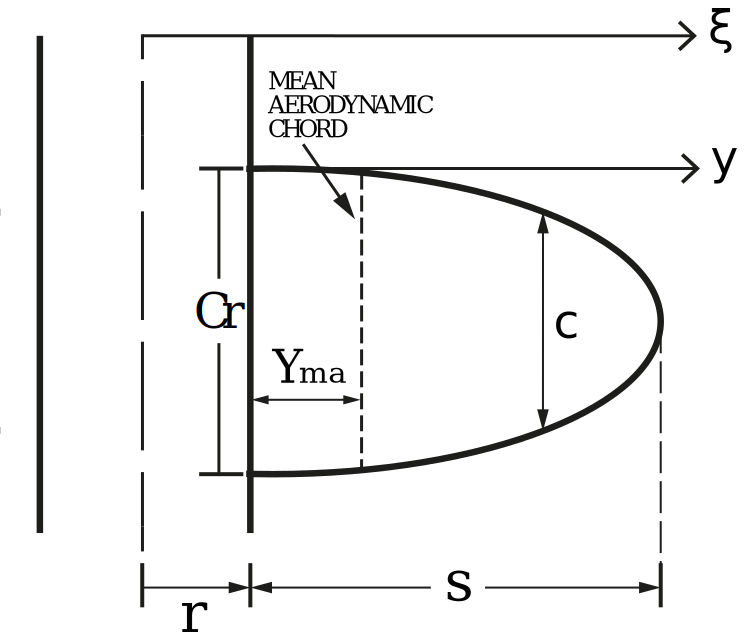

=========================
Elliptical Fins Equations
=========================

:Author: Mateus Stano Junqueira,
:Author: Franz Masatoshi Yuri,
:Author: Kaleb Ramos Wanderley Santos,
:Author: Matheus Gonçalvez Doretto,
:Date:   February 2022

Nomenclature
============

- :math:`Cr` - Root chord
- :math:`Ct` - Tip chord
- :math:`A_{r}` - Reference area
- :math:`C_{N\alpha0}` - Normal force coefficient derivative of a 2D airfoil
- :math:`C_{N\alpha1}` - Normal force coefficient derivative of one fin
- :math:`F` - Force
- :math:`L_{r}` - Reference length, equals rocket diameter
- :math:`M_{roll}` - Roll moment
- :math:`M_{f}` - Roll forcing moment
- :math:`M_{d}` - Roll damping moment
- :math:`N` - Number of fins
- :math:`\overline{q}` - Dynamic pressure
- :math:`r_{t}` - Reference radius at fins position
- :math:`s` - Fin span
- :math:`v_{0}` - Rocket speed in relation to the wind
- :math:`\omega` - Angular velocity
- :math:`Y_{MA}` - Spanwise location of mean aerodynamic chord measured from the root chord
- :math:`\delta` - Fin cant angle
- :math:`x_{i}` - Distance to rotation axis
- :math:`\rho` - Ambient density
- :math:`C_{lf}` - Roll moment lift coefficient
- :math:`C_{lf\delta}` - Roll moment lift coefficient derivative
- :math:`C_{ld}` - Roll moment damping coefficient
- :math:`C_{ld\omega}` - Roll moment damping coefficient derivative

Introduction
============

In order to calculate the effects of elliptical fins in RocketPy we need
to calculate:

-  Geometric parameters
-  Center of pressure
-  Interference Factor

All non proved equations where based on [Barrowman]_.

Geometrical Parameters
======================

An elliptical fin can be defined with two basic parameters: the root
chord (:math:`Cr`) and the span (:math:`S`), as can be seen in the next Figure.
Through them, other geometrical properties are calculated, which are then used
in the computations for the center of pressure and roll coefficients.

Chord Length (:math:`c`)
------------------------

The chord length (:math:`c`) at a spanwise position must be calculated
through two axis: :math:`y`, that begins at the fuselage wall, and
:math:`\xi` that begins in the fuselages center line.

First we calculate :math:`c(y)` through the following elliptical
equation:

.. math::
    
    \frac{x^2}{a} + \frac{y^2}{b} = 1

Substituting variables for the elliptical fins parameters:

.. math::
    
    \frac{y^2}{S^2} + \frac{\Bigl(0.5 \cdot c(y) \Bigr)^{2}}{\Bigl(0.5 \cdot Cr\Bigr)^{2}}  = 1

Simplifying:

.. math::
    
    \frac{c(y)}{2} = \frac{Cr}{2} \cdot \sqrt{1 - \Bigl(\frac{y}{S}\Bigr)^2}
    
    c(y) = Cr\sqrt{1 - \Bigl(\frac{y}{S}\Bigr)^2}

Transforming to the :math:`\xi` axis:

.. math::
    
    c(\xi) = Cr\sqrt{1 - \Bigl(\frac{\xi-r}{S}\Bigr)^2}

Spanwise position of the Mean Aerodynamic Chord (:math:`Y_{ma}`)
----------------------------------------------------------------

We can find the length of the *Mean Aerodynamic Chord* (:math:`Y_{ma}`)
using the known definition [Barrowman]_:

.. math::
    
    c_{ma} = \frac{1}{A_{f}}\int_{0}^{s}c^2(y) \,dy

Where :math:`A_{f}` is the area of the fin, in our case
:math:`A_f = \frac{\pi \, C_r \, S}{4}`

.. math::
    
    c_{ma} = \frac{4}{\pi \, C_r \, S}\int_{0}^{s} \Bigl(Cr\sqrt{1 - \Bigl(\frac{y}{S}\Bigr)^2} \, \Bigr)^2 \,dy

Solving the integral:

.. math::
    
    c_{ma} = \frac{8 C_r}{3 \pi}

Finally, the span wise position of the mean aerodynamic chord can be
found by equating :math:`c_{ma}` with :math:`c(Y_{ma})` and solving for
:math:`Y_{ma}`.

.. math::
    
    c_{ma} = c(Y_{ma})

.. math::
    
    \frac{8 C_r}{3 \pi} = Cr\sqrt{1 - \Bigl(\frac{Y_{ma}}{S}\Bigr)^2}

.. math::
    
    Y_{ma} = \frac{S}{3\pi}\sqrt{9\pi^2 - 64}

Roll Geometrical Constant (:math:`R_{cte}`)
-------------------------------------------

For the calculation of roll moment induced by a cant angle in the fins,
a geometrical constant that takes in regard the fin geometry is used in
the computations.

The formula for the constant is as follows:

.. math::
    
    R_{cte} = \int_{r_t}^{s + r_t} c(\xi) \, \xi^2 \, d\xi

.. math::
    
    R_{cte} = C_r\, S\ \frac{ \Bigl(3\pi S^2 + 32 r_t S + 12 \pi r_t^2 \Bigr)}{48}

Center of Pressure
==================

The position of center of pressure of a elliptical fin along the center
line of a rocket can simply be calculated by the following equation,
according to [Model]_:

.. math::
    
    \overline{X_f} = X_f + 0.288 \cdot C_r

Roll Damping Interference Factor
================================

According to [Barrowman]_, the roll damping interference factor can be given by:

.. math::
    
    k_{R_D} = 1 + \frac{\displaystyle\int_r^{s+r} {r}^{3} \cdot \frac{c(\xi)}{\xi^2} \,d\xi}{\displaystyle\int_r^{s+r}\xi \,  c(\xi) \, d\xi}

Solving the integrals for elliptical fin geometry, using equations described at
Chord Length (:math:`c`):

When :math:`S > r`:

.. math:: 

    k_{R_{D}} = 1 + {r}^{2} \cdot \frac{2\cdot {r}^{2} \sqrt{s^2-r^2}\cdot \ln\Bigl(\frac{2s\cdot\sqrt{s^2-r^2}+ 2s^2}{r}\Bigr) - 2{r}^2\sqrt{{s}^2-{r}^2}\cdot \ln(2s) + 2s^{3} - {\pi}rs^{2} - 2r^2s + {\pi}\cdot {r}^3}{2\cdot {s}^{2} \cdot \Bigl(\frac{s}{3}+\frac{{\pi}\cdot r}{4}\Bigr) \cdot\Bigl(s^2-r^2\Bigr)}

When :math:`S < r`:

.. math::

    k_{R_{D}} = 1-\frac{r^2 \cdot\left(2 s^3-\pi s^2 r-2 s r^2+\pi r^3+2 r^2 \sqrt{-s^2+r^2} \cdot \text{atan}\left(\frac{s}{\sqrt{-s^2+r^2}}\right)-\pi r^2 \sqrt{-s^2+r^2}\right)}{2 s\left(-s^2+r^2\right)\left(\frac{s^2}{3}+\frac{\pi s r}{4}\right)}

And by calculating the limit of the above expressions when :math:`S \rightarrow r` we have that, for :math:`S = r`:

.. math::
    
    k_{R_{D}} = \frac{28-3\pi}{4+3\pi}
