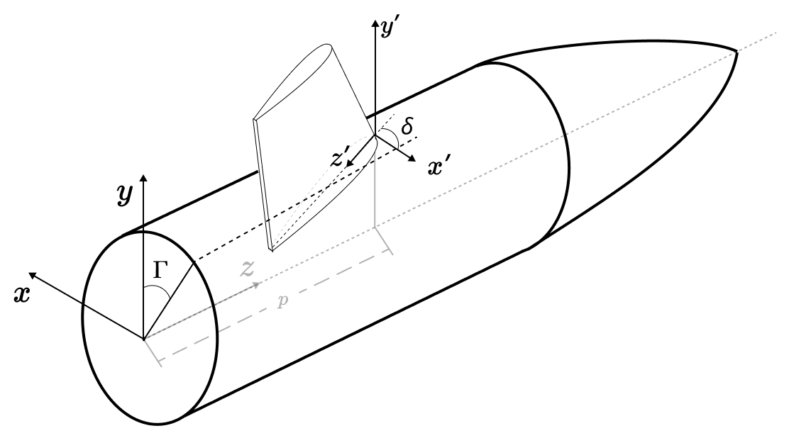
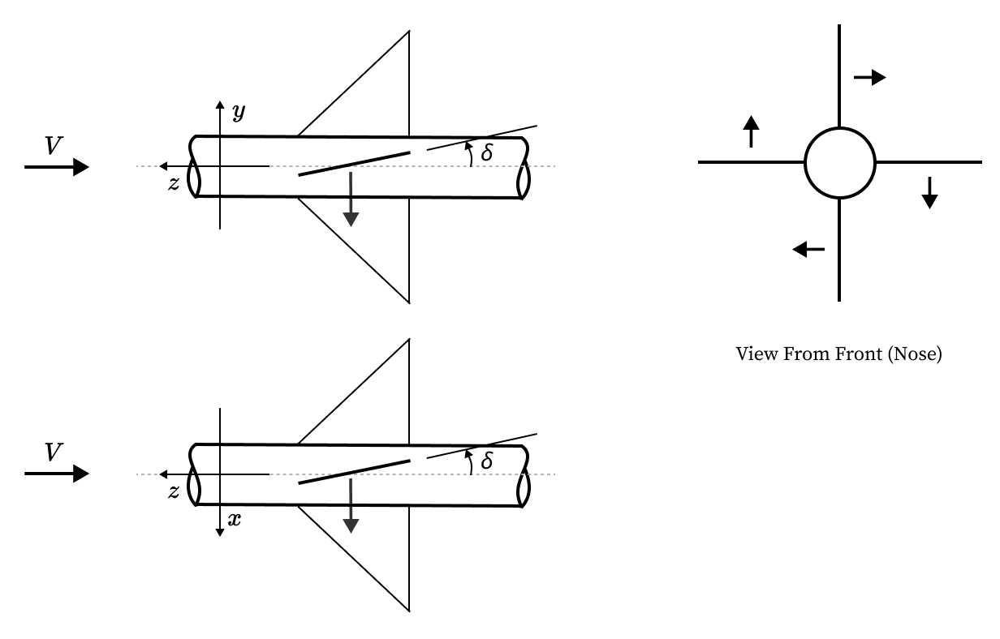

.. _individual_fins:

====================
Individual Fin Model
====================

:Author: Mateus Stano Junqueira
:Date: March 2025

Introduction
============

There are currently three ways to model the aerodynamic effects of fins in RocketPy:

1. By use of the :class:`rocketpy.GenericSurface` or :class:`rocketpy.LinearGenericSurface` classes,
   which are defined by receiving the aerodynamic coefficients directly;
2. By use of the :class:`rocketpy.Fins` classes (:class:`rocketpy.TrapezoidalFins`, :class:`rocketpy.EllipticalFins`, :class:`rocketpy.FreeFormFins`),
   which are defined by receiving the geometric parameters of the **fin set** and 
   calculating the aerodynamic coefficients internally with the Barrowman method;
3. By use of the :class:`rocketpy.Fin` classes (:class:`rocketpy.TrapezoidalFin`, :class:`rocketpy.EllipticalFin`, :class:`rocketpy.FreeFormFin`)
   (which are the base classes for the fin set classes), which are defined by receiving the 
   geometric parameters of **one single fin** and calculating the aerodynamic
   coefficients internally with the Barrowman method, with exception of the
   moment coefficients, which have been derived in this document.

This document will focus on all the mathematical derivations and implementations
of the :class:`rocketpy.Fin` classes.

Fin Coordinate Frame
====================

The fin coordinate frame is defined as follows:

- The origin is at the leading edge of the fin, at the intersection of the
  fin's root chord and the fin's leading edge;
- The z-axis is aligned with the fin's root chord, pointing towards the fin's
  trailing edge;
- The y-axis is aligned with the fin's span, pointing towards the fin's tip chord;
- The x-axis completes the right-handed coordinate system.

The fin is postioned at the rocket's body, given a ``rocket_radius`` :math:`r`, 
an  ``angular_position`` :math:`\Gamma` and a position :math:`p` along the 
rocket's body. The angular position is given according to 
:ref:`Angular Position Inputs <angular_position>`.

The fin can also be rotated by a cant angle :math:`\delta`.

The image below shows the fin coordinate frame:

.. note::
  A positive cant angle :math:`\delta` produces a negative body axis rolling 
  moment at zero angle of attack.

The rotation matrix from the fin coordinate frame to the rocket's body frame is
define by, first a rotation around the y-axis by 180 degrees:

.. math::
  \mathbf{R}_{y(\pi)} = \begin{bmatrix}
    -1 & 0 & 0 \\
    0 & 1 & 0 \\
    0 & 0 & -1
  \end{bmatrix}

Then a rotation around the z-axis by the angle :math:`\Gamma`:

.. math::
  \mathbf{R}_{z(\Gamma)} = \begin{bmatrix}
    \cos(\Gamma) & -\sin(\Gamma) & 0 \\
    \sin(\Gamma) & \cos(\Gamma) & 0 \\
    0 & 0 & 1
  \end{bmatrix}

Then a rotation around the y-axis by the cant angle :math:`\delta`:

.. math::
  \mathbf{R}_{y(\delta)} = \begin{bmatrix}
    \cos(\delta) & 0 & \sin(\delta) \\
    0 & 1 & 0 \\
    -\sin(\delta) & 0 & \cos(\delta)
  \end{bmatrix}

The final rotation matrix is given by:

.. math::
  \mathbf{R} = \mathbf{R}_{y(\delta)} \cdot \mathbf{R}_{z(\Gamma)} \cdot \mathbf{R}_{y(\pi)}

The position of the fin's coordinate frame origin in the rocket's body frame
is calculated by first assuming no a fin frame with no cant angle, then
calculating the position of the fin's leading edge (with cant angle) in this 
frame, and finally translating this position to the fin's position in the
rocket's body frame. The position of the fin's real leading edge in this no cant 
angle fin frame is given by the point :math:`\mathbf{P}^{\delta}_{le_f}`:

.. math::
  \mathbf{P}^{\delta}_{le_f} = \begin{bmatrix}
    -\frac{Cr}{2} \sin(\delta) \\
    0 \\
    \frac{Cr}{2} (1 - \cos(\delta))
  \end{bmatrix}

Then, describing this point to the rocket's body frame orientation (no 
translation):

.. math::
  \mathbf{P}^{\delta}_{le_b} = (\mathbf{R}_{z(\Gamma)} \cdot \mathbf{R}_{y(\pi)}) \cdot \mathbf{P}^{\delta}_{le_f}

The position of the fin's leading edge with no cant angle in the rocket's body
frame is given by:

.. math::
  \mathbf{P}^{\overline{\delta}}_{le_b} = \begin{bmatrix}
    -r \sin(\Gamma) \\
    r \cos(\Gamma) \\
    p
  \end{bmatrix}

Finally, we add the position of the fin's leading edge with no cant angle to the
position of the fin's leading edge with cant angle in the rocket's body frame:

.. math::
  \mathbf{P}_{le_b} = \mathbf{P}^{\overline{\delta}}_{le_b} + \mathbf{P}^{\delta}_{le_b}

Center of Pressure Position
===========================

In the Fin Coordinate Frame, the center of pressure is given by the Barrowman
method, and will here only be defined symbolically:

.. math::
  \mathbf{cp}_f = \begin{bmatrix}
    cp_x \\
    cp_y \\
    cp_z
  \end{bmatrix}

The center of pressure position in the rocket's body frame is given by:

.. math::
  \mathbf{cp}_{rocket} = \mathbf{R} \cdot \mathbf{cp}_f + \mathbf{P}_{le_b}

Aerodynamic Forces
==================

.. note::
  The aerodynamic coefficients are defined according the Barrowman method.

Given a stream velocity in the fin frame :math:`\mathbf{v}_{0f} = [v_{0x}, v_{0y}, v_{0z}]^{T}`,
the effective angle of attack of the fin is given by:

.. math::
  \alpha_f = \arctan\left(\frac{v_{0x}}{v_{0z}}\right)

This can also be seen as the angle between the fin's root chord and the stream
velocity vector in the fin frame.

The aerodynamic force in the x-direction of the fin is given by:

.. math::
  F_{x} = \frac{1}{2} \cdot \rho \cdot \|\mathbf{v}_{0f}\|^2 \cdot A_{r} \cdot C_{N}(\alpha_f, Ma)

Where :math:`A_{r}` is the reference area of the fin, and :math:`C_{N}` is the
normal force coefficient, which is a function of the angle of attack and the
Mach number :math:`Ma`.
This force is then transformed to the rocket's body frame by the rotation matrix:

.. math::
  \begin{bmatrix}
    F_{x} \\
    F_{y} \\
    F_{z}
  \end{bmatrix}_{rocket} = \mathbf{R} \cdot \begin{bmatrix}
    F_{x} \\
    0 \\
    0
  \end{bmatrix}_{fin}

Then, the moments are calculated by the cross product of the center of pressure
and the aerodynamic force:

.. math::
  \begin{bmatrix}
    M_{x} \\
    M_{y} \\
    M_{z}
  \end{bmatrix}_{rocket} = \mathbf{cp}_{rocket} \times \begin{bmatrix}
    F_{x} \\
    F_{y} \\
    F_{z}
  \end{bmatrix}_{rocket}

From the Barrowman method, the moment along the center axis of the rocket
(:math:`M_{z}`) is still missing the damping term, which is given by:

.. math::
  M_{damp} = \frac{1}{2} \cdot \rho \cdot \|v_{0}\| \cdot A_{r} \cdot L_{r}^2 \cdot C_{ld\omega}(Ma) \cdot \frac{1}{2} \cdot \omega_z 

.. math::
  M_{z \, \text{final}} = M_{z} + M_{damp}

Where :math:`C_{ld}` is the roll moment damping coefficient, :math:`L_{r}` 
is the reference length, which is equal to the rocket diamete, and
:math:`\omega_z` is the angular velocity of the rocket around the z-axis.

Adding Individual Fins to the Rocket
====================================
.. jupyter-execute::
  :hide-code:
  :hide-output:

  from rocketpy import *
  env = Environment(latitude=32.990254, longitude=-106.974998, elevation=1400)
  Pro75M1670 = SolidMotor(
      thrust_source="../data/motors/cesaroni/Cesaroni_M1670.eng",
      dry_mass=1.815,
      dry_inertia=(0.125, 0.125, 0.002),
      nozzle_radius=33 / 1000,
      grain_number=5,
      grain_density=1815,
      grain_outer_radius=33 / 1000,
      grain_initial_inner_radius=15 / 1000,
      grain_initial_height=120 / 1000,
      grain_separation=5 / 1000,
      grains_center_of_mass_position=0.397,
      center_of_dry_mass_position=0.317,
      nozzle_position=0,
      burn_time=3.9,
      throat_radius=11 / 1000,
      coordinate_system_orientation="nozzle_to_combustion_chamber",
  )
  # IMPORTANT: modify the file paths below to match your own system

  example_rocket = Rocket(
      radius=127 / 2000,
      mass=14.426,
      inertia=(6.321, 6.321, 0.034),
      power_off_drag="../data/rockets/calisto/powerOffDragCurve.csv",
      power_on_drag="../data/rockets/calisto/powerOnDragCurve.csv",
      center_of_mass_without_motor=0,
      coordinate_system_orientation="tail_to_nose",
  )

  rail_buttons = example_rocket.set_rail_buttons(
      upper_button_position=0.0818,
      lower_button_position=-0.618,
      angular_position=45,
  )
  example_rocket.add_motor(Pro75M1670, position=-1.255)
  nose_cone = example_rocket.add_nose(length=0.55829, kind="vonKarman", position=1.278)
  tail = example_rocket.add_tail(
      top_radius=0.0635, bottom_radius=0.0435, length=0.060, position=-1.194656
  )
  example_rocket.add_trapezoidal_fins(
      n=4,
      root_chord=0.120,
      tip_chord=0.060,
      span=0.110,
      cant_angle=0.0,
      position=-1.04956,
      airfoil=("../data/airfoils/NACA0012-radians.txt", "radians"),
  )

Given a defined ``Rocket`` object, we can add individual fins to the rocket by 
using the ``add_surfaces`` method. Here is an example of adding two canards
in the Calisto rocket from the :ref:`First Simulation <firstsimulation>` example:

.. jupyter-execute::

  canard1 = TrapezoidalFin(
      angular_position=0,
      root_chord=0.060,
      tip_chord=0.020,
      span=0.03,
      rocket_radius=example_rocket.radius,
      cant_angle=0.5,
      airfoil=("../data/airfoils/NACA0012-radians.txt", "radians"),
  )
  canard2 = TrapezoidalFin(
      angular_position=180,
      root_chord=0.060,
      tip_chord=0.020,
      span=0.03,
      rocket_radius=example_rocket.radius,
      cant_angle=0.5,
      airfoil=("../data/airfoils/NACA0012-radians.txt", "radians"),
  )

  # Position along the center axis of the rocket is specified here.
  # If different positions are desired, the position can be specified as a list.
  example_rocket.add_surfaces([canard1, canard2], positions = 0.35)

  example_rocket.draw(plane="yz")

.. seealso::

  There are three classes for defining fins in RocketPy given their geometry:
  
  - :class:`rocketpy.TrapezoidalFin` - For how to define a trapezoidal fin
  - :class:`rocketpy.EllipticalFin` - For how to define an elliptical fin
  - :class:`rocketpy.FreeFormFin` - For how to define a free form fin

Fin Force Conventions
=====================

.. - Explain positive cant angle resultant force
.. - if all fins have positive cant angle then they will all generate a force that will rotate the rocket in the same direction
..   which is negative roll 
.. - show what a positive and negative cant angle on oposing fins looks like. (generate pitch moment -> pitch control)
.. - show what a positive and negative cant angle on oposing fins looks like. (generate yaw moment -> yaw control)
.. - example for 4 fins, show how to count the number of fins and how to access each of them

  
Here we exemplify the fin force conventions relating the cant angle 
(deflection angle) of the fins to the pitch, yaw and roll moments. We will
consider a rocket with four fins, to illustrate the concepts. The image below
show the sign convention for the forces acting on the fins, given positive cant
angles:

Roll
^^^^

.. jupyter-execute::
  :hide-code:
  :hide-output:

  example_rocket.aerodynamic_surfaces.pop()
  example_rocket.aerodynamic_surfaces.pop()

A positive cant angle :math:`\delta` produces a negative roll moment at zero 
angle of attack. Any fin with a positive cant angle will produce a negative roll
moment, and any fin with a negative cant angle will produce a positive roll
moment.

Here is a flight of the calisto with canards defined with a positive cant angle: 

.. jupyter-execute::

  
  canard1 = TrapezoidalFin(
      angular_position=0,
      root_chord=0.060,
      tip_chord=0.020,
      span=0.03,
      rocket_radius=example_rocket.radius,
      cant_angle=0.5,
      airfoil=("../data/airfoils/NACA0012-radians.txt", "radians"),
  )
  canard2 = TrapezoidalFin(
      angular_position=180,
      root_chord=0.060,
      tip_chord=0.020,
      span=0.03,
      rocket_radius=example_rocket.radius,
      cant_angle=0.5,
      airfoil=("../data/airfoils/NACA0012-radians.txt", "radians"),
  )

  example_rocket.add_surfaces([canard1, canard2], positions = 0.35)

  test_flight = Flight(
      rocket=example_rocket, 
      environment=env, rail_length=5.2, inclination=85, heading=0,
      terminate_on_apogee=True,
  )

  # Rolling Moment 
  test_flight.M3()

  # Rolling Speed
  test_flight.w3()

  # Angle of attack
  test_flight.partial_angle_of_attack.plot(test_flight.out_of_rail_time, 5)

  # Angle of sideslip
  test_flight.angle_of_sideslip.plot(test_flight.out_of_rail_time, 5)

Pitch
^^^^^

.. jupyter-execute::
  :hide-code:
  :hide-output:

  example_rocket.aerodynamic_surfaces.pop()
  example_rocket.aerodynamic_surfaces.pop()

Given canards fins at 90 degrees and 270 degrees, having opposite cant angles, 
a positive pitch moment will be generated. The following example shows the 
effect of this configuration in the non-zero angle of attack flight of the 
rocket:

.. jupyter-execute::

  
  canard1 = TrapezoidalFin(
      angular_position=90,
      root_chord=0.060,
      tip_chord=0.020,
      span=0.03,
      rocket_radius=example_rocket.radius,
      cant_angle=0.5,
      airfoil=("../data/airfoils/NACA0012-radians.txt", "radians"),
  )
  canard2 = TrapezoidalFin(
      angular_position=270,
      root_chord=0.060,
      tip_chord=0.020,
      span=0.03,
      rocket_radius=example_rocket.radius,
      cant_angle=-0.5,
      airfoil=("../data/airfoils/NACA0012-radians.txt", "radians"),
  )

  example_rocket.add_surfaces([canard1, canard2], positions = 0.35)

  test_flight = Flight(
      rocket=example_rocket, 
      environment=env, rail_length=5.2, inclination=85, heading=0,
      terminate_on_apogee=True,
  )

  # Angle of attack
  test_flight.partial_angle_of_attack.plot(test_flight.out_of_rail_time, 5)

  # Angle of sideslip
  test_flight.angle_of_sideslip.plot(test_flight.out_of_rail_time, 5)

Yaw
^^^

.. jupyter-execute::
  :hide-code:
  :hide-output:

  example_rocket.aerodynamic_surfaces.pop()
  example_rocket.aerodynamic_surfaces.pop()

Given oposing canards at 0 degrees and 180 degrees, having opposite cant angles, 
a positive yaw moment will be generated. The following example shows the 
effect of this configuration in the non-zero angle of attack flight of the 
rocket:

.. jupyter-execute::

  
  canard1 = TrapezoidalFin(
      angular_position=0,
      root_chord=0.060,
      tip_chord=0.020,
      span=0.03,
      rocket_radius=example_rocket.radius,
      cant_angle=0.5,
      airfoil=("../data/airfoils/NACA0012-radians.txt", "radians"),
  )
  canard2 = TrapezoidalFin(
      angular_position=180,
      root_chord=0.060,
      tip_chord=0.020,
      span=0.03,
      rocket_radius=example_rocket.radius,
      cant_angle=-0.5,
      airfoil=("../data/airfoils/NACA0012-radians.txt", "radians"),
  )

  example_rocket.add_surfaces([canard1, canard2], positions = 0.35)

  test_flight = Flight(
      rocket=example_rocket, 
      environment=env, rail_length=5.2, inclination=85, heading=0,
      terminate_on_apogee=True,
  )

  # Angle of attack
  test_flight.partial_angle_of_attack.plot(test_flight.out_of_rail_time, 5)

  # Angle of sideslip
  test_flight.angle_of_sideslip.plot(test_flight.out_of_rail_time, 5)

