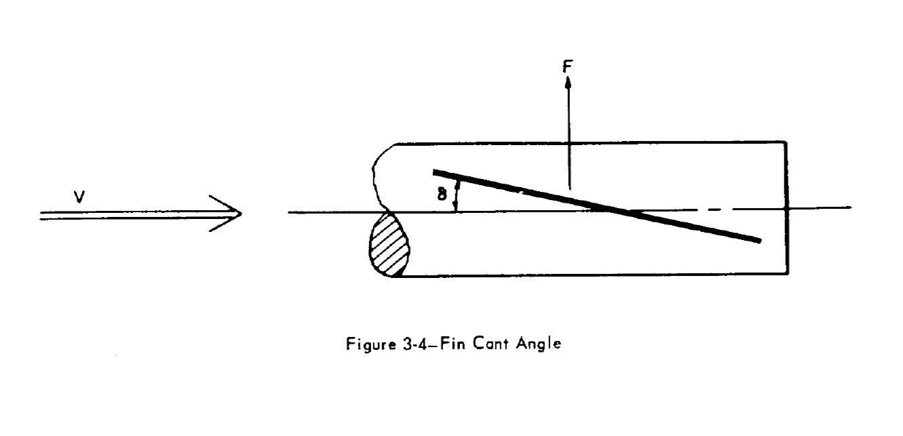
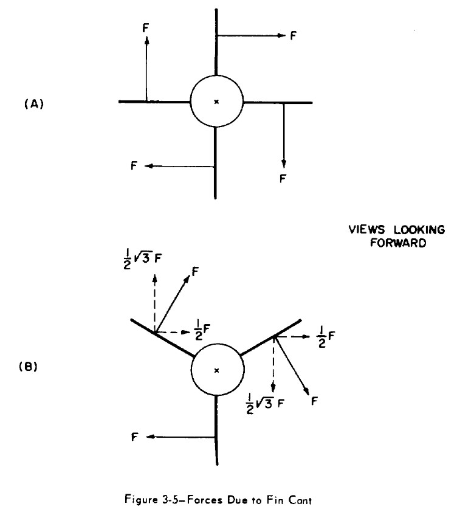
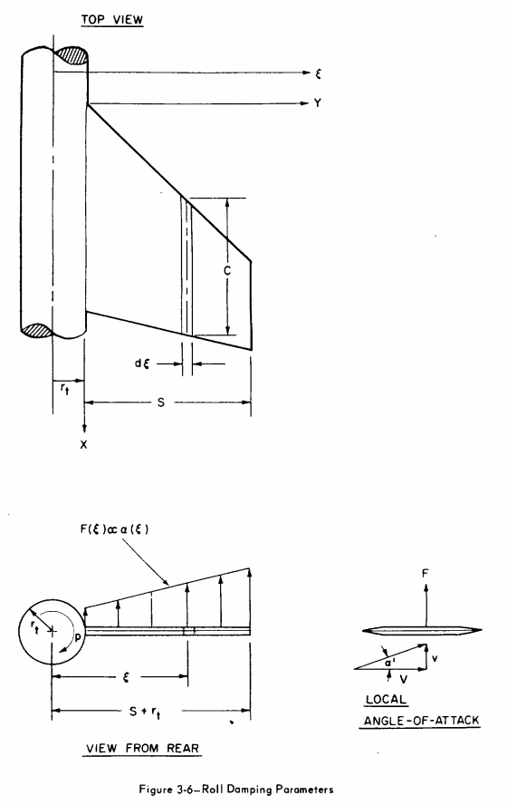

=======================================
Roll equations for high-powered rockets
=======================================

:Author: Bruno Abdulklech Sorban, 
:Author: Mateus Stano Junqueira
:Date:   February 2022

Nomenclature
============

- :math:`A_{r}` - Reference area
- :math:`(C_{N\alpha})_{0}` - Normal force coefficient derivative of a 2D airfoil
- :math:`(C_{N\alpha})_{1}` - Normal force coefficient derivative of one fin
- :math:`C_r`  - Root chord
- :math:`C_t`  - Tip Chord
- :math:`F` - Force
- :math:`L_{r}`  - Reference length, rocket diameter
- :math:`M_{roll}` - Roll moment
- :math:`M_{f}` - Roll forcing moment
- :math:`M_{d}` - Roll damping moment
- :math:`N` - Number of fins
- :math:`\overline{q}` - Dynamic pressure
- :math:`r_t` - Reference radius at fins position
- :math:`s`  - Span
- :math:`v_{0}`  - Rocket speed in relation to the wind
- :math:`\omega` - Angular velocity
- :math:`Y_{MA}` - Spanwise location of mean aerodynamic chord measured from the root chord
- :math:`\delta` - Fin cant angle
- :math:`\xi` - Distance to rotation axis
- :math:`\rho` - Ambient density
- :math:`C_{lf}` - Roll moment lift coefficient
- :math:`C_{lf\delta}` - Roll moment lift coefficient derivative
- :math:`C_{ld}` - Roll moment damping coefficient
- :math:`C_{ld\omega}` - Roll moment damping coefficient derivative

Introduction
============

Calculating the rotational movement of a high powered rocket entails
calculating the **Roll Moment**. Here all formulas and consideration for
the implementation of the Roll Moment on **RocketPy** are shown and
explained.

The main cause for a rocket roll movement are certain asymmetries in its
construction. The most noteworthy of this possible asymmetries is the
fin cant angle (:math:`\delta`), which can be seen in the next Figure and will
be considered for the calculations.

 
.. 

Coefficient derivatives
=======================

According to the equation formulated by [Barrowman]_,
the rotational moment around the rockets axis is governed by two main
forces: one that causes the rolling movement and one that damps the
movement. Each of these forces generates its own moment, the forcing
moment :math:`M_{f}` and the damping moment :math:`M_{d}`. The final roll
moment can then be calculated with:

.. math:: M_{roll} = M_{forcing} - M_{damping}

Roll Forcing
------------

*Roll forcing* is the moment that causes the rocket to rotate around its
axis. The calculations for this moment assumes :math:`\omega = 0` e
:math:`\delta \neq 0`.

Due to the symmetry of the fins - as can be seen in the Figure below - the
forces cancel each other out so that the resulting force :math:`F_{R}` is equal
to zero. However, the resulting moment :math:`M_{R} \neq 0`, that is, it
constitutes a gyroscope binary.

.. 

According to [Barrowman]_, equation (3-31), the roll
forcing moment is given by:

.. math:: M_f = N (Y_{MA} + r_t)(C_{N\alpha})_1\delta \overline{q}A_r

The author also defined the roll forcing moment coefficient as:

.. math:: C_{lf} = \frac{M_f}{\overline{q} A_r L_r}

The letter :math:`f` has been added to the name to differentiate
**Forcing** from **Damping**. Note the similarity with the definition of
drag coefficient (:math:`C_{d} = \frac{2F_{Drag}}{\rho V^2 A_{ref}}`).
Finally, you can also calculate :math:`C_{lf}` as:

.. math:: C_{lf} = \frac{N(Y_{MA} + r_t)(C_{N\alpha})_1 \delta}{L_r}

And its derivative relative to the cant angle as:

.. math:: C_{lf\delta} = \frac{\partial C_{lf}}{\partial \delta}

.. math:: C_{lf\delta} = \frac{N (Y_{MA} + r_t) (C_{N\alpha})_1 }{L_r}

The forcing moment is then calculated with:

.. math:: M_f =  \overline{q} \,\, A_r L_r  \,\, C_{lf\delta}\,\, \delta

or

.. math:: M_f =  \frac{1}{2} \rho v_0^2 \,\, A_r L_r  \,\, C_{lf\delta}\,\, \delta

Roll Damping
------------

While roll forcing causes the rotation movement, the roll damping force
is what counteracts this movement. It is a force that scales with
angular velocity and acts in the opposite direction.
:math:`\omega \neq 0` and :math:`\delta = 0` are assumed.

It is defined in the same way as roll forcing:

.. math::
   :name: 9

   C_{ld} = \frac{M_d}{\overline{q} A_r L_r}

From [Barrowman]_, the roll damping moment depends on the angle of attack of the
tangential velocity of the fin panel at a certain span wise position :math:`\xi`,
as can be seen in the Figure below. 

..

The damping moment at :math:`\xi` is:

.. math:: d M = \xi F(\xi)

Where :math:`F(\xi)` is the force generated at the span wise position
:math:`\xi` and its given by:

.. math:: F(\xi) = - C_{N_{\alpha 0}} \, \overline{q} \, a(\xi) \,c(\xi) \, d\xi

:math:`a(\xi)` is the local angle of attack at :math:`\xi` and is given
by:

.. math:: a(\xi) = \tan^{-1}(\frac{\omega \, \xi}{v_0}    )

An approximation that is valid when :math:`v_0 >> \omega \, \xi` is made

.. math:: a(\xi) = - \frac{\omega \, \xi}{v_0}

:math:`c(\xi)` is the cord length at the span wise :math:`\xi` and is
calculated differently for each fin shape. The damping moment can then
be written as:

.. math:: dM = - \frac{C_{N_{\alpha 0}} \, \overline{q} \, \omega}{v_0} \,\, c(\xi) \,\xi^2 \,  d\xi

We know that:

.. math:: d C_{ld} = \frac{C_{N_{\alpha 0}} \,  \, \omega}{v_0 \ A_r \, L_r} \,\, c(\xi) \,\xi^2 \, d\xi

Integrating over the exposed fin geometry:

.. math:: C_{ld} = \frac{C_{N_{\alpha 0}} \,  \, \omega}{v_0 \ A_r \, L_r} \,\, \int_{r_t}^{s + r_t} c(\xi) \, \xi^2 \, d\xi

The initial hypothesis assumes that, for the roll damping calculation,
the deflection is :math:`\delta = 0`. This implies a larger
cross-sectional area than is actually acting against the movement
(analogous to flow passing through a surface). As a result, the term
:math:`\cos(\delta)` was added to the original formulation:

.. math:: C_{ld} = \frac{C_{N_{\alpha 0}} \,  \, \omega}{v_0 \ A_r \, L_r} \, \cos(\delta) \, \int_{r_t}^{s + r_t} c(\xi) \, \xi^2 \, d\xi

The roll damping coefficient derivative can then be defined as:

.. math:: C_{ld\omega} = \frac{\partial C_{ld}}{\partial (\frac{\omega L_{r}}{2v_0})}

.. math:: C_{ld\omega} = \frac{2 \ C_{N_{\alpha 0}} \,  }{A_r \, L_r^2} \, \cos(\delta) \, \int_{r_t}^{s + r_t} c(\xi) \, \xi^2 \,d\xi

Finally, :math:`C_{N_{\alpha 0}}` must be corrected for three
dimensional effects:

.. math:: C_{ld\omega} = \frac{2 \ N\ \Bigl(C_{N_{\alpha }}\Bigr)_1 \,  }{A_r \, L_r^2} \, \cos(\delta) \, \int_{r_t}^{s + r_t} c(\xi) \, \xi^2 \,d\xi

The values of the definite integral can be calculated for each specific
fin shape. For trapezoidal fins:

.. math:: c(\xi) = C_r \left[1 - \frac{1 - \frac{C_t}{C_r}}{s}(\xi - r_t)\right]

.. math:: \int_{r_t}^{s + r_t} c(\xi) \, \xi^2 \, d\xi = \frac{s}{12} \left[(C_r + 3C_t) s^2 + 4(C_r + 2C_t)s r_t + 6(C_r+C_t)r_t^2 \right]

And for ellipsoidal fins:

.. math:: c(\xi) = C_r \sqrt{1 - \Bigl(\frac{\xi - r_t}{s}\Bigr)^2}

.. math:: \int_{r_t}^{s + r_t} c(\xi) \, \xi^2 \, d\xi = C_r\, s\ \frac{ \Bigl(3\pi s^2 + 32 r_t s + 12 \pi r_t^2 \Bigr)}{48}

The damping moment is finally:

.. math:: M_d = \frac{1}{2} \rho v_0^2 \ A_{ref} \, L_{ref} \ C_{ld\omega} \, \frac{\omega L_{ref}}{2 v_0}

Interference Coefficients
=========================

In [Barrowman]_ some fin-body interference factor are
calculated. These factors are also implemented in the lift coefficient
calculations.

For fins with canted angle:

.. math::

   K_f &=\frac{1}{\pi^{2}}\left[\frac{\pi^2}{4}\frac{(\tau+1)^{2}}{\tau^2}+\frac{\pi\Bigl(\tau^{2}+1\Bigr)^{2}}{\tau^{2}(\tau-1)^{2}} \sin ^{-1}\Bigl(\frac{\tau^{2}-1}{\tau^{2}+1}\Bigr)-\frac{2 \pi(\tau+1)}{\tau(\tau-1)}\right.\\
   &+\frac{\Bigl(\tau^{2}+1\Bigr)^{2}}{\tau^{2}(\tau-1)^{2}}\Bigl(\sin ^{-1} \frac{\tau^{2}-1}{\tau^{2}+1}\Bigr)^{2}-\frac{4(\tau+1)}{\tau(\tau-1)} \sin ^{-1}\Bigl(\frac{\tau^{2}-1}{\tau^{2}+1}\Bigr) \\
   &\left.+\frac{8}{(\tau-1)^{2}} \ln \Bigl(\frac{\tau^{2}+1}{2 \tau}\Bigr)\right]

.. 

For the damping moment lift coefficient derivative:

.. math:: K_d=1+\frac{\frac{\tau-\lambda}{\tau}-\frac{1-\lambda}{\tau-1} \ln \tau}{\frac{(\tau+1)(\tau-\lambda)}{2}-\frac{(1-\lambda)\Bigl(\tau^{3}-1\Bigr)}{3(\tau-1)}}

| Where :math:`\tau = \frac{s + r_t}{r_t}` and :math:`\lambda = \frac{C_t}{C_r}`. The final lift coefficients are:

.. math:: (C_{lf\delta})_{K_{f}} = K_{f} \cdot C_{lf\delta}

.. math:: (C_{ld\omega})_{K_{d}} = K_{d} \cdot C_{ld\omega}

Comments
========

Roll moment is expected to increase linearly with velocity. This
relationship can be verified in the rotation frequency equilibrium
equation, described by [Niskanen]_ in equation
(3.73), and again stated below:

.. math:: f_{eq} = \frac{\omega}{2\pi} = \frac{A_{ref}\beta \overline{Y_t} (C_{N\alpha})_1 }{4\pi^2 \sum_{i} c_i \xi^2 \Delta \xi} \, \delta V_0

The auxiliary value :math:`\beta` is defined as:
:math:`\beta = \sqrt{|1-M|}`, where M is the speed of the rocket in
Mach.

.. .. math:: k = 1 + \frac{\frac{\sqrt{s^2-r_{t}^2}\Bigl(2C_{r}r_{t}^2\ln\Bigl(\frac{2s\sqrt{s^2-r_{t}^2}+2s^2}{r_{t}}\Bigr)-2C_{r}r_{t}^2\ln\Bigl(2s\Bigr)\Bigr)+2C_{r}s^3-{\pi}C_{r}r_{t}s^2-2C_{r}r_{t}^2s+{\pi}C_{r}r_{t}^3}{2r_{t}s^3-2r_{t}^3s}}{C_{r}\cdot\Bigl(\dfrac{s^2}{3}+\dfrac{{\pi}r_{t}s}{4}\Bigr)}

.. .. math::

..    k = 1 + \frac{\sqrt{s^2-r_{t}^2}\Bigl(2r_{t}^2\ln\Bigl(\frac{2s\sqrt{s^2-r_{t}^2}+2s^2}{r_{t}}\Bigr)-2r_{t}^2\ln\Bigl(2s\Bigr)\Bigr)+2s^3-{\pi}r_{t}s^2-2r_{t}^2s+{\pi}r_{t}^3}
..        {(2r_{t}s^3-2r_{t}^3s) \cdot\Bigl(\dfrac{s^2}{3}+\dfrac{{\pi}r_{t}s}{4}\Bigr)}

