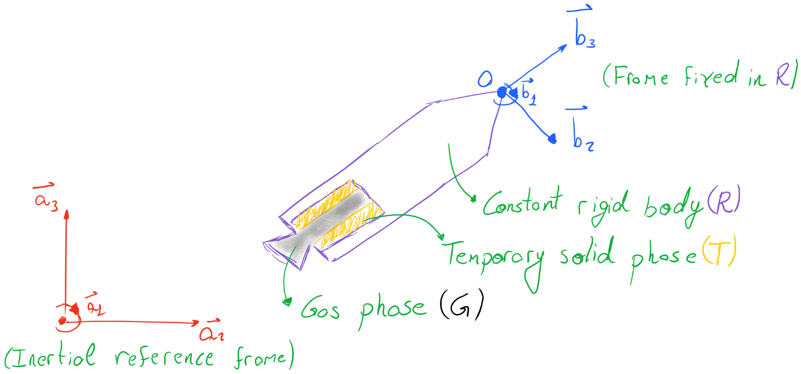

.. _eqsv0:

======================
Equations of Motion v0
======================

Notes on the .rst file format version
=====================================

This file was originally written by Giovani Ceotto in 2017, while he was the 
aerodynamic director of Projeto Jupiter. 
It was then translated to .rst by Guilherme F. Alves in 2022, and then incorporated
as a part of the documentation of the rocketpy package.

The equations described below correspond to the first implementation of RocketPy,
and may suffer some changes in future versions. For instance, at the beginning
it was considering only solid motors, but it has been changed from the v1.0.0 
release.

For a more explained and official documentation, the authors refer to the main 
article of the project, which was published in the Journal of Aerospace Engineering
(https://doi.org/10.1061/(ASCE)AS.1943-5525.0001331) in 2021.

Introduction
============

This document describes the equations of motion which govern the flight
of a rocket. The equations are implemented in Python to simulate the
dynamics of a rocket flight, which can be used to determine its
stability, its dispersion as well as the altitude which the rocket
theoretically reaches.

We start by defining the rocket and the reference systems which will be
used throughout the derivation. Consider the following diagram:

The rocket is considered a composition of a rigid body (:math:`R`), a
temporary solid phase (:math:`T`) and a gas phase (:math:`G`). Fixed to
the permanent rigid body :math:`R` is a coordinate system :math:`B`
whose axes are oriented considering a right-handed orthogonal base
:math:`b_{1}b_{2}b_{3}`. An inertial coordinate system :math:`A` is also
defined. :math:`A` is fixed to Earth, which is assumed inertial, and is
also oriented by a right-handed orthogonal base :math:`a_{1}a_{2}a_{3}`.

Velocity, Angular Velocity, and Reference Frame Transformation
==============================================================

Consider the center of mass :math:`*` of :math:`R + T + G`. Its position
and velocity relative to the inertial reference frame :math:`A` is
written as:

.. math:: _{\ }^{A}{\overrightarrow{r}}_{*} = x{\overrightarrow{a}}_{1} + y{\overrightarrow{a}}_{2} + z{\overrightarrow{a}}_{3}

.. math:: _{\ }^{A}{\overrightarrow{v}}_{*} = \frac{\text{dx}}{\text{dt}}{\overrightarrow{a}}_{1} + \frac{\text{dy}}{\text{dt}}{\overrightarrow{a}}_{2} + \frac{\text{dz}}{\text{dt}}{\overrightarrow{a}}_{3}

One may also choose to represent this in terms of
:math:`b_{1}b_{2}b_{3}`. To convert between both reference frames, a
transformation matrix shall be used. This transformation can be
represented in terms of Euler parameters which will help reach a concise
form of the equations of motion later. More about Euler parameters can
be seen in Analytical Mechanics by Haim Baruh in section 7.7. The
transformation is given by:

.. math::

   \begin{bmatrix}
   {\overrightarrow{b}}_{1} \\
   {\overrightarrow{b}}_{2} \\
   {\overrightarrow{b}}_{3} \\
   \end{bmatrix} = \begin{bmatrix}
   e_{0}^{2} + e_{1}^{2} - e_{2}^{2} - e_{3}^{2} & 2\Bigl( e_{1}e_{2} + e_{0}e_{3} \Bigr) & 2(e_{1}e_{3} - e_{0}e_{2}) \\
   2\Bigl( e_{1}e_{2} - e_{0}e_{3} \Bigr) & e_{0}^{2} - e_{1}^{2} + e_{2}^{2} - e_{3}^{2} & 2\Bigl( e_{2}e_{3} + e_{0}e_{1} \Bigr) \\
   2(e_{1}e_{3} + e_{0}e_{2}) & 2\Bigl( e_{2}e_{3} - e_{0}e_{1} \Bigr) & e_{0}^{2} - e_{1}^{2} - e_{2}^{2} + e_{3}^{2} \\
   \end{bmatrix}\begin{bmatrix}
   {\overrightarrow{a}}_{1} \\
   {\overrightarrow{a}}_{2} \\
   {\overrightarrow{a}}_{3} \\
   \end{bmatrix}

The reverse transformation is found by inverting the rotation matrix,
which is the same as transposing it:

.. math::

   \begin{bmatrix}
   {\overrightarrow{a}}_{1} \\
   {\overrightarrow{a}}_{2} \\
   {\overrightarrow{a}}_{3} \\
   \end{bmatrix} = \begin{bmatrix}
   e_{0}^{2} + e_{1}^{2} - e_{2}^{2} - e_{3}^{2} & 2\Bigl( e_{1}e_{2} - e_{0}e_{3} \Bigr) & 2(e_{1}e_{3} + e_{0}e_{2}) \\
   2\Bigl( e_{1}e_{2} + e_{0}e_{3} \Bigr) & e_{0}^{2} - e_{1}^{2} + e_{2}^{2} - e_{3}^{2} & 2\Bigl( e_{2}e_{3} - e_{0}e_{1} \Bigr) \\
   2(e_{1}e_{3} - e_{0}e_{2}) & 2\Bigl( e_{2}e_{3} + e_{0}e_{1} \Bigr) & e_{0}^{2} - e_{1}^{2} - e_{2}^{2} + e_{3}^{2} \\
   \end{bmatrix}\begin{bmatrix}
   {\overrightarrow{b}}_{1} \\
   {\overrightarrow{b}}_{2} \\
   {\overrightarrow{b}}_{3} \\
   \end{bmatrix}

Therefore, point O's velocity relative to :math:`A` expressed in
:math:`B` is given by:

.. math:: _{\ }^{A}{\overrightarrow{v}}_{*} = \frac{\text{dx}}{\text{dt}}\left\lbrack \Bigl( e_{0}^{2} + e_{1}^{2} - e_{2}^{2} - e_{3}^{2} \Bigr){\overrightarrow{b}}_{1} + \Bigl( 2\Bigl( e_{1}e_{2} - e_{0}e_{3} \Bigr) \Bigr){\overrightarrow{b}}_{2} + \Bigl( 2(e_{1}e_{3} + e_{0}e_{2}) \Bigr){\overrightarrow{b}}_{3} \right\rbrack + \frac{\text{dy}}{\text{dt}}\left\lbrack \Bigl( 2\Bigl( e_{1}e_{2} + e_{0}e_{3} \Bigr) \Bigr){\overrightarrow{b}}_{1} + \Bigl( e_{0}^{2} - e_{1}^{2} + e_{2}^{2} - e_{3}^{2} \Bigr){\overrightarrow{b}}_{2} + \Bigl( 2\Bigl( e_{2}e_{3} - e_{0}e_{1} \Bigr) \Bigr){\overrightarrow{b}}_{3} \right\rbrack + \frac{\text{dz}}{\text{dt}}\left\lbrack \Bigl( 2(e_{1}e_{3} - e_{0}e_{2}) \Bigr){\overrightarrow{b}}_{1} + \Bigl( 2\Bigl( e_{2}e_{3} + e_{0}e_{1} \Bigr) \Bigr){\overrightarrow{b}}_{2} + \Bigl( e_{0}^{2} - e_{1}^{2} - e_{2}^{2} + e_{3}^{2} \Bigr){\overrightarrow{b}}_{3} \right\rbrack

.. math:: _{\ }^{A}{\overrightarrow{v}}_{*} = \Bigl( \frac{\text{dx}}{\text{dt}}\Bigl( e_{0}^{2} + e_{1}^{2} - e_{2}^{2} - e_{3}^{2} \Bigr) + \frac{\text{dy}}{\text{dt}}\Bigl( 2\Bigl( e_{1}e_{2} + e_{0}e_{3} \Bigr) \Bigr) + \frac{\text{dz}}{\text{dt}}\Bigl( 2(e_{1}e_{3} - e_{0}e_{2}) \Bigr) \Bigr){\overrightarrow{b}}_{1} + \Bigl( \frac{\text{dx}}{\text{dt}}\Bigl( 2\Bigl( e_{1}e_{2} - e_{0}e_{3} \Bigr) \Bigr) + \frac{\text{dy}}{\text{dt}}\Bigl( e_{0}^{2} - e_{1}^{2} + e_{2}^{2} - e_{3}^{2} \Bigr) + \frac{\text{dz}}{\text{dt}}\Bigl( 2\Bigl( e_{2}e_{3} + e_{0}e_{1} \Bigr) \Bigr) \Bigr){\overrightarrow{b}}_{2} + \Bigl( \frac{\text{dx}}{\text{dt}}\Bigl( 2(e_{1}e_{3} + e_{0}e_{2}) \Bigr) + \frac{\text{dy}}{\text{dt}}\Bigl( 2\Bigl( e_{2}e_{3} - e_{0}e_{1} \Bigr) \Bigr) + \frac{\text{dz}}{\text{dt}}\Bigl( e_{0}^{2} - e_{1}^{2} - e_{2}^{2} + e_{3}^{2} \Bigr) \Bigr){\overrightarrow{b}}_{3}

By contrast, the angular velocity of :math:`R` with respect to the
inertial reference frame :math:`A` written in terms of :math:`B` is
given by:

.. math:: _{\ }^{A}\overrightarrow{\omega} = \omega_{1}{\overrightarrow{b}}_{1} + \omega_{2}{\overrightarrow{b}}_{2} + \omega_{3}{\overrightarrow{b}}_{3}

Where :math:`\omega_{1}`, :math:`\omega_{2}` and :math:`\omega_{3}` are
given in terms of Euler parameters and their derivatives:

.. math::

   \begin{bmatrix}
   \omega_{1} \\
   \omega_{2} \\
   \omega_{3} \\
   \end{bmatrix} = 2\begin{bmatrix}
    - e_{1} & e_{0} &
   e_{3} & {- e}_{2} \\
   {- e}_{2} & {- e}_{3} &
   e_{0} & e_{1} \\
   {- e}_{3} & e_{2} &
    - e_{1} & e_{0} \\
   \end{bmatrix}\begin{bmatrix}
   {\dot{e}}_{0} \\
   {\dot{e}}_{1} \\
   {\dot{e}}_{2} \\
   {\dot{e}}_{3} \\
   \end{bmatrix}

Procedure to Derive the Equations of Motion
===========================================

The equations of motion will be derived using Kane`s formalism, an
analytical mechanics method similar to Gibbs-Appell formulation. More
about Kane`s formalism can be seen in Dynamics, Theory and Applications
by Kane himself.

Kane`s equations of motion states that:

.. math::
   
   \boxed{\sum_{}^{}\Bigl( \frac{\partial_{\ }^{A}{\overrightarrow{v}}_{i}}{\partial u_{r}} \cdot \overrightarrow{F_{i}} \Bigr) - \sum_{}^{}\Bigl( \frac{\partial_{\ }^{A}{\overrightarrow{v}}_{i}}{\partial u_{r}} \cdot m_{\ }^{A}{\overrightarrow{a}}_{i} \Bigr) = 0}

Where the sub-index :math:`i` indicates a particle in the system and
:math:`u_{r}` is a generalized speed of choice. The summation is over
all particles and an equation is obtained for every :math:`u_{r}` in the
system. It is simply a statement of d'Alembert Principle in terms of
generalized forces.

Kane's equations are only valid in an inertial frame of reference and
for constant mass systems. Therefore, our strategy is to express
velocities and accelerations of every particle contained in
:math:`R + T + G` with respect to reference frame :math:`A`. Since all
particles will be considered, we will treat the system
:math:`S = R + T + G` as a constant mass one. Later, we shall use
Reynolds Transport Theorem to change from :math:`S` to a control system
:math:`C` which only includes the particles inside the rocket, ignoring
the ones which are leaving it.

Now, considering both the velocity of the center of mass of the rocket
and its angular velocity, we can choose generalized speeds such that:

.. math:: _{\ }^{A}\overrightarrow{\omega} = u_{1}{\overrightarrow{b}}_{1} + u_{2}{\overrightarrow{b}}_{2} + u_{3}{\overrightarrow{b}}_{3}

.. math:: _{\ }^{A}{{\overrightarrow{v}}_{*} = u_{4}{\overrightarrow{b}}_{1} + u_{5}{\overrightarrow{b}}_{2} + u_{6}{\overrightarrow{b}}_{3}}

This choice greatly facilitates the derivation of the equations of
motions using Kane's method. Notice that the two equations above
represent the translational and angular velocity of :math:`S` with
respect to :math:`A` in terms of :math:`B`.

Kinematics
==========

Notice that Kane's equations involve two kinematic quantities, the
partial velocity and acceleration of every particle in :math:`S`.
Partial velocity, also known as quasi-velocity is simply
:math:`\partial\overrightarrow{v_{i}}/\partial u_{r}`.

The velocity of any particle in :math:`S` can be written as:

.. math:: _{\ }^{A}{\overrightarrow{v}}_{i} =_{\ }^{A}{\overrightarrow{v}}_{O} +_{\ }^{A}\overrightarrow{\omega} \times {\overrightarrow{r}}_{i - O} +_{\ }^{R}{\overrightarrow{v}}_{i}

Where :math:`_{\ }^{A}{\overrightarrow{v}}_{O}` is the velocity of point
O which is part of rigid body R,
:math:`_{\ }^{A}\overrightarrow{\omega}` is the angular velocity of
:math:`R` with respect to :math:`A`,
:math:`{\overrightarrow{r}}_{i - O}` is the vector which goes from
:math:`O` to :math:`i`. Therefore,
:math:`_{\ }^{A}{\overrightarrow{v}}_{O} +_{\ }^{A}\overrightarrow{\omega} \times {\overrightarrow{r}}_{i - O}`
is the velocity of a point in the rigid body :math:`R` located in the
same place as the particle :math:`i` and
:math:`_{\ }^{R}{\overrightarrow{v}}_{i}` is the relative velocity
between particle :math:`i` and that point in :math:`R`. Notice how
:math:`_{\ }^{R}{\overrightarrow{v}}_{i}` is always null, except for
particles in gas phase which can have arbitrary velocities.

Calculating the partial velocity of particle :math:`i` with respect to a
generalized speed :math:`u_{r}`, we get:

.. math::
   
   \frac{\partial_{\ }^{A}{\overrightarrow{v}}_{i}}{\partial u_{r}} = \frac{\partial_{\ }^{A}{\overrightarrow{v}}_{O}}{\partial u_{r}} + \frac{\partial_{\ }^{A}\overrightarrow{\omega}}{\partial u_{r}} \times {\overrightarrow{r}}_{i - O} +_{\ }^{A}\overrightarrow{\omega} \times \frac{\partial{\overrightarrow{r}}_{i - O}}{\partial u_{r}} + \frac{\partial_{\ }^{R}{\overrightarrow{v}}_{i}}{\partial u_{r}}

However, the last two terms of the equation above are null. The reason
for this is because :math:`{\overrightarrow{r}}_{i - O}` is a vector
which is only a function of time, and its partial derivative with
respect to :math:`u_{r}` is zero. The same goes for
:math:`_{\ }^{R}{\overrightarrow{v}}_{i}`, even though explaining why
:math:`_{\ }^{R}{\overrightarrow{v}}_{i}` is only a function of time
requires a stronger assumption. We will be considering that
:math:`_{\ }^{R}{\overrightarrow{v}}_{i}`, which is the velocity of the
particles in the gas phase relative to the rigid body, is a known
quantity which does not depend on the partial velocities and only
changes with time.

Simplifying, we reach:

.. math::
   
   \frac{\partial_{\ }^{A}{\overrightarrow{v}}_{i}}{\partial u_{r}} = \frac{\partial_{\ }^{A}{\overrightarrow{v}}_{O}}{\partial u_{r}} + \frac{\partial_{\ }^{A}\overrightarrow{\omega}}{\partial u_{r}} \times {\overrightarrow{r}}_{i - O}\ \text{or}\ \frac{\partial_{\ }^{A}{\overrightarrow{v}}_{O}}{\partial u_{r}} = \frac{\partial_{\ }^{A}{\overrightarrow{v}}_{i}}{\partial u_{r}} - \frac{\partial_{\ }^{A}\overrightarrow{\omega}}{\partial u_{r}} \times {\overrightarrow{r}}_{i - O}

Similarly, one may express the partial velocity of the center of mass
:math:`*` of :math:`S` as:

.. math::
   
   \frac{\partial_{\ }^{A}{\overrightarrow{v}}_{*}}{\partial u_{r}} = \frac{\partial_{\ }^{A}{\overrightarrow{v}}_{O}}{\partial u_{r}} + \frac{\partial_{\ }^{A}\overrightarrow{\omega}}{\partial u_{r}} \times {\overrightarrow{r}}_{* - O}

The derivation of this formula is the same as the derivation of an
arbitrary particle :math:`i`. However, one must be careful since the
center of mass is not a particle, but an abstract point. Even though it
may fall on :math:`R`, :math:`_{\ }^{R}{\overrightarrow{v}}_{*}` is not
null, because the velocity of the center of mass depends on the
velocities of the particles in the gas phase.

Combining the last two equations, we reach:

.. math::
   
   \frac{\partial_{\ }^{A}{\overrightarrow{v}}_{*}}{\partial u_{r}} = \Bigl( \frac{\partial_{\ }^{A}{\overrightarrow{v}}_{i}}{\partial u_{r}} - \frac{\partial_{\ }^{A}\overrightarrow{\omega}}{\partial u_{r}} \times {\overrightarrow{r}}_{i - O} \Bigr) + \frac{\partial_{\ }^{A}\overrightarrow{\omega}}{\partial u_{r}} \times {\overrightarrow{r}}_{* - O}

.. math:: \frac{\partial_{\ }^{A}{\overrightarrow{v}}_{i}}{\partial u_{r}} = \frac{\partial_{\ }^{A}{\overrightarrow{v}}_{*}}{\partial u_{r}} + \frac{\partial_{\ }^{A}\overrightarrow{\omega}}{\partial u_{r}} \times \Bigl( {\overrightarrow{r}}_{i - O} - {\overrightarrow{r}}_{* - O} \Bigr)

.. math:: \boxed{\frac{\partial_{\ }^{A}{\overrightarrow{v}}_{i}}{\partial u_{r}} = \frac{\partial_{\ }^{A}{\overrightarrow{v}}_{*}}{\partial u_{r}} + \frac{\partial_{\ }^{A}\overrightarrow{\omega}}{\partial u_{r}} \times {\overrightarrow{r}}_{i - *}}

Which gives the partial velocity of an arbitrary particle :math:`i` in
:math:`S` relative to the generalized speed
:math:`u_{r}(r = 1,\ 2,\ 3,\ 4,\ 5,\ or\ 6)` in terms of the partial
velocity of the center of mass of :math:`S`, the angular velocity of
:math:`R` and the vector :math:`{\overrightarrow{r}}_{i - *}` which goes
from the center of mass :math:`*` to the particle :math:`i`.

The acceleration for an arbitrary particle :math:`i` is given by the
time derivative of its velocity:

.. math:: \frac{\partial_{\ }^{A}{\overrightarrow{v}}_{i}}{\partial t} = \frac{\partial_{\ }^{A}{\overrightarrow{v}}_{O}}{\partial t} + \frac{\partial_{\ }^{A}\overrightarrow{\omega}}{\partial t} \times {\overrightarrow{r}}_{i - O} +_{\ }^{A}\overrightarrow{\omega} \times \frac{\partial{\overrightarrow{r}}_{i - O}}{\partial t} + \frac{\partial_{\ }^{R}{\overrightarrow{v}}_{i}}{\partial t}

.. math:: _{\ }^{A}{\overrightarrow{a}}_{i} =_{\ }^{A}{\overrightarrow{a}}_{O} +_{\ }^{A}\overrightarrow{\alpha} \times {\overrightarrow{r}}_{i - O} +_{\ }^{A}\overrightarrow{\omega} \times \Bigl(_{\ }^{A}\overrightarrow{\omega} \times {\overrightarrow{r}}_{i - O} \Bigr) + 2_{\ }^{A}\overrightarrow{\omega} \times_{\ }^{R}{\overrightarrow{v}}_{i} +_{\ }^{R}{\overrightarrow{a}}_{i}

Likewise, the acceleration of the center of mass of :math:`S` is given
by:

.. math:: _{\ }^{A}{\overrightarrow{a}}_{*} =_{\ }^{A}{\overrightarrow{a}}_{O} +_{\ }^{A}\overrightarrow{\alpha} \times {\overrightarrow{r}}_{* - O} +_{\ }^{A}\overrightarrow{\omega} \times \Bigl(_{\ }^{A}\overrightarrow{\omega} \times {\overrightarrow{r}}_{* - O} \Bigr) + 2_{\ }^{A}\overrightarrow{\omega} \times_{\ }^{R}{\overrightarrow{v}}_{*} +_{\ }^{R}{\overrightarrow{a}}_{*}

Combining both equations, we reach:

.. math:: \boxed{_{\ }^{A}{\overrightarrow{a}}_{i} =_{\ }^{A}{\overrightarrow{a}}_{*} +_{\ }^{A}\overrightarrow{\alpha} \times {\overrightarrow{r}}_{i - *} +_{\ }^{A}\overrightarrow{\omega} \times \Bigl(_{\ }^{A}\overrightarrow{\omega} \times {\overrightarrow{r}}_{i - *} \Bigr) + 2_{\ }^{A}\overrightarrow{\omega} \times (_{\ }^{R}{\overrightarrow{v}}_{i} -_{\ }^{R}{\overrightarrow{v}}_{*}) + (_{\ }^{R}{\overrightarrow{a}}_{i} -_{\ }^{R}{\overrightarrow{a}}_{*})}

Application of Kane's Equation of Motion
========================================

Using the results from the previous section on the partial velocity and
acceleration of an arbitrary particle, we can use Kane's equation of
motion as follows:

.. math:: \sum_{}^{}\Bigl( \frac{\partial_{\ }^{A}{\overrightarrow{v}}_{i}}{\partial u_{r}} \cdot \overrightarrow{F_{i}} \Bigr) - \sum_{}^{}\Bigl( \frac{\partial_{\ }^{A}{\overrightarrow{v}}_{i}}{\partial u_{r}} \cdot m_{\ }^{A}{\overrightarrow{a}}_{i} \Bigr) = 0

.. math:: \sum_{}^{}\Bigl( \Bigl( \frac{\partial_{\ }^{A}{\overrightarrow{v}}_{*}}{\partial u_{r}} + \frac{\partial_{\ }^{A}\overrightarrow{\omega}}{\partial u_{r}} \times {\overrightarrow{r}}_{i - *} \Bigr) \cdot \overrightarrow{F_{i}} \Bigr) = \sum_{}^{}\Bigl( \Bigl( \frac{\partial_{\ }^{A}{\overrightarrow{v}}_{*}}{\partial u_{r}} + \frac{\partial_{\ }^{A}\overrightarrow{\omega}}{\partial u_{r}} \times {\overrightarrow{r}}_{i - *} \Bigr) \cdot m{\overrightarrow{a}}_{i} \Bigr)

.. math:: \sum_{}^{}\Bigl( \Bigl( \frac{\partial_{\ }^{A}{\overrightarrow{v}}_{*}}{\partial u_{r}} \Bigr) \cdot \overrightarrow{F_{i}} + \Bigl( \frac{\partial_{\ }^{A}\overrightarrow{\omega}}{\partial u_{r}} \times {\overrightarrow{r}}_{i - *} \Bigr) \cdot \overrightarrow{F_{i}} \Bigr) = \sum_{}^{}\Bigl( \Bigl( \frac{\partial_{\ }^{A}{\overrightarrow{v}}_{*}}{\partial u_{r}} + \frac{\partial_{\ }^{A}\overrightarrow{\omega}}{\partial u_{r}} \times {\overrightarrow{r}}_{i - *} \Bigr) \cdot m{\overrightarrow{a}}_{i} \Bigr)

Noting that:

.. math:: _{\ }^{A}\overrightarrow{\omega} = u_{1}{\overrightarrow{b}}_{1} + u_{2}{\overrightarrow{b}}_{2} + u_{3}{\overrightarrow{b}}_{3}

.. math:: _{\ }^{A}{{\overrightarrow{v}}_{*} = u_{4}{\overrightarrow{b}}_{1} + u_{5}{\overrightarrow{b}}_{2} + u_{6}{\overrightarrow{b}}_{3}}

.. math:: \Bigl( \frac{\partial_{\ }^{A}{\overrightarrow{v}}_{*}}{\partial u_{1}} \Bigr) = \Bigl( \frac{\partial_{\ }^{A}{\overrightarrow{v}}_{*}}{\partial u_{2}} \Bigr) = \Bigl( \frac{\partial_{\ }^{A}{\overrightarrow{v}}_{*}}{\partial u_{3}} \Bigr) = \Bigl( \frac{\partial_{\ }^{A}\overrightarrow{\omega}}{\partial u_{1}} \Bigr) = \Bigl( \frac{\partial_{\ }^{A}\overrightarrow{\omega}}{\partial u_{2}} \Bigr) = \Bigl( \frac{\partial_{\ }^{A}\overrightarrow{\omega}}{\partial u_{3}} \Bigr) = 0

We conclude that for :math:`r = 1,\ 2,\ 3,\ 4,\ 5,\ \text{or}\ 6` we
have:

.. math:: \sum_{}^{}{\Bigl( {\overrightarrow{b}}_{1} \times {\overrightarrow{r}}_{i - *} \Bigr) \cdot \overrightarrow{F_{i}}} = \sum_{}^{}{\Bigl( {\overrightarrow{b}}_{1} \times {\overrightarrow{r}}_{i - *} \Bigr) \cdot m{\overrightarrow{a}}_{i}}

.. math:: \sum_{}^{}{\Bigl( {\overrightarrow{b}}_{2} \times {\overrightarrow{r}}_{i - *} \Bigr) \cdot \overrightarrow{F_{i}}} = \sum_{}^{}{\Bigl( {\overrightarrow{b}}_{2} \times {\overrightarrow{r}}_{i - *} \Bigr) \cdot m{\overrightarrow{a}}_{i}}

.. math:: \sum_{}^{}{\Bigl( {\overrightarrow{b}}_{3} \times {\overrightarrow{r}}_{i - *} \Bigr) \cdot \overrightarrow{F_{i}}} = \sum_{}^{}{\Bigl( {\overrightarrow{b}}_{3} \times {\overrightarrow{r}}_{i - *} \Bigr) \cdot m{\overrightarrow{a}}_{i}}

.. math:: \sum_{}^{}{{\overrightarrow{b}}_{1} \cdot \overrightarrow{F_{i}}} = \sum_{}^{}{{\overrightarrow{b}}_{1} \cdot m{\overrightarrow{a}}_{i}}

.. math:: \sum_{}^{}{{\overrightarrow{b}}_{2} \cdot \overrightarrow{F_{i}}} = \sum_{}^{}{{\overrightarrow{b}}_{2} \cdot m{\overrightarrow{a}}_{i}}

.. math:: \sum_{}^{}{{\overrightarrow{b}}_{3} \cdot \overrightarrow{F_{i}}} = \sum_{}^{}{{\overrightarrow{b}}_{3} \cdot m{\overrightarrow{a}}_{i}}

Rearranging and writing sum over mass in integral from assuming a
continuous system :math:`S`:

.. math:: \sum_{}^{}{\Bigl( {\overrightarrow{r}}_{i - *} \times \overrightarrow{F_{i}} \Bigr) \cdot {\overrightarrow{b}}_{1}} = \iiint_{S}^{\ }{\Bigl( {\overrightarrow{r}}_{i - *} \times {\overrightarrow{a}}_{i} \Bigr) \cdot {\overrightarrow{b}}_{1}\text{dm}}

.. math:: \sum_{}^{}{\Bigl( {\overrightarrow{r}}_{i - *} \times \overrightarrow{F_{i}} \Bigr) \cdot {\overrightarrow{b}}_{2}} = \iiint_{S}^{\ }{\Bigl( {\overrightarrow{r}}_{i - *} \times {\overrightarrow{a}}_{i} \Bigr) \cdot {\overrightarrow{b}}_{2}\text{dm}}

.. math:: \sum_{}^{}{\Bigl( {\overrightarrow{r}}_{i - *} \times \overrightarrow{F_{i}} \Bigr) \cdot {\overrightarrow{b}}_{3}} = \iiint_{S}^{\ }{\Bigl( {\overrightarrow{r}}_{i - *} \times {\overrightarrow{a}}_{i} \Bigr) \cdot {\overrightarrow{b}}_{3}\text{dm}}

.. math:: \sum_{}^{}{{\overrightarrow{b}}_{1} \cdot \overrightarrow{F_{i}}} = \iiint_{S}^{\ }{{\overrightarrow{a}}_{i} \cdot {\overrightarrow{b}}_{1}\text{dm}}

.. math:: \sum_{}^{}{{\overrightarrow{b}}_{2} \cdot \overrightarrow{F_{i}}} = \iiint_{S}^{\ }{{\overrightarrow{a}}_{i} \cdot {\overrightarrow{b}}_{2}\text{dm}}

.. math:: \sum_{}^{}{{\overrightarrow{b}}_{3} \cdot \overrightarrow{F_{i}}} = \iiint_{S}^{\ }{{\overrightarrow{a}}_{i} \cdot {\overrightarrow{b}}_{3}\text{dm}}

Writing :math:`\sum_{}^{}\overrightarrow{F_{i}} = \overrightarrow{R}`
and
:math:`\sum_{}^{}\Bigl( {\overrightarrow{r}}_{i - *} \times \overrightarrow{F_{i}} \Bigr) = {\overrightarrow{M}}_{*}`,
it simplifies to:

.. math:: {\overrightarrow{M}}_{*} \cdot {\overrightarrow{b}}_{1} = \iiint_{S}^{\ }{\Bigl( {\overrightarrow{r}}_{i - *} \times {\overrightarrow{a}}_{i} \Bigr) \cdot {\overrightarrow{b}}_{1}\text{dm}}

.. math:: {\overrightarrow{M}}_{*} \cdot {\overrightarrow{b}}_{2} = \iiint_{S}^{\ }{\Bigl( {\overrightarrow{r}}_{i - *} \times {\overrightarrow{a}}_{i} \Bigr) \cdot {\overrightarrow{b}}_{2}\text{dm}}

.. math:: {\overrightarrow{M}}_{*} \cdot {\overrightarrow{b}}_{3} = \iiint_{S}^{\ }{\Bigl( {\overrightarrow{r}}_{i - *} \times {\overrightarrow{a}}_{i} \Bigr) \cdot {\overrightarrow{b}}_{3}\text{dm}}

.. math:: \overrightarrow{R} \cdot {\overrightarrow{b}}_{1} = \iiint_{S}^{\ }{{\overrightarrow{a}}_{i} \cdot {\overrightarrow{b}}_{1}\text{dm}}

.. math:: \overrightarrow{R} \cdot {\overrightarrow{b}}_{2} = \iiint_{S}^{\ }{{\overrightarrow{a}}_{i} \cdot {\overrightarrow{b}}_{2}\text{dm}}

.. math:: \overrightarrow{R} \cdot {\overrightarrow{b}}_{3} = \iiint_{S}^{\ }{{\overrightarrow{a}}_{i} \cdot {\overrightarrow{b}}_{3}\text{dm}}

This can be written in a considerably reduced form as:

.. math:: \overrightarrow{R} = \int_{S}^{\ }{{\overrightarrow{a}}_{i}\text{dm}}

.. math:: {\overrightarrow{M}}_{*} = \int_{S}^{\ }{{\overrightarrow{r}}_{i - *} \times {\overrightarrow{a}}_{i}\text{dm}}

Now, expanding the integral we have:

.. math:: \overrightarrow{R} = \int_{S}^{\ }{_{\ }^{A}{\overrightarrow{a}}_{*} +_{\ }^{A}\overrightarrow{\alpha} \times {\overrightarrow{r}}_{i - *} +_{\ }^{A}\overrightarrow{\omega} \times \Bigl(_{\ }^{A}\overrightarrow{\omega} \times {\overrightarrow{r}}_{i - *} \Bigr) + 2_{\ }^{A}\overrightarrow{\omega} \times (_{\ }^{R}{\overrightarrow{v}}_{i} -_{\ }^{R}{\overrightarrow{v}}_{*}) + (_{\ }^{R}{\overrightarrow{a}}_{i} -_{\ }^{R}{\overrightarrow{a}}_{*})\text{dm}}

.. math:: {\overrightarrow{M}}_{*} = \int_{S}^{\ }{{\overrightarrow{r}}_{i - *} \times \Bigl(_{\ }^{A}{\overrightarrow{a}}_{*} +_{\ }^{A}\overrightarrow{\alpha} \times {\overrightarrow{r}}_{i - *} +_{\ }^{A}\overrightarrow{\omega} \times \Bigl(_{\ }^{A}\overrightarrow{\omega} \times {\overrightarrow{r}}_{i - *} \Bigr) + 2_{\ }^{A}\overrightarrow{\omega} \times (_{\ }^{R}{\overrightarrow{v}}_{i} -_{\ }^{R}{\overrightarrow{v}}_{*}) + (_{\ }^{R}{\overrightarrow{a}}_{i} -_{\ }^{R}{\overrightarrow{a}}_{*}) \Bigr)\text{dm}}

Which after straight forward simplifications and remembering that
:math:`\iiint_{S}^{\ }{{\overrightarrow{r}}_{i - *}\text{dm}} = 0`
becomes:

.. math:: \overrightarrow{R} = m_{\ }^{A}{\overrightarrow{a}}_{*} \Rightarrow \overrightarrow{R} = m\Bigl(_{\ }^{A}{\overrightarrow{a}}_{O} +_{\ }^{A}\overrightarrow{\alpha} \times {\overrightarrow{r}}_{* - O} +_{\ }^{A}\overrightarrow{\omega} \times \Bigl(_{\ }^{A}\overrightarrow{\omega} \times {\overrightarrow{r}}_{* - O} \Bigr) + 2_{\ }^{A}\overrightarrow{\omega} \times_{\ }^{R}{\overrightarrow{v}}_{*} +_{\ }^{R}{\overrightarrow{a}}_{*} \Bigr)

.. math:: {\overrightarrow{M}}_{*} = \int_{S}^{\ }{{\overrightarrow{r}}_{i - *} \times (_{\ }^{A}\overrightarrow{\alpha} \times {\overrightarrow{r}}_{i - *}) + {\overrightarrow{r}}_{i - *} \times (_{\ }^{A}\overrightarrow{\omega} \times \Bigl(_{\ }^{A}\overrightarrow{\omega} \times {\overrightarrow{r}}_{i - *} \Bigr)) + {\overrightarrow{r}}_{i - *} \times (2_{\ }^{A}\overrightarrow{\omega} \times \Bigl(_{\ }^{R}{\overrightarrow{v}}_{i} -_{\ }^{R}{\overrightarrow{v}}_{*} \Bigr)) + {\overrightarrow{r}}_{i - *} \times \Bigl(_{\ }^{R}{\overrightarrow{a}}_{i} -_{\ }^{R}{\overrightarrow{a}}_{*} \Bigr)\text{dm}}

Knowing that:

.. math:: \int_{S}^{\ }{{\overrightarrow{r}}_{i - *} \times \Bigl(_{\ }^{A}\overrightarrow{\alpha} \times {\overrightarrow{r}}_{i - *} \Bigr)dm =}\int_{S}^{\ }{_{\ }^{A}\overrightarrow{\alpha} \cdot ({\overrightarrow{r}}_{i - *}^{2}\widetilde{U} - {\overrightarrow{r}}_{i - *}{\overrightarrow{r}}_{i - *})dm} = {\widetilde{I}}_{*} \cdot_{\ }^{A}\overrightarrow{\alpha}

.. math:: \int_{S}^{\ }{{\overrightarrow{r}}_{i - *} \times (_{\ }^{A}\overrightarrow{\omega} \times \Bigl(_{\ }^{A}\overrightarrow{\omega} \times {\overrightarrow{r}}_{i - *} \Bigr))dm =}\int_{S}^{\ }{_{\ }^{A}\overrightarrow{\omega} \times ({\overrightarrow{r}}_{i - *} \times \Bigl(_{\ }^{A}\overrightarrow{\omega} \times {\overrightarrow{r}}_{i - *} \Bigr))dm =}_{\ }^{A}\overrightarrow{\omega}\  \times \ {\widetilde{I}}_{*} \cdot_{\ }^{A}\overrightarrow{\omega}

Where :math:`\widetilde{U}` is the identity dyadic and
:math:`{\widetilde{I}}_{*}` is the central inertia dyadic, we can
simplify the equations to:

.. math:: \boxed{\overrightarrow{R} = m\Bigl(_{\ }^{A}{\overrightarrow{a}}_{O} +_{\ }^{A}\overrightarrow{\alpha} \times {\overrightarrow{r}}_{* - O} +_{\ }^{A}\overrightarrow{\omega} \times \Bigl(_{\ }^{A}\overrightarrow{\omega} \times {\overrightarrow{r}}_{* - O} \Bigr) + 2_{\ }^{A}\overrightarrow{\omega} \times_{\ }^{R}{\overrightarrow{v}}_{*} +_{\ }^{R}{\overrightarrow{a}}_{*} \Bigr)}

.. math:: \boxed{{\overrightarrow{M}}_{*} = {\widetilde{I}}_{*} \cdot_{\ }^{A}\overrightarrow{\alpha} +_{\ }^{A}\overrightarrow{\omega}\  \times \ {\widetilde{I}}_{*} \cdot_{\ }^{A}\overrightarrow{\omega} + 2\int_{S}^{\ }{{\overrightarrow{r}}_{i - *} \times \Bigl( 2_{\ }^{A}\overrightarrow{\omega} \times_{\ }^{R}{\overrightarrow{v}}_{i} \Bigr)\text{dm}} + \int_{S}^{\ }{{\overrightarrow{r}}_{i - *} \times_{\ }^{R}{\overrightarrow{a}}_{i}\text{dm}}}

Notice that when :math:`_{\ }^{R}{\overrightarrow{v}}_{i}` and
:math:`_{\ }^{R}{\overrightarrow{a}}_{i}` equals zero for every particle
in :math:`S`, the equations reduce to the classical equations in rigid
body dynamics.

The equations in this form are, however, not very useful since we would
have to deal with all particles in :math:`S` and we would like to deal
with only particles which stay inside the rocket, that is, in a control
volume :math:`C` that follows the rocket and includes all particles
inside it. Since :math:`S` and :math:`C` are the same in an instant, and
then become different due to particles leaving the rocket, we shall
apply Reynolds Transport Theorem to make the equations useful.

Application of Reynolds Transport Theorem
=========================================

Let's first work with the following equation:

.. math:: \overrightarrow{R} = m\Bigl(_{\ }^{A}{\overrightarrow{a}}_{O} +_{\ }^{A}\overrightarrow{\alpha} \times {\overrightarrow{r}}_{* - O} +_{\ }^{A}\overrightarrow{\omega} \times \Bigl(_{\ }^{A}\overrightarrow{\omega} \times {\overrightarrow{r}}_{* - O} \Bigr) + 2_{\ }^{A}\overrightarrow{\omega} \times_{\ }^{R}{\overrightarrow{v}}_{*} +_{\ }^{R}{\overrightarrow{a}}_{*} \Bigr)

Knowing that:

.. math:: m_{\ }^{R}{\overrightarrow{v}}_{*} = \int_{S}^{\ }{_{\ }^{R}{\overrightarrow{v}}_{i}\text{dm\ }} = \frac{d}{\text{dt}}\int_{S}^{\ }{{\overrightarrow{r}}_{i - O}\text{dm\ }}\text{and\ }\text{\ m}_{\ }^{R}{\overrightarrow{a}}_{*} = \int_{S}^{\ }{_{\ }^{R}{\overrightarrow{a}}_{i}\text{dm}} = \frac{d}{\text{dt}}\int_{S}^{\ }{_{\ }^{R}{\overrightarrow{v}}_{i}\text{dm}}

We can rewrite the equation as:

.. math:: \overrightarrow{R} = m\Bigl(_{\ }^{A}{\overrightarrow{a}}_{O} +_{\ }^{A}\overrightarrow{\alpha} \times {\overrightarrow{r}}_{* - O} +_{\ }^{A}\overrightarrow{\omega} \times \Bigl(_{\ }^{A}\overrightarrow{\omega} \times {\overrightarrow{r}}_{* - O} \Bigr) \Bigr) + 2_{\ }^{A}\overrightarrow{\omega} \times \frac{d}{\text{dt}}\int_{S}^{\ }{{\overrightarrow{r}}_{i - O}\text{dm\ }}\ \  + \frac{d}{\text{dt}}\int_{S}^{\ }{_{\ }^{R}{\overrightarrow{v}}_{i}\text{dm}}

Studying the integrals in :math:`S` and using Reynolds Transport Theorem
when convenient, we have:

.. math:: \frac{d}{\text{dt}}\int_{S}^{\ }{{\overrightarrow{r}}_{i - O}\text{dm\ }} = \frac{d}{\text{dt}}\int_{S}^{\ }{\rho{\overrightarrow{r}}_{i - O}\text{\ dV\ }} = \frac{d}{\text{dt}}\int_{C}^{\ }{\rho{\overrightarrow{r}}_{i - O}\text{\ dV\ }} + \int_{\partial C}^{\ }{\rho{\overrightarrow{r}}_{i - O}\ \Bigl(_{\ }^{R}{\overrightarrow{v}}_{i} \cdot \overrightarrow{n} \Bigr)\text{dS}}

.. math:: \frac{d}{\text{dt}}\int_{S}^{\ }{_{\ }^{R}{\overrightarrow{v}}_{i}\text{dm}} = \frac{d}{\text{dt}}\int_{S}^{\ }{\rho_{\ }^{R}{\overrightarrow{v}}_{i}\text{\ dV}} = \frac{d}{\text{dt}}\int_{C}^{\ }{\rho_{\ }^{R}{\overrightarrow{v}}_{i}\text{\ dV}} + \int_{\partial C}^{\ }{\rho_{\ }^{R}{\overrightarrow{v}}_{i}\ \Bigl(_{\ }^{R}{\overrightarrow{v}}_{i} \cdot \overrightarrow{n} \Bigr)\text{dS}}

Where :math:`C` is a control volume which includes :math:`R`, :math:`T`
and all the particles of the gas phase :math:`G` inside the rocket,
while :math:`S` includes the particles which also leave the rocket. In
the instant of time :math:`t` when :math:`S` and :math:`C` become
identical, Kane`s equations of motion are applied. Even though
calculating the integral in :math:`C` or in :math:`S` should give the
same result, the derivative is different. We want the derivative of the
integrals calculated in :math:`S`. Reynolds Transport Theorem gives us
just that, in terms of integrals done in the control volume :math:`C`
and in its surface :math:`\partial C`.

We can rewrite the equation of motion as:

.. math:: \overrightarrow{R} = m\Bigl(_{\ }^{A}{\overrightarrow{a}}_{O} +_{\ }^{A}\overrightarrow{\alpha} \times {\overrightarrow{r}}_{* - O} +_{\ }^{A}\overrightarrow{\omega} \times \Bigl(_{\ }^{A}\overrightarrow{\omega} \times {\overrightarrow{r}}_{* - O} \Bigr) \Bigr) + 2_{\ }^{A}\overrightarrow{\omega} \times \Bigl( \frac{d}{\text{dt}}\int_{C}^{\ }{\rho{\overrightarrow{r}}_{i - O}\text{\ dV\ }} + \int_{\partial C}^{\ }{\rho{\overrightarrow{r}}_{i - O}\ \Bigl(_{\ }^{R}{\overrightarrow{v}}_{i} \cdot \overrightarrow{n} \Bigr)\text{dS}} \Bigr) + \Bigl( \frac{d}{\text{dt}}\int_{C}^{\ }{\rho_{\ }^{R}{\overrightarrow{v}}_{i}\text{\ dV}} + \int_{\partial C}^{\ }{\rho_{\ }^{R}{\overrightarrow{v}}_{i}\ \Bigl(_{\ }^{R}{\overrightarrow{v}}_{i} \cdot \overrightarrow{n} \Bigr)\text{dS}} \Bigr)

This equation defines has no simplifications yet. However, calculating
derivatives of volume integrals concerning position and velocity of gas
phases is not exactly easy to do. However, in most rockets, the flow
which is established in the gas phase :math:`G` becomes stationary rather
quickly. Therefore, this volume integrals are constant for the most part
and their derivatives become null.

With this assumption, the final form of the equation becomes:

.. math:: \boxed{\overrightarrow{R} = m\Bigl(_{\ }^{A}{\overrightarrow{a}}_{O} +_{\ }^{A}\overrightarrow{\alpha} \times {\overrightarrow{r}}_{* - O} +_{\ }^{A}\overrightarrow{\omega} \times \Bigl(_{\ }^{A}\overrightarrow{\omega} \times {\overrightarrow{r}}_{* - O} \Bigr) \Bigr) + 2\int_{\partial C}^{\ }{_{\ }^{A}\overrightarrow{\omega} \times \rho{\overrightarrow{r}}_{i - O}\ \Bigl(_{\ }^{R}{\overrightarrow{v}}_{i} \cdot \overrightarrow{n} \Bigr)\text{dS}} + \int_{\partial C}^{\ }{\rho_{\ }^{R}{\overrightarrow{v}}_{i}\ \Bigl(_{\ }^{R}{\overrightarrow{v}}_{i} \cdot \overrightarrow{n} \Bigr)\text{dS}}}

The first integral is generally referred to as the Coriolis term while
the second integral represents thrust. Notice how if
:math:`_{\ }^{R}{\overrightarrow{v}}_{i}` is null in the nozzle of the
rocket, that is, if the gas does not leave the rocket, the equation
simplifies to the classical equations of rigid body motion.

Now we must deal with the following equation which describes rotational
motion:

.. math:: {\overrightarrow{M}}_{*} = {\widetilde{I}}_{*} \cdot_{\ }^{A}\overrightarrow{\alpha} +_{\ }^{A}\overrightarrow{\omega}\  \times \ {\widetilde{I}}_{*} \cdot_{\ }^{A}\overrightarrow{\omega} + 2\int_{S}^{\ }{{\overrightarrow{r}}_{i - *} \times \Bigl( 2_{\ }^{A}\overrightarrow{\omega} \times_{\ }^{R}{\overrightarrow{v}}_{i} \Bigr)\text{dm}} + \int_{S}^{\ }{{\overrightarrow{r}}_{i - *} \times_{\ }^{R}{\overrightarrow{a}}_{i}\text{dm}}

Similarly, both integrals in this equation can be expanded using
Reynolds Transport Theorem. By using the simplification that the flow in
the gas phase is axis-symmetric, one finds that:

.. math:: \boxed{{\overrightarrow{M}}_{*} = {\widetilde{I}}_{*} \cdot_{\ }^{A}\overrightarrow{\alpha} +_{\ }^{A}\overrightarrow{\omega}\  \times \ {\widetilde{I}}_{*} \cdot_{\ }^{A}\overrightarrow{\omega} + \Bigl( \frac{_{\ }^{B}d{\widetilde{I}}_{*}}{\text{dt}} \Bigr) \cdot_{\ }^{A}\overrightarrow{\omega} + \int_{\partial C}^{\ }{\rho\left\lbrack {\overrightarrow{r}}_{i - *} \times \Bigl(_{\ }^{A}\overrightarrow{\omega} \times {\overrightarrow{r}}_{i - *} \Bigr) \right\rbrack\ \Bigl(_{\ }^{R}{\overrightarrow{v}}_{i} \cdot \overrightarrow{n} \Bigr)\text{dS}}}

Preparing Equations for Simulation
==================================

The following two equations have been derived to describe the complete
motion of a variable mass system:

.. math::
   
   \overrightarrow{R} = m\Bigl(_{\ }^{A}{\overrightarrow{a}}_{O} +_{\ }^{A}\overrightarrow{\alpha} \times {\overrightarrow{r}}_{* - O} +_{\ }^{A}\overrightarrow{\omega} \times \Bigl(_{\ }^{A}\overrightarrow{\omega} \times {\overrightarrow{r}}_{* - O} \Bigr) \Bigr) + 2\int_{\partial C}^{\ }{_{\ }^{A}\overrightarrow{\omega} \times \rho{\overrightarrow{r}}_{i - O}\ \Bigl(_{\ }^{R}{\overrightarrow{v}}_{i} \cdot \overrightarrow{n} \Bigr)\text{dS}} + \int_{\partial C}^{\ }{\rho_{\ }^{R}{\overrightarrow{v}}_{i}\ \Bigl(_{\ }^{R}{\overrightarrow{v}}_{i} \cdot \overrightarrow{n} \Bigr)\text{dS}}

.. math::
   
   {\overrightarrow{M}}_{*} = {\widetilde{I}}_{*} \cdot_{\ }^{A}\overrightarrow{\alpha} +_{\ }^{A}\overrightarrow{\omega}\  \times \ {\widetilde{I}}_{*} \cdot_{\ }^{A}\overrightarrow{\omega} + \Bigl( \frac{_{\ }^{B}d{\widetilde{I}}_{*}}{\text{dt}} \Bigr) \cdot_{\ }^{A}\overrightarrow{\omega} + \int_{\partial C}^{\ }{\rho\left\lbrack {\overrightarrow{r}}_{i - *} \times \Bigl(_{\ }^{A}\overrightarrow{\omega} \times {\overrightarrow{r}}_{i - *} \Bigr) \right\rbrack\ \Bigl(_{\ }^{R}{\overrightarrow{v}}_{i} \cdot \overrightarrow{n} \Bigr)\text{dS}}

The only assumptions they make are that the internal gas flow is steady
and irrotational relative to the axis of symmetry.

We shall now consider how the terms in these two equations are written
in terms of the 6 degrees of freedom that we need to model in a rocket.
To do that, consider the following diagram:

.. image:: ../static/equations_of_motion/image2.png
   :alt: Figure 2
   :width: 500
   :align: center

A rocket without fins can be considered cylindrical in terms of
symmetry. Adding four fins to it separated by :math:`90{^\circ}` does
break its cylindrical symmetry, however, important symmetry properties
remain if we choose our frame of reference :math:`B` fixed to the rocket
with :math:`{\overrightarrow{b}}_{1}` and
:math:`{\overrightarrow{b}}_{2}` aligned to the fins. With this choice,
the central inertia dyadic of :math:`R` is given by:

.. math:: {\widetilde{I}}_{R} = R_{x}{\overrightarrow{b}}_{1}{\overrightarrow{b}}_{1} + R_{y}{\overrightarrow{b}}_{2}{\overrightarrow{b}}_{2} + R_{z}{\overrightarrow{b}}_{3}{\overrightarrow{b}}_{3}

In tensor form, considering
:math:`{\overrightarrow{b}}_{1}{\overrightarrow{b}}_{2}{\overrightarrow{b}}_{3}`,
we have:

.. math::

   {\widetilde{I}}_{R} = \begin{bmatrix}
   R_{x} & 0 & 0 \\
   0 & R_{y} & 0 \\
   0 & 0 & R_{z} \\
   \end{bmatrix}

Notice how :math:`{\overrightarrow{b}}_{1}`,
:math:`{\overrightarrow{b}}_{2}` and :math:`{\overrightarrow{b}}_{3}`
are principal axis of inertia of :math:`R`. This is due to two facts:
first, :math:`{\overrightarrow{b}}_{1}` and
:math:`{\overrightarrow{b}}_{2}` are perpendicular to planes of
symmetries of :math:`R`, second, if :math:`R` is rotated
:math:`180{^\circ}` around :math:`{\overrightarrow{b}}_{3}` its mass
distribution with respect to :math:`B` does not change. Consider
:math:`B` position in such a way that :math:`R_{*}`, or the center of
mass of :math:`R`, is its origin to help visualize all of this.

For most rockets, we have that :math:`R_{x} = R_{y} = R_{I}`, therefore:

.. math::

   {\widetilde{I}}_{R} = R_{I}\Bigl( {\overrightarrow{b}}_{1}{\overrightarrow{b}}_{1} + {\overrightarrow{b}}_{2}{\overrightarrow{b}}_{2} \Bigr) + R_{z}\Bigl( {\overrightarrow{b}}_{3}{\overrightarrow{b}}_{3} \Bigr) = \begin{bmatrix}
   R_{I} & 0 & 0 \\
   0 & R_{I} & 0 \\
   0 & 0 & R_{z} \\
   \end{bmatrix}

Similarly, the central inertial dyadic for the grains in the motor, that
is, the temporary solid phase :math:`T`, is given by:

.. math::

   {\widetilde{I}}_{T} = T_{I}\Bigl( {\overrightarrow{b}}_{1}{\overrightarrow{b}}_{1} + {\overrightarrow{b}}_{2}{\overrightarrow{b}}_{2} \Bigr) + T_{z}\Bigl( {\overrightarrow{b}}_{3}{\overrightarrow{b}}_{3} \Bigr) = \begin{bmatrix}
   T_{I} & 0 & 0 \\
   0 & T_{I} & 0 \\
   0 & 0 & T_{z} \\
   \end{bmatrix}

By using the parallel axis theorem, we can write the central inertia
dyadic for :math:`S = R + T`:

.. math:: {\widetilde{I}}_{*} = \Bigl( R_{I} + m_{R}a^{2} + T_{I} + m_{T}(b - a)^{2} \Bigr)\Bigl( {\overrightarrow{b}}_{1}{\overrightarrow{b}}_{1} + {\overrightarrow{b}}_{2}{\overrightarrow{b}}_{2} \Bigr) + \Bigl( R_{z} + T_{z} \Bigr)\Bigl( {\overrightarrow{b}}_{3}{\overrightarrow{b}}_{3} \Bigr)

.. math::

   {\widetilde{I}}_{*} = \begin{bmatrix}
   R_{I} + m_{R}a^{2} + T_{I} + m_{T}(b - a)^{2} & 0 & 0 \\
   0 & R_{I} + m_{R}a^{2} + T_{I} + m_{T}(b - a)^{2} & 0 \\
   0 & 0 & R_{z} + T_{z} \\
   \end{bmatrix}

Where :math:`m_{R}` is the mass of the rocket's permanent rigid body
:math:`R`, :math:`m_{T}` is the mass of the rocket's propellant grains,
:math:`a` is the distance between the center of mass of :math:`R` and
the center of mass of :math:`S = T + R`, and :math:`b` is the distance
between the center of mass of :math:`T` and the center of mass of
:math:`R`.

By the center of mass relationship, we have that:

.. math:: \Bigl( m_{R} + m_{T} \Bigr)a = m_{T}b

.. math:: a = b\frac{m_{T}}{m_{R} + m_{T}}

Which lets us rewrite the central inertia dyadic of :math:`S` as:

.. math:: {\widetilde{I}}_{*} = \Bigl( R_{I} + T_{I} + b^{2}\mu \Bigr)\Bigl( {\overrightarrow{b}}_{1}{\overrightarrow{b}}_{1} + {\overrightarrow{b}}_{2}{\overrightarrow{b}}_{2} \Bigr) + \Bigl( R_{z} + T_{z} \Bigr)\Bigl( {\overrightarrow{b}}_{3}{\overrightarrow{b}}_{3} \Bigr)

Where :math:`\mu` is the reduced mass of the system, given by:

.. math:: \mu = \frac{m_{T}m_{R}}{m_{T} + m_{R}}

Like this, the central inertial dyadic of :math:`S = R + T` is written
in terms of 6 parameters. Three of them are constant, :math:`R_{I}`,
:math:`R_{z}` and :math:`b`, while the remaining three, :math:`T_{I}`,
:math:`T_{z}` and :math:`\mu` are functions of time.

Notice how :math:`S` used to be defined as :math:`R + T + G` when we
were deriving the equations of motion for the rocket and here, when
calculating the central inertia dyadic, it is defined as :math:`R + T`.
The reason is simple, we consider that the mass :math:`G` has is
negligible when compared to :math:`R` and :math:`T`.

Just as important as :math:`{\widetilde{I}}_{*}` is its derivative.
Since the derivative is taken with respect to frame of reference
:math:`B`, we have:

.. math:: \frac{_{\ }^{B}d{\widetilde{I}}_{*}}{\text{dt}} = \frac{_{\ }^{B}d}{\text{dt}}\Bigl( R_{I} + T_{I} + b^{2}\mu \Bigr)\Bigl( {\overrightarrow{b}}_{1}{\overrightarrow{b}}_{1} + {\overrightarrow{b}}_{2}{\overrightarrow{b}}_{2} \Bigr) + \Bigl( R_{z} + T_{z} \Bigr)\Bigl( {\overrightarrow{b}}_{3}{\overrightarrow{b}}_{3} \Bigr)

.. math:: \frac{_{\ }^{B}d{\widetilde{I}}_{*}}{\text{dt}} = \Bigl( \frac{dT_{I}}{\text{dt}} + b^{2}\frac{\text{dμ}}{\text{dt}} \Bigr)\Bigl( {\overrightarrow{b}}_{1}{\overrightarrow{b}}_{1} + {\overrightarrow{b}}_{2}{\overrightarrow{b}}_{2} \Bigr) + \Bigl( \frac{dT_{z}}{\text{dt}} \Bigr)\Bigl( {\overrightarrow{b}}_{3}{\overrightarrow{b}}_{3} \Bigr)

The derivative of the reduced mass is given by:

.. math:: \frac{\text{dμ}}{\text{dt}} = \frac{d}{\text{dt}}\Bigl( \frac{m_{T}m_{R}}{m_{T} + m_{R}} \Bigr) = {\dot{m}}_{T}\Bigl( \frac{m_{R}}{m_{R} + m_{T}} \Bigr)^{2} = \frac{{\dot{m}}_{T}}{m_{T}^{2}}\mu^{2}

Which lets us rewrite the previous equation as:

.. math:: \frac{_{\ }^{B}d{\widetilde{I}}_{*}}{\text{dt}} = \Bigl( {\dot{T}}_{I} + {\dot{m}}_{T}b^{2}\frac{\mu^{2}}{m_{T}^{2}} \Bigr)\Bigl( {\overrightarrow{b}}_{1}{\overrightarrow{b}}_{1} + {\overrightarrow{b}}_{2}{\overrightarrow{b}}_{2} \Bigr) + \Bigl( {\dot{T}}_{z} \Bigr)\Bigl( {\overrightarrow{b}}_{3}{\overrightarrow{b}}_{3} \Bigr)

The temporal derivative of :math:`T_{I}` and :math:`T_{Z}` are function
of the grain geometry, and will be left as it is.

Next, we are left with three integrals which must be calculated. Since
we are dealing with the second equation, which describes only rotational
motion, lets first calculate the following:

.. math:: \int_{\partial C}^{\ }{\rho\left\lbrack {\overrightarrow{r}}_{i - *} \times \Bigl(_{\ }^{A}\overrightarrow{\omega} \times {\overrightarrow{r}}_{i - *} \Bigr) \right\rbrack\ \Bigl(_{\ }^{R}{\overrightarrow{v}}_{i} \cdot \overrightarrow{n} \Bigr)\text{dS}}

First, remember that :math:`\partial C`, or the boundary of the control
volume in a rocket in which :math:`_{\ }^{R}{\overrightarrow{v}}_{i}` is
not null is just its nozzle exit area and that, by flow and mass rate
conversion:

.. math:: \rho\int_{\partial C}^{\ }{\ \Bigl(_{\ }^{R}{\overrightarrow{v}}_{i} \cdot \overrightarrow{n} \Bigr)\text{dS}} = \rho\pi r_{n}^{2}v_{e} = - {\dot{m}}_{T}

Where :math:`v_{e}` is the propellant gas velocity relative to
:math:`R`, which is assumed uniform in the nozzle exit area, and
:math:`r_{n}`, as shown in the diagram is the nozzle exit radius.

With this information, one should be able to expand the integral
:math:`\int_{\partial C}^{\ }{\rho\left\lbrack {\overrightarrow{r}}_{i - *} \times \Bigl(_{\ }^{A}\overrightarrow{\omega} \times {\overrightarrow{r}}_{i - *} \Bigr) \right\rbrack\ \Bigl(_{\ }^{R}{\overrightarrow{v}}_{i} \cdot \overrightarrow{n} \Bigr)\text{dS}}`
and solve it to get the following result:

.. math:: \int_{\partial C}^{\ }{\rho\left\lbrack {\overrightarrow{r}}_{i - *} \times \Bigl(_{\ }^{A}\overrightarrow{\omega} \times {\overrightarrow{r}}_{i - *} \Bigr) \right\rbrack\ \Bigl(_{\ }^{R}{\overrightarrow{v}}_{i} \cdot \overrightarrow{n} \Bigr)\text{dS}} = \rho\pi r_{n}^{2}v_{e}\left\lbrack \Bigl( \frac{r_{n}^{2}}{4} + \Bigl( c - b\frac{\mu}{m_{R}} \Bigr)^{2} \Bigr)\Bigl( {\overrightarrow{b}}_{1}{\overrightarrow{b}}_{1} + {\overrightarrow{b}}_{2}{\overrightarrow{b}}_{2} \Bigr) + \Bigl( \frac{r_{n}^{2}}{2} \Bigr)\Bigl( {\overrightarrow{b}}_{3}{\overrightarrow{b}}_{3} \Bigr) \right\rbrack \cdot_{\ }^{A}\overrightarrow{\omega}

.. math:: \int_{\partial C}^{\ }{\rho\left\lbrack {\overrightarrow{r}}_{i - *} \times \Bigl(_{\ }^{A}\overrightarrow{\omega} \times {\overrightarrow{r}}_{i - *} \Bigr) \right\rbrack\ \Bigl(_{\ }^{R}{\overrightarrow{v}}_{i} \cdot \overrightarrow{n} \Bigr)\text{dS}} = - {\dot{m}}_{T}\left\lbrack \Bigl( \frac{r_{n}^{2}}{4} + \Bigl( c - b\frac{\mu}{m_{R}} \Bigr)^{2} \Bigr)\Bigl( {\overrightarrow{b}}_{1}{\overrightarrow{b}}_{1} + {\overrightarrow{b}}_{2}{\overrightarrow{b}}_{2} \Bigr) + \Bigl( \frac{r_{n}^{2}}{2} \Bigr)\Bigl( {\overrightarrow{b}}_{3}{\overrightarrow{b}}_{3} \Bigr) \right\rbrack \cdot_{\ }^{A}\overrightarrow{\omega}

Where :math:`c` is the distance between the center of mass of :math:`R`
and the nozzle exit plane, and :math:`c - b\frac{\mu}{m_{r}} = c - a` is
the distance between the center of mass of :math:`S` and the nozzle exit
plane.

The other two integrals present in the other equation are easier to
calculate. Let's start with the following:

.. math:: \int_{\partial C}^{\ }{\rho_{\ }^{R}{\overrightarrow{v}}_{i}\ \Bigl(_{\ }^{R}{\overrightarrow{v}}_{i} \cdot \overrightarrow{n} \Bigr)\text{dS}}

This term can be easily recognized as the thrust produced by the motor
as exhaust is released at a high velocity :math:`v_{e}` relative to the
rocket. In most cases, the thrust curve that a motor produces can be
determined by static firings in ground. With the results from the test,
other information can be approximated, such as :math:`v_{e}` and
:math:`{\dot{m}}_{T}`. We shall illustrate that next. The thrust
:math:`T_{\text{thrust}}` a rocket motor produces is given by the thrust
equation from fluid dynamics (comes from the principle of momentum
conservation):

.. math:: {\overrightarrow{T}}_{\text{thrust}} = \int_{\partial C}^{\ }{\rho_{\ }^{R}{\overrightarrow{v}}_{i}\ \Bigl(_{\ }^{R}{\overrightarrow{v}}_{i} \cdot \overrightarrow{n} \Bigr)\text{dS}} + \pi r_{n}^{2}\Bigl( p_{e} - p_{\text{amb}} \Bigr)\overrightarrow{n}

Where :math:`p_{e}` is the static pressure at nozzle exit and
:math:`p_{\text{amb}}` is the outside ambient pressure. It is a general
assumption that, since :math:`p_{e} \approx p_{\text{amb}}`:

.. math:: \int_{\partial C}^{\ }{\rho_{\ }^{R}{\overrightarrow{v}}_{i}\ \Bigl(_{\ }^{R}{\overrightarrow{v}}_{i} \cdot \overrightarrow{n} \Bigr)\text{dS}} \gg \pi r_{n}^{2}\Bigl( p_{e} - p_{\text{amb}} \Bigr)\overrightarrow{n}

Which simplifies the thrust equation to:

.. math:: {\overrightarrow{T}}_{\text{thrust}} = \int_{\partial C}^{\ }{\rho_{\ }^{R}{\overrightarrow{v}}_{i}\ \Bigl(_{\ }^{R}{\overrightarrow{v}}_{i} \cdot \overrightarrow{n} \Bigr)\text{dS}}

Once again, assuming a constant exhaust exit velocity relative to the
rocket :math:`v_{e}` and that this velocity is in the direction normal
to the exit plane of the nozzle, we have:

.. math:: {\overrightarrow{T}}_{\text{thrust}} = \text{ρπ}r_{n}^{2}v_{e} \cdot v_{e}\overrightarrow{n}

Remembering that we have the relation:

.. math:: \text{ρπ}r_{n}^{2}v_{e} = - {\dot{m}}_{T}

We conclude that:

.. math:: {\overrightarrow{T}}_{\text{thrust}} = - {\dot{m}}_{T}v_{e}\overrightarrow{n}

However, using the continuity relation we can express the thrust only as
a function of :math:`v_{e}` and only as a function of
:math:`{\dot{m}}_{T}`:

.. math:: \left| {\overrightarrow{T}}_{\text{thrust}} \right| = \text{ρπ}r_{n}^{2}v_{e}^{2} \Rightarrow v_{e} = \sqrt{\frac{\left| {\overrightarrow{T}}_{\text{thrust}} \right|}{\text{ρπ}r_{n}^{2}}}

.. math:: \left| {\overrightarrow{T}}_{\text{thrust}} \right| = \frac{{\dot{m}}_{T}^{2}}{\text{ρπ}r_{n}^{2}} \Rightarrow {\dot{m}}_{T} = - \sqrt{\left| {\overrightarrow{T}}_{\text{thrust}} \right|\text{ρπ}r_{n}^{2}}

Therefore, by having the thrust curve from a static firing, which gives
values of :math:`\left| {\overrightarrow{T}}_{\text{thrust}} \right|` as
a function of time, we can have :math:`{\dot{m}}_{T}` and :math:`v_{e}`
as a function of time. However, keep in mind that one must have
:math:`\rho` as a function of time as well.

Not only did we derive relations to extract information about
:math:`{\dot{m}}_{T}` and :math:`v_{e}` from
:math:`{\overrightarrow{T}}_{\text{thrust}}`, we also derived the
relationship to express our integral:

.. math:: \int_{\partial C}^{\ }{\rho_{\ }^{R}{\overrightarrow{v}}_{i}\ \Bigl(_{\ }^{R}{\overrightarrow{v}}_{i} \cdot \overrightarrow{n} \Bigr)\text{dS}} = - \left| {\overrightarrow{T}}_{\text{thrust}} \right|\overrightarrow{n} = \left| {\overrightarrow{T}}_{\text{thrust}} \right|{\overrightarrow{b}}_{3}

The last integral which must be solved has to do the with the Coriolis
effect. If we chose :math:`O` as the center of mass of the permanent
rigid body :math:`R`, we have:

.. math:: 2 \cdot \int_{\partial C}^{\ }{_{\ }^{A}\overrightarrow{\omega} \times \rho \cdot {\overrightarrow{r}}_{i - O}\ \Bigl(_{\ }^{R}{\overrightarrow{v}}_{i} \cdot \overrightarrow{n} \Bigr)\text{dS}} = 2\cdot \rho \cdot v_{e_{\ }^{A}}\cdot \overrightarrow{\omega} \times \int_{\partial C}^{\ }{{\overrightarrow{r}}_{i - R_{*}}\text{dS}}

.. math:: 2 \cdot \int_{\partial C}^{\ }{_{\ }^{A}\overrightarrow{\omega} \times \rho \cdot {\overrightarrow{r}}_{i - O}\ \Bigl(_{\ }^{R}{\overrightarrow{v}}_{i} \cdot \overrightarrow{n} \Bigr)\text{dS}} = 2\cdot \rho \cdot v_{e_{\ }^{A}}\cdot \overrightarrow{\omega} \times \Bigl( - c\pi r_{n}^{2}{\overrightarrow{b}}_{3} \Bigr)

.. math:: 2 \cdot \int_{\partial C}^{\ }{_{\ }^{A}\overrightarrow{\omega} \times \rho \cdot {\overrightarrow{r}}_{i - O}\ \Bigl(_{\ }^{R}{\overrightarrow{v}}_{i} \cdot \overrightarrow{n} \Bigr)\text{dS}} = 2\cdot c\cdot {\dot{m}}_{{T_{\ }}^{A}} \cdot \overrightarrow{\omega} \times \Bigl( {\overrightarrow{b}}_{3} \Bigr)

.. math:: 2 \cdot \int_{\partial C}^{\ }{_{\ }^{A}\overrightarrow{\omega} \times \rho \cdot {\overrightarrow{r}}_{i - O}\ \Bigl(_{\ }^{R}{\overrightarrow{v}}_{i} \cdot \overrightarrow{n} \Bigr)\text{dS}} = 2\cdot c\cdot {\dot{m}}_{T} \cdot(\omega_{2}{\overrightarrow{b}}_{1} - \omega_{1}{\overrightarrow{b}}_{2})

Having solved these integrals, we are ready to write our equations in
final form. The equation governing rotational motion is written as:

.. math:: {\overrightarrow{M}}_{*} = \left\lbrack \Bigl( R_{I} + T_{I} + b^{2}\mu \Bigr)\Bigl( {\overrightarrow{b}}_{1}{\overrightarrow{b}}_{1} + {\overrightarrow{b}}_{2}{\overrightarrow{b}}_{2} \Bigr) + \Bigl( R_{z} + T_{z} \Bigr)\Bigl( {\overrightarrow{b}}_{3}{\overrightarrow{b}}_{3} \Bigr) \right\rbrack \cdot \Bigl( \alpha_{1}{\overrightarrow{b}}_{1} + \alpha_{2}{\overrightarrow{b}}_{2} + \alpha_{3}{\overrightarrow{b}}_{3} \Bigr) + \Bigl( \omega_{1}{\overrightarrow{b}}_{1} + \omega_{2}{\overrightarrow{b}}_{2} + \omega_{3}{\overrightarrow{b}}_{3} \Bigr)\  \times \ \left\lbrack \Bigl( R_{I} + T_{I} + b^{2}\mu \Bigr)\Bigl( {\overrightarrow{b}}_{1}{\overrightarrow{b}}_{1} + {\overrightarrow{b}}_{2}{\overrightarrow{b}}_{2} \Bigr) + \Bigl( R_{z} + T_{z} \Bigr)\Bigl( {\overrightarrow{b}}_{3}{\overrightarrow{b}}_{3} \Bigr) \right\rbrack \cdot \Bigl( \omega_{1}{\overrightarrow{b}}_{1} + \omega_{2}{\overrightarrow{b}}_{2} + \omega_{3}{\overrightarrow{b}}_{3} \Bigr)\  + \left\lbrack \Bigl( {\dot{T}}_{I} + {\dot{m}}_{T}b^{2}\frac{\mu^{2}}{m_{T}^{2}} \Bigr)\Bigl( {\overrightarrow{b}}_{1}{\overrightarrow{b}}_{1} + {\overrightarrow{b}}_{2}{\overrightarrow{b}}_{2} \Bigr) + \Bigl( {\dot{T}}_{z} \Bigr)\Bigl( {\overrightarrow{b}}_{3}{\overrightarrow{b}}_{3} \Bigr) \right\rbrack \cdot \Bigl( \omega_{1}{\overrightarrow{b}}_{1} + \omega_{2}{\overrightarrow{b}}_{2} + \omega_{3}{\overrightarrow{b}}_{3} \Bigr) - {\dot{m}}_{T}\left\lbrack \Bigl( \frac{r_{n}^{2}}{4} + \Bigl( c - b\frac{\mu}{m_{R}} \Bigr)^{2} \Bigr)\Bigl( {\overrightarrow{b}}_{1}{\overrightarrow{b}}_{1} + {\overrightarrow{b}}_{2}{\overrightarrow{b}}_{2} \Bigr) + \Bigl( \frac{r_{n}^{2}}{2} \Bigr)\Bigl( {\overrightarrow{b}}_{3}{\overrightarrow{b}}_{3} \Bigr) \right\rbrack \cdot \Bigl( \omega_{1}{\overrightarrow{b}}_{1} + \omega_{2}{\overrightarrow{b}}_{2} + \omega_{3}{\overrightarrow{b}}_{3} \Bigr)

We can also try a matrix representation:

.. math::

   \begin{bmatrix}
   {\overrightarrow{M}}_{*} \cdot {\overrightarrow{b}}_{1} \\
   {\overrightarrow{M}}_{*} \cdot {\overrightarrow{b}}_{2} \\
   {\overrightarrow{M}}_{*} \cdot {\overrightarrow{b}}_{3} \\
   \end{bmatrix} = \begin{bmatrix}
   R_{I} + T_{I} + b^{2}\mu & 0 & 0 \\
   0 & R_{I} + T_{I} + b^{2}\mu & 0 \\
   0 & 0 & R_{z} + T_{z} \\
   \end{bmatrix}\begin{bmatrix}
   \alpha_{1} \\
   \alpha_{2} \\
   \alpha_{3} \\
   \end{bmatrix} + \begin{bmatrix}
   \omega_{1} \\
   \omega_{2} \\
   \omega_{3} \\
   \end{bmatrix} \times \begin{bmatrix}
   R_{I} + T_{I} + b^{2}\mu & 0 & 0 \\
   0 & R_{I} + T_{I} + b^{2}\mu & 0 \\
   0 & 0 & R_{z} + T_{z} \\
   \end{bmatrix}\begin{bmatrix}
   \omega_{1} \\
   \omega_{2} \\
   \omega_{3} \\
   \end{bmatrix} + \begin{bmatrix}
   {\dot{T}}_{I} + {\dot{m}}_{T}b^{2}\frac{\mu^{2}}{m_{T}^{2}} & 0 & 0 \\
   0 & {\dot{T}}_{I} + {\dot{m}}_{T}b^{2}\frac{\mu^{2}}{m_{T}^{2}} & 0 \\
   0 & 0 & {\dot{T}}_{z} \\
   \end{bmatrix}\begin{bmatrix}
   \omega_{1} \\
   \omega_{2} \\
   \omega_{3} \\
   \end{bmatrix} - {\dot{m}}_{T}\begin{bmatrix}
   \frac{r_{n}^{2}}{4} + \Bigl( c - b\frac{\mu}{m_{R}} \Bigr)^{2} & 0 & 0 \\
   0 & \frac{r_{n}^{2}}{4} + \Bigl( c - b\frac{\mu}{m_{R}} \Bigr)^{2} & 0 \\
   0 & 0 & \frac{r_{n}^{2}}{2} \\
   \end{bmatrix}\begin{bmatrix}
   \omega_{1} \\
   \omega_{2} \\
   \omega_{3} \\
   \end{bmatrix}

However, the best representation for our purposes is in terms of its
components:

.. math::

   \begin{bmatrix}
   M_{1} = \alpha_{1}\Bigl( R_{I} + T_{I} + b^{2}\mu \Bigr) + \omega_{2}\omega_{3}\Bigl( {R_{Z} + T_{Z} - R}_{I} - T_{I} - b^{2}\mu \Bigr) + \omega_{1}\left\lbrack \Bigl( {\dot{T}}_{I} + {\dot{m}}_{T}b^{2}\frac{\mu^{2}}{m_{T}^{2}} \Bigr) - {\dot{m}}_{T}\Bigl( \frac{r_{n}^{2}}{4} + \Bigl( c - b\frac{\mu}{m_{R}} \Bigr)^{2} \Bigr) \right\rbrack \\
   M_{2} = \alpha_{2}\Bigl( R_{I} + T_{I} + b^{2}\mu \Bigr) + \omega_{1}\omega_{3}\Bigl( R_{I} + T_{I} + b^{2}\mu - R_{z} - T_{z} \Bigr) + \omega_{2}\left\lbrack \Bigl( {\dot{T}}_{I} + {\dot{m}}_{T}b^{2}\frac{\mu^{2}}{m_{T}^{2}} \Bigr) - {\dot{m}}_{T}\Bigl( \frac{r_{n}^{2}}{4} + \Bigl( c - b\frac{\mu}{m_{R}} \Bigr)^{2} \Bigr) \right\rbrack \\
   M_{3} = \alpha_{3}\Bigl( R_{z} + T_{z} \Bigr) + \omega_{3}\left\lbrack \Bigl( {\dot{T}}_{z} \Bigr) - {\dot{m}}_{T}\Bigl( \frac{r_{n}^{2}}{2} \Bigr) \right\rbrack \\
   \end{bmatrix}

Where :math:`M_{1}`, :math:`M_{2}` and :math:`M_{3}` are given by:

.. math::

   \begin{bmatrix}
   M_{1} \\
   M_{2} \\
   M_{3} \\
   \end{bmatrix} = \begin{bmatrix}
   {\overrightarrow{M}}_{*} \cdot {\overrightarrow{b}}_{1} \\
   {\overrightarrow{M}}_{*} \cdot {\overrightarrow{b}}_{2} \\
   {\overrightarrow{M}}_{*} \cdot {\overrightarrow{b}}_{3} \\
   \end{bmatrix}

The equation governing translational motion, remembering :math:`O` was
chosen as the center of mass of the permanent rigid body :math:`R`, is
written as:

.. math:: \overrightarrow{R} = m\Bigl( \Bigl( a_{1}{\overrightarrow{b}}_{1} + a_{2}{\overrightarrow{b}}_{2} + a_{3}{\overrightarrow{b}}_{3} \Bigr) + \Bigl( \alpha_{1}{\overrightarrow{b}}_{1} + \alpha_{2}{\overrightarrow{b}}_{2} + \alpha_{3}{\overrightarrow{b}}_{3} \Bigr) \times \Bigl( - b\frac{m_{T}}{m_{R} + m_{T}}{\overrightarrow{b}}_{1} \Bigr) + \Bigl( \omega_{1}{\overrightarrow{b}}_{1} + \omega_{2}{\overrightarrow{b}}_{2} + \omega_{3}{\overrightarrow{b}}_{3} \Bigr) \times \Bigl( \Bigl( \omega_{1}{\overrightarrow{b}}_{1} + \omega_{2}{\overrightarrow{b}}_{2} + \omega_{3}{\overrightarrow{b}}_{3} \Bigr) \times \Bigl( - b\frac{m_{T}}{m_{R} + m_{T}}{\overrightarrow{b}}_{1} \Bigr) \Bigr) \Bigr) + 2c{\dot{m}}_{T}\Bigl( \omega_{2}{\overrightarrow{b}}_{1} - \omega_{1}{\overrightarrow{b}}_{2} \Bigr) + \left| {\overrightarrow{T}}_{\text{thrust}} \right|{\overrightarrow{b}}_{3}

.. math:: \overrightarrow{R} = m\Bigl( \Bigl( a_{1}{\overrightarrow{b}}_{1} + a_{2}{\overrightarrow{b}}_{2} + a_{3}{\overrightarrow{b}}_{3} \Bigr) + \Bigl( - b\frac{m_{T}}{m_{R} + m_{T}} \Bigr)\Bigl( - \alpha_{2}{\overrightarrow{b}}_{3} + \alpha_{3}{\overrightarrow{b}}_{2} \Bigr) + \Bigl( \omega_{1}{\overrightarrow{b}}_{1} + \omega_{2}{\overrightarrow{b}}_{2} + \omega_{3}{\overrightarrow{b}}_{3} \Bigr) \times \Bigl( \Bigl( - b\frac{m_{T}}{m_{R} + m_{T}} \Bigr)\Bigl( \omega_{2}{\overrightarrow{b}}_{3} - \omega_{3}{\overrightarrow{b}}_{2} \Bigr) \Bigr) \Bigr) + 2c{\dot{m}}_{T}\Bigl( \omega_{2}{\overrightarrow{b}}_{1} - \omega_{1}{\overrightarrow{b}}_{2} \Bigr) + \left| {\overrightarrow{T}}_{\text{thrust}} \right|{\overrightarrow{b}}_{3}

.. math:: \overrightarrow{R} = m\Bigl( \Bigl( a_{1}{\overrightarrow{b}}_{1} + a_{2}{\overrightarrow{b}}_{2} + a_{3}{\overrightarrow{b}}_{3} \Bigr) + \Bigl( - b\frac{m_{T}}{m_{R} + m_{T}} \Bigr)\Bigl( - \alpha_{2}{\overrightarrow{b}}_{3} + \alpha_{3}{\overrightarrow{b}}_{2} \Bigr) + \Bigl( - b\frac{m_{T}}{m_{R} + m_{T}} \Bigr)\Bigl( \Bigl( - \omega_{2}^{2} - \omega_{3}^{2} \Bigr){\overrightarrow{b}}_{1} + \omega_{1}\omega_{2}{\overrightarrow{b}}_{2} + \omega_{1}\omega_{3}{\overrightarrow{b}}_{3} \Bigr) \Bigr) + 2c{\dot{m}}_{T}\Bigl( \omega_{2}{\overrightarrow{b}}_{1} - \omega_{1}{\overrightarrow{b}}_{2} \Bigr) + \left| {\overrightarrow{T}}_{\text{thrust}} \right|{\overrightarrow{b}}_{3}

.. math:: \overrightarrow{R} = m\Bigl( a_{1}{\overrightarrow{b}}_{1} + a_{2}{\overrightarrow{b}}_{2} + a_{3}{\overrightarrow{b}}_{3} \Bigr) + \Bigl( - bm_{T} \Bigr)\Bigl( - \alpha_{2}{\overrightarrow{b}}_{3} + \alpha_{3}{\overrightarrow{b}}_{2} \Bigr) + \Bigl( - bm_{T} \Bigr)\Bigl( \Bigl( - \omega_{2}^{2} - \omega_{3}^{2} \Bigr){\overrightarrow{b}}_{1} + \omega_{1}\omega_{2}{\overrightarrow{b}}_{2} + \omega_{1}\omega_{3}{\overrightarrow{b}}_{3} \Bigr) + 2c{\dot{m}}_{T}\Bigl( \omega_{2}{\overrightarrow{b}}_{1} - \omega_{1}{\overrightarrow{b}}_{2} \Bigr) + \left| {\overrightarrow{T}}_{\text{thrust}} \right|{\overrightarrow{b}}_{3}

Or, in terms of its components:

.. math::

   \begin{bmatrix}
   R_{1} \\
   R_{2} \\
   R_{3} \\
   \end{bmatrix} = \begin{bmatrix}
   ma_{1} + \Bigl( \omega_{2}^{2} + \omega_{3}^{2} \Bigr)bm_{T} + 2c{\dot{m}}_{T}\omega_{2} \\
   ma_{2} - bm_{T}\Bigl( \alpha_{3} + \omega_{1}\omega_{2} \Bigr) - 2c{\dot{m}}_{T}\omega_{1} \\
   ma_{3} + bm_{T}\Bigl( \alpha_{2} - \omega_{1}\omega_{3} \Bigr) + \left| {\overrightarrow{T}}_{\text{thrust}} \right| \\
   \end{bmatrix}

State-Space Representation
==========================

In order to apply numerical integrators to our equations, it is
convenient to write them in terms of state-space.

Consider the following variables: :math:`x`, :math:`y`, :math:`z`,
:math:`v_{x}`, :math:`v_{y}`, :math:`v_{z}`, :math:`e_{0}`,
:math:`e_{1}`, :math:`e_{2}`, :math:`e_{3}`, :math:`\omega_{1}`,
:math:`\omega_{2}` and :math:`\omega_{3}`. Here, :math:`(x,\ y,z)`
represents the location of point :math:`O`, chosen as :math:`R_{*}`, in
the inertial coordinate system :math:`A`. On the other hand,
:math:`\Bigl( v_{x},\ v_{y},\ v_{z} \Bigr)` represents the velocity of
point :math:`O` relative to :math:`A` written in terms of :math:`A`. As
expected, :math:`\Bigl( e_{0},\ e_{1},\ e_{2},\ e_{3} \Bigr)` are the
quaternions used to represent the rocket's attitude. Finally,
:math:`\Bigl( \omega_{1},\omega_{2},\omega_{3} \Bigr)` represents the
rockets angular velocity relative to :math:`A` but written in terms of
:math:`B`.

Consider the following vector:

.. math::

   \overrightarrow{u} = \begin{bmatrix}
   x \\
   y \\
   z \\
   v_{x} \\
   v_{y} \\
   v_{z} \\
   e_{0} \\
   e_{1} \\
   e_{2} \\
   e_{3} \\
   \omega_{1} \\
   \omega_{2} \\
   \omega_{3} \\
   \end{bmatrix}

Defining that:

.. math::

   \begin{bmatrix}
   a_{x} \\
   a_{y} \\
   a_{z} \\
   \end{bmatrix} = \begin{bmatrix}
   e_{0}^{2} + e_{1}^{2} - e_{2}^{2} - e_{3}^{2} & 2\Bigl( e_{1}e_{2} - e_{0}e_{3} \Bigr) & 2(e_{1}e_{3} + e_{0}e_{2}) \\
   2\Bigl( e_{1}e_{2} + e_{0}e_{3} \Bigr) & e_{0}^{2} - e_{1}^{2} + e_{2}^{2} - e_{3}^{2} & 2\Bigl( e_{2}e_{3} - e_{0}e_{1} \Bigr) \\
   2(e_{1}e_{3} - e_{0}e_{2}) & 2\Bigl( e_{2}e_{3} + e_{0}e_{1} \Bigr) & e_{0}^{2} - e_{1}^{2} - e_{2}^{2} + e_{3}^{2} \\
   \end{bmatrix}\begin{bmatrix}
   \frac{R_{1} - bm_{T}\Bigl( \omega_{2}^{2} + \omega_{3}^{2} \Bigr) - 2c{\dot{m}}_{T}\omega_{2}}{m} \\
   \frac{R_{2} + bm_{T}\Bigl( \alpha_{3} + \omega_{1}\omega_{2} \Bigr) + 2c{\dot{m}}_{T}\omega_{1}}{m} \\
   \frac{R_{3} - bm_{T}\Bigl( \alpha_{2} - \omega_{1}\omega_{3} \Bigr) + \left| {\overrightarrow{T}}_{\text{thrust}} \right|}{m} \\
   \end{bmatrix}

We have that the derivative of :math:`\overrightarrow{u}` in time is
given by:

.. math::

   \frac{d}{\text{dt}}\overrightarrow{u} = \begin{bmatrix}
   v_{x} \\
   v_{y} \\
   v_{z} \\
   a_{x} \\
   a_{y} \\
   a_{z} \\
   {\dot{e}}_{0} \\
   {\dot{e}}_{1} \\
   {\dot{e}}_{2} \\
   {\dot{e}}_{3} \\
   \alpha_{1} \\
   \alpha_{2} \\
   \alpha_{3} \\
   \end{bmatrix} = \begin{bmatrix}
   v_{x} \\
   v_{y} \\
   v_{z} \\
   a_{x} \\
   a_{y} \\
   a_{z} \\
   \frac{1}{2}\Bigl( - \omega_{1}e_{1} - \omega_{2}e_{2} - \omega_{3}e_{3} \Bigr) \\
   \frac{1}{2}\Bigl( \omega_{1}e_{0} + \omega_{3}e_{2} - \omega_{2}e_{3} \Bigr) \\
   \frac{1}{2}\Bigl( \omega_{2}e_{0} - \omega_{3}e_{1} + \omega_{1}e_{3} \Bigr) \\
   \frac{1}{2}\Bigl( \omega_{3}e_{0} + \omega_{2}e_{1} - \omega_{1}e_{2} \Bigr) \\
   \frac{\Bigl( M_{1} - \Bigl( \omega_{2}\omega_{3}\Bigl( {R_{Z} + T_{Z} - R}_{I} - T_{I} - b^{2}\mu \Bigr) + \omega_{1}\left\lbrack \Bigl( {\dot{T}}_{I} + {\dot{m}}_{T}b^{2}\frac{\mu^{2}}{m_{T}^{2}} \Bigr) - {\dot{m}}_{T}\Bigl( \frac{r_{n}^{2}}{4} + \Bigl( c - b\frac{\mu}{m_{R}} \Bigr)^{2} \Bigr) \right\rbrack \Bigr) \Bigr)}{\Bigl( R_{I} + T_{I} + b^{2}\mu \Bigr)} \\
   \frac{\Bigl( M_{2} - \Bigl( \omega_{1}\omega_{3}\Bigl( R_{I} + T_{I} + b^{2}\mu - R_{z} - T_{z} \Bigr) + \omega_{2}\left\lbrack \Bigl( {\dot{T}}_{I} + {\dot{m}}_{T}b^{2}\frac{\mu^{2}}{m_{T}^{2}} \Bigr) - {\dot{m}}_{T}\Bigl( \frac{r_{n}^{2}}{4} + \Bigl( c - b\frac{\mu}{m_{R}} \Bigr)^{2} \Bigr) \right\rbrack \Bigr) \Bigr)}{\Bigl( R_{I} + T_{I} + b^{2}\mu \Bigr)} \\
   \frac{\Bigl( M_{3} - \omega_{3}\left\lbrack \Bigl( {\dot{T}}_{z} \Bigr) - {\dot{m}}_{T}\Bigl( \frac{r_{n}^{2}}{2} \Bigr) \right\rbrack \Bigr)}{\Bigl( R_{z} + T_{z} \Bigr)} \\
   \end{bmatrix}
