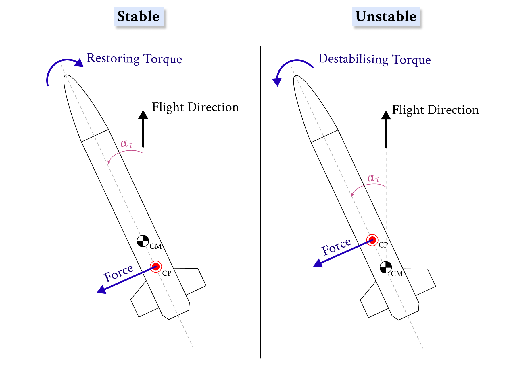
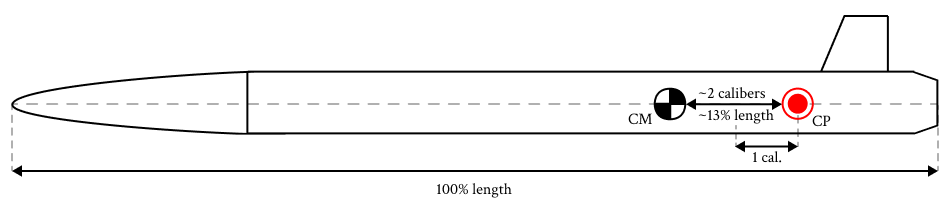
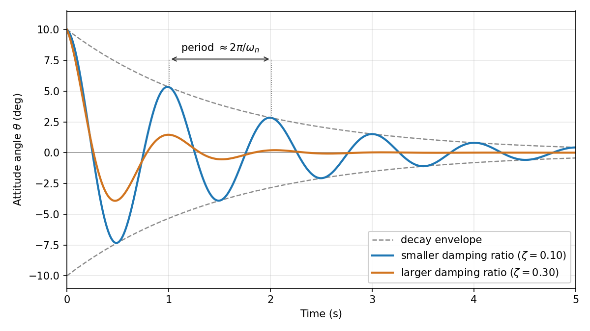

.. _aero_cp_stability:

================================
Center of Pressure and Stability
================================

Introduction
============

Stability is a central consideration in rocket design. Two rules of thumb are
widely repeated in amateur and student rocketry: the center of pressure must be
behind the center of gravity, and a static margin of one to two calibers is
generally desirable. This document explains the reasoning behind those rules
and distinguishes between three related but distinct quantities: **static
margin**, **stability margin**, and **dynamic stability**.

The presentation proceeds from physical principles to the exact definitions and
formulas used by RocketPy, illustrated throughout with the **Calisto** reference
rocket, introduced in the :ref:`firstsimulation` guide.

.. contents:: On this page
   :local:
   :depth: 2

.. jupyter-execute::
   :hide-code:
   :hide-output:

   # The Calisto reference rocket from the First Simulation guide, reused for
   # every worked example below. See the firstsimulation guide for the full
   # build. IMPORTANT: adjust the data paths below to match your own system.
   from rocketpy import Environment, SolidMotor, Rocket, Flight

   env = Environment(latitude=32.990254, longitude=-106.974998, elevation=1400)
   env.set_atmospheric_model(type="standard_atmosphere")

   Pro75M1670 = SolidMotor(
       thrust_source="../data/motors/cesaroni/Cesaroni_M1670.eng",
       dry_mass=1.815,
       dry_inertia=(0.125, 0.125, 0.002),
       nozzle_radius=33 / 1000,
       grain_number=5,
       grain_density=1815,
       grain_outer_radius=33 / 1000,
       grain_initial_inner_radius=15 / 1000,
       grain_initial_height=120 / 1000,
       grain_separation=5 / 1000,
       grains_center_of_mass_position=0.397,
       center_of_dry_mass_position=0.317,
       nozzle_position=0,
       burn_time=3.9,
       throat_radius=11 / 1000,
       coordinate_system_orientation="nozzle_to_combustion_chamber",
   )

   rocket = Rocket(
       radius=127 / 2000,
       mass=14.426,
       inertia=(6.321, 6.321, 0.034),
       power_off_drag="../data/rockets/calisto/powerOffDragCurve.csv",
       power_on_drag="../data/rockets/calisto/powerOnDragCurve.csv",
       center_of_mass_without_motor=0,
       coordinate_system_orientation="tail_to_nose",
   )
   rocket.add_motor(Pro75M1670, position=-1.255)
   rocket.set_rail_buttons(
       upper_button_position=0.0818,
       lower_button_position=-0.618,
       angular_position=45,
   )
   rocket.add_nose(length=0.55829, kind="vonKarman", position=1.278)
   rocket.add_trapezoidal_fins(
       n=4,
       root_chord=0.120,
       tip_chord=0.060,
       span=0.110,
       cant_angle=0.0,
       position=-1.04956,
       airfoil=("../data/airfoils/NACA0012-radians.txt", "radians"),
   )
   rocket.add_tail(
       top_radius=0.0635, bottom_radius=0.0435, length=0.060, position=-1.194656
   )

   test_flight = Flight(
       rocket=rocket, environment=env, rail_length=5.2, inclination=85, heading=0
   )

Part 1: Physical principles
============================

Static stability
-----------------

.. admonition:: Static stability
   :class: note

   A rocket is **statically stable** if, when a disturbance pushes its nose
   away from the flight direction, the aerodynamic forces generate a
   restoring moment that returns it toward that direction.

   An **unstable** rocket exhibits the opposite behavior: a disturbance is
   never corrected, and the rocket tumbles.

Whether a restoring moment exists depends on the relative position of two
points along the rocket's axis: the **center of mass** and the **center of
pressure**:

- **Center of mass (CM), also called center of gravity (CG).** The point about
  which the rocket's mass is balanced, and about which the rocket rotates in
  flight. In RocketPy this quantity is ``Rocket.center_of_mass``, a function of
  time since propellant consumption shifts it.

- **Center of pressure (CP).** The point at which the net aerodynamic force can
  be considered to act. At a small angle to the airflow, a sideways ("normal")
  force is generated, and the CP is its effective point of application. In
  RocketPy this quantity is ``Rocket.cp_position``, a function of Mach number
  (see :ref:`cp_ac_np` below for its exact meaning).

The relative position of these two points determines stability:

.. admonition:: The stability rule
   :class: important

   If the **center of pressure is located behind the center of mass** (toward
   the tail), the rocket is stable.

   If the center of pressure is located ahead of the center of mass the rocket
   is unstable.

   The aerodynamic force acting at the CP creates a torque about the CM.
   When the CP is aft of the CM the torque is restoring (left); when the CP
   is forward of the CM the torque grows the disturbance (right).

.. _cp_ac_np:

Center of pressure, aerodynamic center and neutral point
---------------------------------------------------------

Rocketry speaks of the center of pressure, and for most rockets that is all
that is needed. Strictly, three points are involved, and RocketPy names each
one:

.. list-table::
   :header-rows: 1
   :widths: 22 44 34

   * - Point
     - What it is
     - RocketPy
   * - **Center of pressure**
     - Where the total aerodynamic force acts: the pitch moment divided by the
       normal force, :math:`C_m / C_N`.
     - ``Rocket.center_of_pressure(alpha, mach)``
   * - **Aerodynamic center**
     - Where the *change* of the force acts when the angle of attack changes a
       little, starting from zero angle:
       :math:`C_{m,\alpha} / C_{N,\alpha}`.
     - ``Rocket.aerodynamic_center``, also available as ``Rocket.cp_position``
       (functions of Mach number)
   * - **Neutral point**
     - The same as the aerodynamic center, but starting from the angle of
       attack the rocket is actually flying at.
     - ``Rocket.neutral_point(alpha, mach)``

Stability depends on how the force *changes* with the angle, so the point that
decides it is the aerodynamic center (or the neutral point, at an angle). In
practice:

- **Most rockets**, built from nose cones, fins, tails or a
  ``LinearGenericSurface``: the three points are the same, so "center of
  pressure" is exact.
- **Lift that is not proportional to the angle**, such as a body-lift term: the
  points agree at zero angle and separate as the angle grows. The stability
  margin uses the neutral point.
- **A force at zero angle**, such as a deflected control surface or a canted
  single fin: the center of pressure is meaningless here, so use
  ``Rocket.aerodynamic_center``.

The rest of this page says "center of pressure" where the first case is meant
or the difference does not matter, and uses the precise name where it does.

.. Role of the fins
.. -----------------

.. Fins are the primary means of shifting the CP toward the tail. As large
.. lifting surfaces positioned far aft, they move the rocket's aggregate center
.. of pressure behind the center of mass, establishing the restoring lever arm.
.. Nose cones and outward-flaring transitions tend to move the CP forward and are
.. destabilizing in isolation; the fins must more than compensate for this
.. effect.

.. Increasing fin size, moving the fins aft, or adding mass to the nose (which
.. moves the CM forward) are the standard corrective measures for an unstable
.. design, since each increases the distance by which the CP trails the CM.

Part 2: Static margin
=====================

Definition
----------

.. admonition:: Static margin
   :class: note

   The **static margin** is the distance between the **CM** and the **CP**,
   expressed in **calibers**, where one caliber equals the body diameter.

   .. math::
      :label: static_margin_intro

      \text{static margin} =
          \frac{(\text{CP position}) - (\text{CM position})}{\text{diameter}}
          \;\;[\text{calibers}]

   - A **positive** static margin indicates that the CP is behind the CM, and
     therefore that the rocket is stable. A margin of two calibers indicates
     that the two points are separated by two body diameters.
   - A **negative** static margin indicates that the CP is ahead of the CM, and
     therefore that the rocket is unstable.

   The diameter is used as the reference length because it is the natural
   length scale of the aerodynamics: the normal force generated by a body
   scales with its cross-sectional area. This convention is widely used in
   rocketry.

Here is a plot of the static margin of the Calisto rocket over time. The 
variation of the static margin here is due to the forward shift of the center of
mass as the motor burns and propellant is consumed. The right-hand axis
expresses the same margin as a percentage of body length (discussed in
:ref:`percent_of_length`):

.. jupyter-execute::

   rocket.plots.static_margin()

Recommended margin range
------------------------

The following ranges are widely used design rules of thumb, not precise or
authoritative thresholds:

- **Below approximately 1 caliber:** marginal. Manufacturing tolerances, added
  nose-cone mass, or a shifted CG can be enough to make the rocket unstable.
- **Approximately 1 to 2 calibers:** the standard target range for most
  rockets, and the most common recommendation in hobby and student rocketry.
- **Approximately 2 to 3 calibers:** another common target range for high-power
  rockets, providing extra margin for the CG shift that occurs as the motor
  burns.
- **Above approximately 4 calibers (over-stable):** also undesirable, for the
  reasons described below.

**These figures are rules of thumb, not objective truths**: the transition
between ranges is gradual and depends on the specific rocket, so a margin
just outside one of them does not mean the rocket will not fly safely. Falling
within a target range also does not by itself guarantee good flight behavior.

.. admonition:: Excessive static margin
   :class: warning

   An over-stable rocket has a strong restoring moment, so in a crosswind it
   turns into the wind and drifts further downwind ("weathercocking"). Aim for
   enough margin to keep the rocket reliably stable, rather than the largest
   margin achievable. The flight studies in :ref:`stability_in_flight` examine
   how much this actually affects a real flight.

.. _percent_of_length:

Margin as a percentage of length
--------------------------------

An alternative convention expresses the margin as a **percentage of the
rocket's overall length** rather than in calibers:

.. math::

   \text{margin (\% of length)} =
       \frac{(\text{CP position}) - (\text{CM position})}{\text{body length}}
       \times 100

   The same CM-to-CP distance expressed against two reference lengths: the
   body diameter (one caliber) and the overall body length. Both numbers
   describe the identical physical gap.

This measures the identical physical distance as the caliber margin,
normalized by the total length instead of the diameter, as illustrated
above. RocketPy exposes the overall length as
:attr:`rocketpy.Rocket.length`, defined as the axial span from the nose tip
to the aft-most point of the rocket, whether that is an aerodynamic surface
or the motor nozzle if it extends further aft. Measuring it needs a nose cone
and at least one of a tail, a fin set or a motor. For a rocket without them,
such as one described only by a :class:`rocketpy.GenericSurface`, give the
``length`` argument when creating the ``Rocket``; otherwise the percentage is
left out of the prints and plots.

For Calisto (from :ref:`firstsimulation`), with a length of **2.53 m** and a 
fineness ratio of approximately 20, the two conventions yield:

.. list-table::
   :header-rows: 1
   :widths: 40 30 30

   * - Condition
     - Calibers
     - % of length
   * - Lift-off (``t = 0``)
     - ``2.20 c``
     - ``11.0 %``
   * - Burnout (``t = 3.9 s``)
     - ``3.11 c``
     - ``15.6 %``

As a rule of thumb, a percent-of-length margin of roughly **8 to 15%** is a
commonly cited target, with the lower bound the firmer of the two. For a
typical rocket with a fineness ratio near 10, one caliber is about 10% of the
length, so this range corresponds to the familiar 1 to 2 calibers. The two
conventions only diverge for unusually short or slender rockets, which is
precisely where the percentage form is meant to help. Like the caliber ranges,
these are **informal guidelines rather than authoritative thresholds**.

.. admonition:: Why express margin as a percent of length?
   :class: note

   The percent-of-length convention fixes a **gap in the caliber measure**: the
   caliber says nothing about the rocket's overall length. Two rockets with
   a static margin of 2 calibers, one short and one long and slender, don't
   necessarily behave the same in flight.
   
   The slender rocket has
   **substantially greater** rotational inertia (which scales with length
   squared) and a longer aerodynamic damping arm. Expressing the margin as
   a fraction of length scales the required
   physical margin with rocket size. This is a rough correction for
   slenderness.

.. _stability_margin_part:

Part 3: Stability margin
========================

The **stability margin** is the same center-of-mass-to-center-of-pressure 
distance, in the same calibers, but with the center of pressure taken at the
rocket's **actual flight condition**, its Mach number and angle of attack, 
rather than at rest.

Writing :math:`z_\text{cm}(t)` for the center of mass, with positions measured
along the rocket toward the nose, and :math:`2R` for the body diameter (one
caliber), the two margins have the same form and differ only in the
center-of-pressure reference they subtract:

.. math::

   \text{static margin}(t) &= \frac{z_\text{cm}(t) - z_\text{AC}(M = 0)}{2R}, \\
   \text{stability margin}(\alpha, M, t) &= \frac{z_\text{cm}(t) - z_\text{NP}(\alpha, M)}{2R}.

- The static margin uses the **aerodynamic center** at zero airspeed,
  :math:`z_\text{AC}(M = 0)`: the center of pressure of the rocket at a small
  angle of attack. It is a fixed reference, so the static margin varies only
  through the center of mass, that is, with time.
- The stability margin uses the **neutral point** :math:`z_\text{NP}(\alpha, M)`:
  the aerodynamic center taken at the actual Mach number and angle of attack.
  Because that reference moves with the flow, the stability margin depends on
  angle of attack and Mach number as well as time.

For a rocket built from the pre-set surfaces both are simply the center of
pressure (:ref:`cp_ac_np`). Both margins are positive when the center of
pressure is behind the center of mass.

The static margin and the stability margin are the same underlying
quantity, evaluated under different
conditions:

.. list-table::
   :header-rows: 1
   :widths: 24 24 26

   * -
     - **Static margin**
     - **Stability margin**
   * - Depends on
     - Time only
     - Angle of attack, Mach number **and** time
   * - Evaluated at
     - Zero incidence, zero airspeed (``M = 0``)
     - *Any* angle of attack and Mach number (an aerodynamic map)
   * - Answers
     - Stability at rest
     - Stability at any chosen flow state
   * - RocketPy
     - ``Rocket.static_margin`` (function of ``t``)
     - ``Rocket.stability_margin`` (function of ``M, t``, at zero angle of
       attack); at another angle, from ``Rocket.neutral_point(alpha, mach)``

The margin varies for up to three independent reasons:

**1. Center-of-mass displacement (time).** As the motor consumes propellant the
CM moves. This changes the CM-to-CP distance.

**2. Center-of-pressure displacement (Mach number).** Aerodynamic surfaces
effectivenss (e.g. fins) varies with speed, causing the CP
to shift with Mach number.

**3. Center-of-pressure displacement (angle of attack).** For a rocket
carrying a surface that generates lift nonlinearly with incidence, the center
of pressure also migrates with the angle of attack. RocketPy's pre-set
geometric surfaces (``NoseCone``, ``TrapezoidalFins``,
``EllipticalFins``, ``FreeFormFins``, ``Tail``) are all linear in
incidence, so a rocket built only from them never sees this effect. It shows up
when a surface is added as a :class:`rocketpy.GenericSurface` with a nonlinear
coefficient, for example a Galejs body-lift term.

The flight stability margin
----------------------------

``Flight.stability_margin`` computes the stability margin at the angle of
attack, Mach number and time of each instant of the simulated flight.
The angle only matters for a rocket with a surface that is nonlinear in it.

.. jupyter-execute::

   test_flight.prints.stability_margin()

``Flight.plots.stability_margin_data()`` plots this curve for the pitch and yaw
planes, with a percent-of-length axis on the right:

.. jupyter-execute::

   test_flight.plots.stability_margin_data()

.. tip::

   The **out-of-rail stability margin** is frequently the most significant
   single value: it is the margin at the instant of rail departure, when the
   rocket is slowest and most susceptible to wind disturbance. A recommended
   design practice is to ensure this value is suficcient. The out-of-rail
   instant is examined in detail in :ref:`stability_in_flight`.

.. _part_dynamic:

Part 4: Dynamic stability
=========================

The static margin has a fundamental limitation: it indicates only the *sign*
of the restoring moment, not the rocket's actual dynamic behavior. A positive
margin guarantees the existence of a restoring tendency but provides no
information regarding the rate of return, the presence of overshoot, or
whether resulting oscillations decay or persist. These characteristics are
described by **dynamic stability**.

.. jupyter-execute::
   :hide-code:
   :hide-output:

   import numpy as np
   import matplotlib.pyplot as plt

   def build_rocket(center_of_mass_without_motor=0.0, lateral_inertia=6.321,
                    mass=14.426, motor=Pro75M1670):
       """Calisto with four adjustable parameters. Shifting the dry center of
       mass toward the nose (positive) raises the static margin; toward the tail
       (negative) lowers it. The lateral moment of inertia is adjustable
       separately, which changes the dynamic response without changing the
       static margin. The dry mass (in kilograms) and the motor can also be
       swapped.
       Everything else, including the aerodynamics, is fixed.
       """
       rocket = Rocket(
           radius=127 / 2000,
           mass=mass,
           inertia=(lateral_inertia, lateral_inertia, 0.034),
           power_off_drag="../data/rockets/calisto/powerOffDragCurve.csv",
           power_on_drag="../data/rockets/calisto/powerOnDragCurve.csv",
           center_of_mass_without_motor=center_of_mass_without_motor,
           coordinate_system_orientation="tail_to_nose",
       )
       rocket.add_motor(motor, position=-1.255)
       rocket.add_nose(length=0.55829, kind="vonKarman", position=1.278)
       rocket.add_trapezoidal_fins(
           n=4, root_chord=0.120, tip_chord=0.060, span=0.110,
           cant_angle=0.0, position=-1.04956,
           airfoil=("../data/airfoils/NACA0012-radians.txt", "radians"),
       )
       rocket.add_tail(
           top_radius=0.0635, bottom_radius=0.0435, length=0.060, position=-1.194656
       )
       return rocket

   def windy_site(wind_speed):
       """A standard atmosphere with a constant eastward crosswind, in m/s."""
       site = Environment(latitude=32.990254, longitude=-106.974998, elevation=1400)
       site.set_atmospheric_model(
           type="custom_atmosphere", wind_u=wind_speed, wind_v=0
       )
       return site

The attitude oscillator
-----------------------

A stable rocket disturbed by angle :math:`\theta` behaves as a damped
spring-mass oscillator:

.. math::

   I_L\,\ddot\theta + C_2\,\dot\theta + C_1\,\theta = 0

with three governing parameters:

- :math:`C_1`, the **corrective (restoring) moment coefficient**, analogous
  to a spring constant. It is proportional to the stability margin:

  .. math::

     C_1 = \bar q\, A\, C_{N,\alpha}\, (z_\text{cm} - z_\text{NP})

  where :math:`\bar q` is the dynamic pressure and :math:`z_\text{NP}` the
  neutral point of :ref:`Part 3 <stability_margin_part>`. A larger margin or
  higher airspeed produces a stiffer restoring moment.
- :math:`C_2`, the **damping moment coefficient**, analogous to a damping
  coefficient. It has an aerodynamic part and a jet-damping part from the
  motor:

  .. math::

     C_2 &= C_{2,\text{aero}} + C_{2,\text{jet}}, \\
     C_{2,\text{aero}} &= \tfrac12 \rho V A \sum_i \frac{A_i}{A}\,
         C_{N,\alpha,i}\, (z_i - z_\text{cm})^2, \\
     C_{2,\text{jet}} &= |\dot m|\, (z_\text{n} - z_\text{cm})^2 + \dot I_L.

  The aerodynamic part comes from every surface resisting the rotation, with
  :math:`z_i` the position of surface :math:`i`; a surface with a negative
  slope, such as a boat tail, takes damping away. The jet part comes from the
  exhaust, which leaves the nozzle (at :math:`z_\text{n}`) moving sideways
  with the rocket and carries angular momentum away, while the lateral inertia
  lost with the consumed propellant gives part of it back
  (:math:`\dot I_L < 0`). Jet damping matters at rail exit, where the airspeed
  is low; by burnout the aerodynamic part dominates.
- :math:`I_L`, the **lateral moment of inertia** about the center of mass,
  representing the rotational inertia opposing angular acceleration.

These parameters determine the two quantities that characterize the dynamic
response:

.. math::

   \omega_n = \sqrt{\frac{C_1}{I_L}}
   \quad(\text{natural frequency}),
   \qquad
   \zeta = \frac{C_2}{2\sqrt{C_1\,I_L}}
   \quad(\text{damping ratio}).

- The **natural frequency** :math:`\omega_n` sets the oscillation rate, in
  rad/s (divide by :math:`2\pi` for Hz), and increases with static margin and
  airspeed.
- The **damping ratio** :math:`\zeta` sets how quickly the oscillation
  decays. Rockets are normally *underdamped* (:math:`\zeta < 1`), oscillating
  with the amplitude shrinking over several cycles.

   Attitude response to a single disturbance. The spacing between peaks is set
   by the natural frequency; the rate at which the peaks shrink toward zero, the
   dashed envelope, is set by the damping ratio. A larger damping ratio decays
   faster for the same natural frequency.

RocketPy exposes each of these quantities on the ``Flight`` object:
``corrective_moment_coefficient`` (:math:`C_1`),
``damping_moment_coefficient`` (:math:`C_2`),
``pitch_natural_frequency``, ``pitch_damping_ratio``, and the corresponding
``yaw_*`` quantities. While the rocket is on the rail it cannot swing, so the
natural frequency and damping ratio are zero up to rail departure. They are
also zero whenever there is no restoring moment (:math:`C_1 \le 0`).
``Flight.prints.dynamic_stability()`` summarizes them at the key ascent
instants, rail departure and burnout, together with the roll rate at burnout:

.. jupyter-execute::

   test_flight.prints.dynamic_stability()

``Flight.plots.dynamic_stability_data()`` plots natural frequency and damping
ratio as functions of time, with roll rate overlaid.

.. jupyter-execute::

   test_flight.plots.dynamic_stability_data()

Response to a disturbance
-------------------------

The natural frequency and damping ratio are easier to judge as a curve.
``disturbance_response`` tilts the rocket by a small angle (5 degrees by
default), releases it, and returns the angle over time as it swings back. It
exists in two forms:

- ``Rocket.disturbance_response`` needs no flight simulation. You choose the
  flight condition:

  - ``speed``: the airspeed, in m/s.
  - ``time``: the time since ignition, in seconds, which sets the mass, the
    inertia and whether the motor is burning. Default is 0.
  - ``density``: the air density, in kg/m³. Default is 1.225 (sea level).
  - ``speed_of_sound``: in m/s, used to find the Mach number. Default is
    340.29 (sea level).

- ``Flight.disturbance_response`` reads the airspeed, the air density and the
  angle of attack from the flight. You only choose the instant:

  - ``time``: the instant of the flight, in seconds. It must be after the
    rocket leaves the rail.

Both forms also accept:

- ``disturbance``: the angle the rocket is tilted by, in degrees. Default is 5.
- ``plane``: ``"pitch"`` or ``"yaw"``. The two only differ for a rocket that is
  not axisymmetric. Default is ``"pitch"``.
- ``duration``: how long to follow the response, in seconds. By default, long
  enough for the oscillation to settle.

Some uses:

- **Check the response to a gust at rail exit**, where the rocket is slowest
  and a crosswind disturbs it most.
- **Compare designs before flying them**: larger fins, nose ballast or a
  different motor change how fast the rocket swings back and how long it keeps
  swinging.
- **See what a damping ratio means**: count the swings before the curve
  settles.

The response of the reference flight at rail exit:

.. jupyter-execute::

   response = test_flight.disturbance_response(
       time=test_flight.out_of_rail_time,
       disturbance=3,  # degrees
   )
   response.plot()

The same question without a flight, comparing a low and a high airspeed just
after ignition:

.. jupyter-execute::

   from rocketpy import Function

   slow = rocket.disturbance_response(speed=25, time=0.4, disturbance=3)
   fast = rocket.disturbance_response(speed=60, time=0.4, disturbance=3)
   print("25 m/s:", slow.title)
   print("60 m/s:", fast.title)
   Function.compare_plots(
       [(slow, "25 m/s"), (fast, "60 m/s")],
       lower=0,
       upper=20,
       title="Response to a 3° disturbance",
       xlabel="Time after the disturbance (s)",
       ylabel="Angle (°)",
   )

.. note::

   The response holds the airspeed, the air and the rocket's mass fixed, so it
   is a snapshot of one instant. During the motor burn the airspeed changes
   while the rocket swings, so the real motion differs. To see it, fly the
   rocket in a crosswind (:ref:`Part 5 <stability_in_flight>`). The response is
   also only valid for small angles.

.. _stability_in_flight:

Part 5: Stability in a real flight
==================================

Parts 1 to 4 defined each stability quantity on a single nominal flight. This
part watches those quantities at work: the wind disturbance at rail exit, the
margin and damping correcting it, and how stable the rocket stays across the
spread of conditions a real launch day brings.

.. admonition:: The out-of-rail instant
   :class: note  

   Rail departure is the most critical moment of a rocket's flight. The rail
   buttons hold its orientation until the last one clears the rail. From then
   on, aerodynamics takes over, right as the rocket is at its slowest and
   least able to resist a disturbance.

Stall is not modeled
--------------------

**RocketPy does not model stall.** On a real fin, lift grows with angle of
attack only up to a point. Past roughly 10 to 15 degrees the flow
**separates** from the surface, the lift collapses, and the drag climbs
sharply: the fin *stalls*. A stalled fin **stops correcting**, and the rocket
can tumble out of controlled flight.

RocketPy's Barrowman fins never do this. A fin takes its lift *slope* at zero
angle of attack and applies that **same slope at every angle**, so its normal
force keeps growing without limit:

.. jupyter-execute::
   :hide-code:

   # Left: the measured NACA 0012 lift curve (the file stores angle in radians).
   # Right: the RocketPy fin built from that same airfoil. RocketPy keeps only
   # the curve's slope at 0 degrees, so the fin's coefficient never stalls.
   airfoil = np.loadtxt("../data/airfoils/NACA0012-radians.txt", delimiter=",")
   aoa_deg, cl = np.degrees(airfoil[:, 0]), airfoil[:, 1]

   fin = build_rocket().fins[0]
   clalpha = fin.clalpha(0.1)                 # normal-force slope at low Mach
   aoa = np.linspace(0, 15, 200)
   cn_fin = clalpha * np.radians(aoa)
   peak = np.argmax(cl[aoa_deg <= 20])        # airfoil peak, just before stall

   fig, (axL, axR) = plt.subplots(1, 2, figsize=(10, 3.8))

   shown = aoa_deg <= 15
   axL.plot(aoa_deg[shown], cl[shown], "-o", color="#c0392b", lw=2, ms=4)
   axL.annotate("stall", xy=(aoa_deg[peak], cl[peak]),
                xytext=(aoa_deg[peak] + 1.5, cl[peak] + 0.005),
                fontsize=11, fontweight="bold", color="#c0392b",
                arrowprops=dict(arrowstyle="->", color="#c0392b"))
   axL.set_title("Real airfoil (NACA 0012 data)", fontweight="bold")
   axL.set_ylabel(r"lift coefficient  $C_L$")

   axR.plot(aoa, cn_fin, color="#2980b9", lw=2.4)
   axR.text(0.05, 0.9, "linear: never stalls", transform=axR.transAxes,
            fontsize=11, fontweight="bold", color="#2980b9")
   axR.set_title("RocketPy fin (Barrowman)", fontweight="bold")
   axR.set_ylabel(r"normal-force coefficient  $C_N$")

   for ax in (axL, axR):
       ax.set_xlabel("angle of attack (deg)")
       ax.set_xlim(0, 15)
       ax.set_ylim(0, 0.9)
       ax.grid(alpha=0.25)
       ax.spines[["top", "right"]].set_visible(False)
   fig.tight_layout()
   plt.show()

The airfoil on the left carries the whole story of the flow: lift rises,
**peaks near 9 degrees, then falls off a cliff** as the flow separates. The
RocketPy fin on the right, built from that very airfoil, **keeps the same
initial slope forever**.

So **a high computed rail-exit angle of attack marks a failure, not a
survivable condition.** The simulation shows the rocket swinging back into
line even past the angle where a real fin would have stalled. In the examples
below, a large angle of attack is a warning sign.

To actually simulate stall, or any other measured nonlinear aerodynamics,
provide the coefficients directly with a generic surface (see
:ref:`genericsurfaces`).

The angle of attack at rail exit
--------------------------------

At rail departure the body points along the rail. But the air it meets is the
vector sum of the rocket's own velocity and the wind. That gives an angle of
attack of approximately

.. math::

   \alpha_\text{exit} \approx \arctan\!\left(\frac{V_\text{wind}}{V_\text{exit}}\right),

where :math:`V_\text{wind}` is the crosswind and :math:`V_\text{exit}` is the
out-of-rail velocity. Only their *ratio* matters: a stronger wind and a
slower exit velocity push the angle up the same way. The flight below, the
nominal Calisto in an 8 m/s crosswind, checks the estimate against a real
simulation:

.. jupyter-execute::

   import numpy as np

   windy_flight = Flight(
       rocket=build_rocket(), environment=windy_site(5),
       rail_length=5.2, inclination=85, heading=0, terminate_on_apogee=True,
   )

   v_exit = windy_flight.out_of_rail_velocity
   aoa_exit = windy_flight.angle_of_attack(windy_flight.out_of_rail_time)
   estimate = np.degrees(np.arctan(5 / v_exit))

   print(f"out-of-rail velocity : {v_exit:5.1f} m/s")
   print(f"rail-exit AoA        : {aoa_exit:5.2f} deg   (simulated)")
   print(f"arctan(wind / V_exit): {estimate:5.2f} deg   (geometric estimate)")

The simulated angle tracks the arctangent estimate closely. This is the
disturbance set the instant the rail lets go, and the rest of the flight has
to correct it. Keeping it well below the stall range of the fins is the
first stability requirement of any launch.

The disturbance, corrected
--------------------------

The damped oscillation from :ref:`part_dynamic` can be represented in a flight
simulation. Tracking the angle of
attack after rail exit shows the rocket swinging back toward the relative
wind, and the swing dying away:

.. jupyter-execute::

   t0 = windy_flight.out_of_rail_time
   t = np.linspace(t0, t0 + 4, 400)
   aoa = [windy_flight.angle_of_attack(ti) for ti in t]

   fig, ax = plt.subplots(figsize=(8, 4))
   ax.plot(t, aoa)
   ax.axvline(t0, color="0.6", ls="--", lw=1, label="rail exit")
   ax.set_xlabel("Time (s)")
   ax.set_ylabel("Angle of attack (deg)")
   ax.set_title("Response to the rail-exit disturbance (8 m/s crosswind)")
   ax.legend()
   ax.grid(True)
   plt.show()

\\
Every stability quantity from earlier parts shows up here. The rocket returns
toward zero at all because its **stability margin**
(:ref:`stability_margin_part`) is positive. The center of pressure sits
behind the center of mass, so the aerodynamic force restores rather than
diverges. The *rate* of the wobble is the **natural frequency**. The *speed*
it settles at is the **damping ratio** (:ref:`part_dynamic`).

Stability across a launch day
-----------------------------

**A single nominal flight is not what a launch actually delivers.** The wind
shifts from minute to minute. The finished mass differs from the design
value. The center of mass is never exactly where the drawing puts it. That
spread of conditions moves two quantities that matter at rail exit: the
stability margin and the angle of attack.

RocketPy's Monte Carlo tooling measures exactly that. The ``Stochastic*``
classes wrap the nominal environment, rocket, motor and flight, and attach a
spread to each uncertain input. :class:`rocketpy.MonteCarlo` then runs the
flight many times, each with a fresh draw, and saves the results. Here the
balance (dry mass and center of mass), the motor's total impulse and burn
time, and the crosswind are dispersed:

.. code-block:: python

   from rocketpy import MonteCarlo, NoseCone, TrapezoidalFins, Tail
   from rocketpy.stochastic import (
       StochasticEnvironment,
       StochasticRocket,
       StochasticSolidMotor,
       StochasticFlight,
       StochasticNoseCone,
       StochasticTrapezoidalFins,
       StochasticTail,
   )

   # Environment: 3 m/s mean crosswind, scaled by a normal factor so the wind
   # spans roughly 3 +/- 2.5 m/s from flight to flight.
   stochastic_env = StochasticEnvironment(
       environment=windy_site(3),
       wind_velocity_x_factor=(1.0, 0.42, "normal"),
   )

   # Motor: total impulse and burn time vary together, the way two motors from
   # the same production lot differ. Roughly +/- 3%, a typical manufacturing
   # tolerance; reshapes the whole thrust curve to match each draw.
   stochastic_motor = StochasticSolidMotor(
       solid_motor=Pro75M1670,
       total_impulse=(6026, 180, "normal"),  # newton-seconds
       burn_out_time=(3.9, 0.12, "normal"),  # seconds
   )

   # Rocket: same Calisto, but the dry mass and the balance point vary too.
   # The surfaces are added back with no spread (fixed geometry).
   stochastic_rocket = StochasticRocket(
       rocket=rocket,
       mass=(14.426, 0.4, "normal"),                        # dry mass, kg
       center_of_mass_without_motor=(0.0, 0.03, "normal"),  # balance, m
   )
   stochastic_rocket.add_motor(stochastic_motor, position=(-1.255, 0))
   fixed_surface = {
       NoseCone: (StochasticNoseCone, stochastic_rocket.add_nose),
       TrapezoidalFins: (StochasticTrapezoidalFins,
                         stochastic_rocket.add_trapezoidal_fins),
       Tail: (StochasticTail, stochastic_rocket.add_tail),
   }
   # Re-add each surface with no spread; a (value, 0) position means "fixed".
   for surface, position in rocket.aerodynamic_surfaces:
       stochastic_surface, add = fixed_surface[type(surface)]
       add(stochastic_surface(surface), (position.z, 0))

   # Flight: fixed rail and launch angles; stop each run at apogee to save time.
   base_flight = Flight(
       rocket=rocket, environment=windy_site(5),
       rail_length=5.2, inclination=85, heading=0, terminate_on_apogee=True,
   )
   stochastic_flight = StochasticFlight(flight=base_flight, terminate_on_apogee=True)

   # A data_collector callback receives each finished flight and returns a value,
   # here the rail-exit angle of attack (not one of the standard exports).
   analysis = MonteCarlo(
       filename="../data/monte_carlo/stability_dispersion",
       environment=stochastic_env,
       rocket=stochastic_rocket,
       flight=stochastic_flight,
       data_collector={
           "rail_exit_aoa": lambda f: f.angle_of_attack(f.out_of_rail_time),
       },
   )
   analysis.simulate(number_of_simulations=100, include_function_data=False)

   analysis.set_results()
   margins = np.array(analysis.results["out_of_rail_stability_margin"])
   aoa_exits = np.array(analysis.results["rail_exit_aoa"])

.. jupyter-execute::
   :hide-code:
   :hide-output:

   # The docs build does not run the Monte Carlo above; it loads the committed
   # output below instead. Regenerate it by running the code above (which writes
   # to the same path) after changing any distribution.
   import json

   results_file = "../data/monte_carlo/stability_dispersion.outputs.txt"
   with open(results_file, encoding="utf-8") as f:
       records = [json.loads(line) for line in f]
   margins = np.array([r["out_of_rail_stability_margin"] for r in records])
   aoa_exits = np.array([r["rail_exit_aoa"] for r in records])

The two quantities are now distributions over a simulated launch day:

.. jupyter-execute::

   fig, (axm, axa) = plt.subplots(1, 2, figsize=(10, 4))
   axm.hist(margins, bins=20, color="#4c72b0")
   axm.axvspan(2.0, 3.0, color="green", alpha=0.12, label="2-3 cal target")
   axm.set_xlabel("Out-of-rail stability margin (cal)")
   axm.set_ylabel("Simulations")
   axm.legend()
   axa.hist(aoa_exits, bins=20, color="#c44e52")
   axa.axvline(10, color="k", ls="--", label="stall onset (~10 deg)")
   axa.set_xlabel("Rail-exit angle of attack (deg)")
   axa.legend()
   fig.suptitle(f"Launch-day dispersion ({margins.size} simulations)")
   fig.tight_layout()
   plt.show()

   print(f"out-of-rail margin : {np.percentile(margins, 5):.2f} to "
         f"{np.percentile(margins, 95):.2f} cal (5th-95th percentile)")
   print(f"rail-exit AoA      : 95th pct {np.percentile(aoa_exits, 95):.1f} deg, "
         f"worst {aoa_exits.max():.1f} deg")
   print(f"flights above stall: {100 * np.mean(aoa_exits > 10):.0f}%")

This is a concrete deliverable of a stability analysis. Not a single
margin, but a *distribution* read against the design thresholds. If a meaningful
fraction of flights cross either line, the rail, the mass or the margin needs 
another look before flying.

.. seealso::

   A full dispersion study varies every input, not just five, and runs the
   flights in parallel. ``analysis.simulate(..., parallel=True)`` does that,
   and the ``Stochastic*`` classes cover parachutes and rail buttons too. See
   :ref:`stochastic_usage` for the class walkthrough, and :ref:`MRS` for
   weighting a finished sample toward measured launch-day conditions.

Helper code
===========

Every worked example on this page is built on the same Calisto reference
rocket and a handful of small helper functions. Most of that code runs behind
the scenes so the examples above can stay focused on one idea at a time. It is
gathered here so it can be read and reused. The data-file paths are written
relative to the RocketPy ``docs`` directory; adjust them to your own setup.

.. code-block:: python

   import numpy as np
   import matplotlib.pyplot as plt

   from rocketpy import Environment, SolidMotor, Rocket, Flight

   # The Calisto reference rocket from the First Simulation guide, reused for
   # every worked example on this page.
   env = Environment(latitude=32.990254, longitude=-106.974998, elevation=1400)
   env.set_atmospheric_model(type="standard_atmosphere")

   Pro75M1670 = SolidMotor(
       thrust_source="../data/motors/cesaroni/Cesaroni_M1670.eng",
       dry_mass=1.815,
       dry_inertia=(0.125, 0.125, 0.002),
       nozzle_radius=33 / 1000,
       grain_number=5,
       grain_density=1815,
       grain_outer_radius=33 / 1000,
       grain_initial_inner_radius=15 / 1000,
       grain_initial_height=120 / 1000,
       grain_separation=5 / 1000,
       grains_center_of_mass_position=0.397,
       center_of_dry_mass_position=0.317,
       nozzle_position=0,
       burn_time=3.9,
       throat_radius=11 / 1000,
       coordinate_system_orientation="nozzle_to_combustion_chamber",
   )

   rocket = Rocket(
       radius=127 / 2000,
       mass=14.426,
       inertia=(6.321, 6.321, 0.034),
       power_off_drag="../data/rockets/calisto/powerOffDragCurve.csv",
       power_on_drag="../data/rockets/calisto/powerOnDragCurve.csv",
       center_of_mass_without_motor=0,
       coordinate_system_orientation="tail_to_nose",
   )
   rocket.add_motor(Pro75M1670, position=-1.255)
   rocket.set_rail_buttons(
       upper_button_position=0.0818,
       lower_button_position=-0.618,
       angular_position=45,
   )
   rocket.add_nose(length=0.55829, kind="vonKarman", position=1.278)
   rocket.add_trapezoidal_fins(
       n=4,
       root_chord=0.120,
       tip_chord=0.060,
       span=0.110,
       cant_angle=0.0,
       position=-1.04956,
       airfoil=("../data/airfoils/NACA0012-radians.txt", "radians"),
   )
   rocket.add_tail(
       top_radius=0.0635, bottom_radius=0.0435, length=0.060, position=-1.194656
   )

   test_flight = Flight(
       rocket=rocket, environment=env, rail_length=5.2, inclination=85, heading=0
   )

The design studies build fresh rockets and windy environments through two
small factories:

.. code-block:: python

   def build_rocket(center_of_mass_without_motor=0.0, lateral_inertia=6.321,
                    mass=14.426, motor=Pro75M1670):
       """Calisto with four adjustable parameters. Shifting the dry center of
       mass toward the nose (positive) raises the static margin; toward the tail
       (negative) lowers it. The lateral moment of inertia is adjustable
       separately, which changes the dynamic response without changing the
       static margin. The dry mass (in kilograms) and the motor can also be
       swapped.
       Everything else, including the aerodynamics, is fixed.
       """
       rocket = Rocket(
           radius=127 / 2000,
           mass=mass,
           inertia=(lateral_inertia, lateral_inertia, 0.034),
           power_off_drag="../data/rockets/calisto/powerOffDragCurve.csv",
           power_on_drag="../data/rockets/calisto/powerOnDragCurve.csv",
           center_of_mass_without_motor=center_of_mass_without_motor,
           coordinate_system_orientation="tail_to_nose",
       )
       rocket.add_motor(motor, position=-1.255)
       rocket.add_nose(length=0.55829, kind="vonKarman", position=1.278)
       rocket.add_trapezoidal_fins(
           n=4, root_chord=0.120, tip_chord=0.060, span=0.110,
           cant_angle=0.0, position=-1.04956,
           airfoil=("../data/airfoils/NACA0012-radians.txt", "radians"),
       )
       rocket.add_tail(
           top_radius=0.0635, bottom_radius=0.0435, length=0.060, position=-1.194656
       )
       return rocket

   def windy_site(wind_speed):
       """A standard atmosphere with a constant eastward crosswind, in m/s."""
       site = Environment(latitude=32.990254, longitude=-106.974998, elevation=1400)
       site.set_atmospheric_model(
           type="custom_atmosphere", wind_u=wind_speed, wind_v=0
       )
       return site
