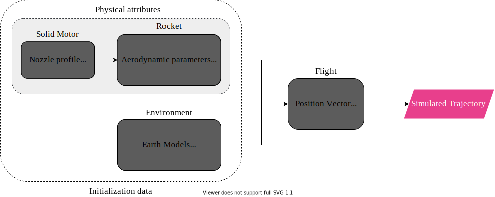

.. _firstsimulation:

First Simulation with RocketPy
==============================

Here we will show how to set up a complete simulation with RocketPy.

.. seealso::

    You can find all the code used in this page in the notebooks folder of the
    RocketPy repository. You can also run the code in Google Colab:

    .. grid:: auto

        .. grid-item::

            .. button-link:: https://github.com/RocketPy-Team/RocketPy/blob/master/docs/notebooks/getting_started.ipynb
                :ref-type: any
                :color: primary

                Notebook File

        .. grid-item::

            .. button-link:: https://colab.research.google.com/github/RocketPy-Team/rocketpy/blob/master/docs/notebooks/getting_started_colab.ipynb
                :ref-type: any
                :color: secondary

                Google Colab

RocketPy is structured into four main classes, each one with its own purpose:

- ``Environment`` - Keeps data related to weather.

- ``Motor`` - Subdivided into SolidMotor, HybridMotor and LiquidMotor. Keeps
  data related to rocket motors.

- ``Rocket`` - Keeps data related to a rocket.

- ``Flight`` - Runs the simulation and keeps the results.

By using these four classes, we can create a complete simulation of a rocket
flight.

The following image shows how the four main classes interact with each other to
generate a rocket flight simulation:

Setting Up a Simulation
-----------------------

A basic simulation with RocketPy is composed of the following steps:

1. Defining a ``Environment``, ``Motor`` and ``Rocket`` object.
2. Running the simulation by defining a ``Flight`` object.
3. Plotting/Analyzing the results.

.. tip::

    It is recommended that RocketPy is ran in a Jupyter Notebook. This way,
    the results can be easily plotted and analyzed.

The first step to set up a simulation, we need to first import the classes
we will use from RocketPy:

.. jupyter-execute::

    from rocketpy import Environment, SolidMotor, Rocket, Flight

.. note::

    Here we will use a SolidMotor as an example, but the same steps can be
    applied to Hybrid and Liquid motors.

Defining a Environment
----------------------

The ``Environment`` class is used to store data related to the weather and the
wind conditions of the launch site. The weather conditions are imported from
weather organizations such as NOAA and ECMWF.

To define a Environment object, we need to first specify some information
regarding the launch site:

.. jupyter-execute::

    env = Environment(latitude=32.990254, longitude=-106.974998, elevation=1400)

| This roughly corresponds to the location of Spaceport America, New Mexico.

Next, we need to specify the atmospheric model to be used. In this example,
we will get GFS forecasts data from tomorrow.

First we must set the date of the simulation. The date must be given in a tuple
with the following format: ``(year, month, day, hour)``.
The hour is given in UTC time. Here we use the datetime library to get the date
of tomorrow:

.. jupyter-execute::

    import datetime

    tomorrow = datetime.date.today() + datetime.timedelta(days=1)

    env.set_date(
        (tomorrow.year, tomorrow.month, tomorrow.day, 12)
    )  # Hour given in UTC time

| Now we set the atmospheric model to be used:

.. jupyter-execute::

    env.set_atmospheric_model(type="Forecast", file="GFS")

.. seealso::

    To learn more about the different types of atmospheric models and
    a better description of the initialization parameters, see
    `Environment Usage <https://colab.research.google.com/github/RocketPy-Team/rocketpy/blob/master/docs/notebooks/environment/environment_class_usage.html>`_.

We can see what the weather will look like by calling the ``info`` method:

.. jupyter-execute::

    env.info()

Defining a Motor
----------------

RocketPy can simulate **Solid**, **Hybrid** and **Liquid** motors. Each type of
motor has its own class: :class:`rocketpy.SolidMotor`,
:class:`rocketpy.HybridMotor` and :class:`rocketpy.LiquidMotor`.

.. seealso::

    To see more information about each class, see:

    .. grid:: auto

        .. grid-item::

            .. button-ref:: /user/motors/solidmotor
                :ref-type: doc
                :color: primary

                Solid Motors

        .. grid-item::

            .. button-ref:: /user/motors/hybridmotor
                :ref-type: doc
                :color: secondary

                Hybrid Motors

        .. grid-item::

            .. button-ref:: /user/motors/liquidmotor
                :ref-type: doc
                :color: success

                Liquid Motors

In this example, we will use a SolidMotor. To define a ``SolidMotor``, we need
to specify several parameters:

.. jupyter-execute::

    Pro75M1670 = SolidMotor(
        thrust_source="../data/motors/cesaroni/Cesaroni_M1670.eng",
        dry_mass=1.815,
        dry_inertia=(0.125, 0.125, 0.002),
        nozzle_radius=33 / 1000,
        grain_number=5,
        grain_density=1815,
        grain_outer_radius=33 / 1000,
        grain_initial_inner_radius=15 / 1000,
        grain_initial_height=120 / 1000,
        grain_separation=5 / 1000,
        grains_center_of_mass_position=0.397,
        center_of_dry_mass_position=0.317,
        nozzle_position=0,
        burn_time=3.9,
        throat_radius=11 / 1000,
        coordinate_system_orientation="nozzle_to_combustion_chamber",
    )

| We can see its characteristics by calling the info method:

.. jupyter-execute::

    Pro75M1670.info()

Defining a Rocket
-----------------

To create a complete ``Rocket`` object, we need to complete some steps:

1. Define the rocket itself by passing in the rocket's dry mass, inertia,
   drag coefficient and radius;
2. Add a motor;
3. Add, if desired, aerodynamic surfaces;
4. Add, if desired, parachutes;
5. Set, if desired, rail guides;
6. See results.

.. seealso::
    To learn more about each step, see :ref:`Rocket Class Usage <rocketusage>`

To create a ``Rocket`` object, we need to specify some parameters.

.. jupyter-execute::

    calisto = Rocket(
        radius=127 / 2000,
        mass=14.426,
        inertia=(6.321, 6.321, 0.034),
        power_off_drag="../data/rockets/calisto/powerOffDragCurve.csv",
        power_on_drag="../data/rockets/calisto/powerOnDragCurve.csv",
        center_of_mass_without_motor=0,
        coordinate_system_orientation="tail_to_nose",
    )

Next, we need to add a ``Motor`` object to the ``Rocket`` object:

.. jupyter-execute::

    calisto.add_motor(Pro75M1670, position=-1.255)

We can also add rail guides to the rocket. These are not necessary for a
simulation, but they are useful for a more realistic out of rail velocity and
stability calculation.

.. jupyter-execute::

    rail_buttons = calisto.set_rail_buttons(
        upper_button_position=0.0818,
        lower_button_position=-0.6182,
        angular_position=45,
    )

Then, we can add any number of Aerodynamic Components to the ``Rocket`` object.
Here we create a rocket with a nose cone, four fins and a tail:

.. jupyter-execute::

    nose_cone = calisto.add_nose(
        length=0.55829, kind="von karman", position=1.278
    )

    fin_set = calisto.add_trapezoidal_fins(
        n=4,
        root_chord=0.120,
        tip_chord=0.060,
        span=0.110,
        position=-1.04956,
        cant_angle=0.5,
        airfoil=("../data/airfoils/NACA0012-radians.txt","radians"),
    )

    tail = calisto.add_tail(
        top_radius=0.0635, bottom_radius=0.0435, length=0.060, position=-1.194656
    )

Finally, we can add any number of Parachutes to the ``Rocket`` object.

.. jupyter-execute::

    main = calisto.add_parachute(
        name="main",
        cd_s=10.0,
        trigger=800,      # ejection altitude in meters
        sampling_rate=105,
        lag=1.5,
        noise=(0, 8.3, 0.5),
    )

    drogue = calisto.add_parachute(
        name="drogue",
        cd_s=1.0,
        trigger="apogee",  # ejection at apogee
        sampling_rate=105,
        lag=1.5,
        noise=(0, 8.3, 0.5),
    )

We can then see if the rocket is stable by plotting the static margin:

.. jupyter-execute::

    calisto.plots.static_margin()

.. danger::

    Always check the static margin of your rocket.

    If it is **negative**, your rocket is **unstable** and the simulation
    will most likely **fail**.

    If it is unreasonably **high**, your rocket is **super stable** and the
    simulation will most likely **fail**.

To guarantee that the rocket is stable, the positions of all added components
must be correct. The ``Rocket`` class can help you with the ``draw`` method:

.. jupyter-execute::

    calisto.draw()

Running the Simulation
----------------------

To simulate a flight, we need to create a ``Flight`` object.
This object will run the simulation and store the results.

To do this, we need to specify the environment in which the
rocket will fly and the rocket itself. We must also specify the length of the
launch rail, the inclination of the launch rail and the heading of the launch
rail.

.. jupyter-execute::

    test_flight = Flight(
        rocket=calisto, environment=env, rail_length=5.2, inclination=85, heading=0
        )

All simulation information will be saved in the ``test_flight`` object.

RocketPy has two submodules to access the results of the simulation: ``prints``
and ``plots``. Each class has its ``prints`` and ``plots`` submodule imported as
an attribute. For example, to access the ``prints`` submodule of the ``Flight``
object, we can use ``test_flight.prints``.

Also, each class has its own methods to quickly access all the information, for
example, the ``test_flight.all_info()`` for visualizing all the plots and
the ``test_flight.info()`` for a summary of the numerical results.

Bellow we describe how to access and manipulate the results of the simulation.

Accessing numerical results
---------------------------

.. note::

    All the methods that are used in this section can be accessed at once by
    running ``test_flight.info()``.

You may want to start by checking the initial conditions of the simulation. This
will allow you to check the state of the rocket at the time of ignition:

.. jupyter-execute::

    test_flight.prints.initial_conditions()

Also important to check the surface wind conditions at launch site and the
conditions of the launch rail:

.. jupyter-execute::

    test_flight.prints.surface_wind_conditions()

.. jupyter-execute::

    test_flight.prints.launch_rail_conditions()

Once we have checked the initial conditions, we can check the conditions at the
out of rail state, which is the first important moment of the flight. After this
point, the rocket will start to fly freely:

.. jupyter-execute::

    test_flight.prints.out_of_rail_conditions()

Next, we can check at the burn out time, which is the moment when the motor
stops burning. From this point on, the rocket will fly without any thrust:

.. jupyter-execute::

    test_flight.prints.burn_out_conditions()

We can also check the apogee conditions, which is the moment when the rocket
reaches its maximum altitude. The apogee will be displayed in both
"Above Sea Level (ASL)" and "Above Ground Level (AGL)" formats.

.. jupyter-execute::

    test_flight.prints.apogee_conditions()

To check for the ejection of any parachutes, we can use the following method:

.. jupyter-execute::

    test_flight.prints.events_registered()

To understand the conditions at the end of the simulation, especially upon
impact, we can use:

.. jupyter-execute::

    test_flight.prints.impact_conditions()

Finally, the ``prints.maximum_values()`` provides a summary of the maximum
values recorded during the flight for various parameters.

.. jupyter-execute::

    test_flight.prints.maximum_values()

Plotting the Results
--------------------

.. note::

    All the methods that are used in this section can be accessed at once by
    running ``test_flight.all_info()``. The output will be equivalent to
    running block by block the following methods.

Using the ``test_flight.plots`` module, we can access multiple results of the
simulation. For example, we can plot the rocket's trajectory. Moreover, we can
get plots of multiple data:

Full trajectory
^^^^^^^^^^^^^^^^^^^^^^^^

.. jupyter-execute::

    test_flight.plots.trajectory_3d()

Velocity and acceleration
^^^^^^^^^^^^^^^^^^^^^^^^^^^^^^^^^^

The velocity and acceleration in 3 directions can be accessed using the
following method. The reference frame used for these plots is the absolute
reference frame, which is the reference frame of the launch site.
The acceleration might have a hard drop when the motor stops burning.

.. jupyter-execute::

    test_flight.plots.linear_kinematics_data()

Angular Positions
^^^^^^^^^^^^^^^^^^^^^^^^^^

Here you can plot 3 different parameters of the rocket's angular position:

1. ``Flight Path Angle``: The angle between the rocket's velocity vector and the horizontal plane. This angle is 90° when the rocket is going straight up and 0° when the rocket is turned horizontally.
2. ``Attitude Angle``: The angle between the axis of the rocket and the horizontal plane.
3. ``Lateral Attitude Angle``: The angle between the rockets axis and the vertical plane that contains the launch rail. The bigger this angle, the larger is the deviation from the original heading of the rocket.

.. jupyter-execute::

    test_flight.plots.flight_path_angle_data()

.. tip::

    The ``Flight Path Angle`` and the ``Attitude Angle`` should be close to each
    other as long as the rocket is stable.

Rocket's Orientation or Attitude
^^^^^^^^^^^^^^^^^^^^^^^^^^^^^^^^

Rocket's orientation in RocketPy is done through Euler Parameters or Quaternions.
Additionally, RocketPy uses the quaternions to calculate the Euler Angles
(Precession, nutation and spin) and their changes. All these information can be
accessed through the following method:

.. jupyter-execute::

    test_flight.plots.attitude_data()

.. seealso::
    Further information about Euler Parameters, or Quaternions, can be found
    in `Quaternions <https://en.wikipedia.org/wiki/Quaternion>`_, while
    further information about Euler Angles can be found in
    `Euler Angles <https://en.wikipedia.org/wiki/Euler_angles>`_.

Angular Velocity and Acceleration
^^^^^^^^^^^^^^^^^^^^^^^^^^^^^^^^^

The angular velocity and acceleration are particularly important to check the
stability of the rocket. You may expect a sudden change in the angular velocity
and acceleration when the motor stops burning, for example:

.. jupyter-execute::

    test_flight.plots.angular_kinematics_data()

Aerodynamic forces and moments
^^^^^^^^^^^^^^^^^^^^^^^^^^^^^^

The aerodynamic forces and moments are also important to check the flight
behavior of the rocket. The drag (axial) and lift forces are made available,
as well as the bending and spin moments. The lift is decomposed in two
directions orthogonal to the drag force.

.. jupyter-execute::

    test_flight.plots.aerodynamic_forces()

Forces Applied to the Rail Buttons
^^^^^^^^^^^^^^^^^^^^^^^^^^^^^^^^^^

RocketPy can also plot the forces applied to the rail buttons before the rocket
leaves the rail. This information may be useful when designing the rail buttons
and the launch rail.

.. jupyter-execute::

    test_flight.plots.rail_buttons_forces()

Energies and Power
^^^^^^^^^^^^^^^^^^^^^^^^

RocketPy also calculates the kinetic and potential energy of the rocket during
the flight, as well as the thrust and drag power:

.. jupyter-execute::

    test_flight.plots.energy_data()

Fluid Mechanics Related Parameters
^^^^^^^^^^^^^^^^^^^^^^^^^^^^^^^^^^

RocketPy computes the Mach Number, Reynolds Number, total and dynamic pressure
felt by the rocket and the rocket's angle of attack, all available through the
following method:

.. jupyter-execute::

    test_flight.plots.fluid_mechanics_data()

Stability Margin and Frequency Response
^^^^^^^^^^^^^^^^^^^^^^^^^^^^^^^^^^^^^^^

The Stability margin can be checked along with the frequency response of the
rocket:

.. jupyter-execute::

    test_flight.plots.stability_and_control_data()

Visualizing the Trajectory in Google Earth
------------------------------------------

We can export the trajectory to ``.kml`` to visualize it in Google Earth:

.. jupyter-input::

    test_flight.export_kml(
        file_name="trajectory.kml",
        extrude=True,
        altitude_mode="relative_to_ground",
    )

.. note::

    To learn more about the ``.kml`` format, see
    `KML Reference <https://developers.google.com/kml/documentation/kmlreference>`_.

Manipulating results
--------------------

There are several methods to access the results. For example, we can plot the
speed of the rocket until the first parachute is deployed:

.. jupyter-execute::

    test_flight.speed.plot(0, test_flight.apogee_time)

Or get the array of the speed of the entire flight, in the form
of ``[[time, speed], ...]``:

.. jupyter-execute::

    test_flight.speed.source

.. seealso::

    The ``Flight`` object has several attributes containing every result of the
    simulation. To see all the attributes of the ``Flight`` object, see
    :class:`rocketpy.Flight`. These attributes are usually instances of the
    :class:`rocketpy.Function` class, see the :ref:`Function Class Usage <functionusage>` for more information.

Exporting Flight Data
---------------------

In this section, we will explore how to export specific data from your RocketPy
simulations to CSV files. This is particularly useful if you want to insert the
data into spreadsheets or other software for further analysis.

The main method that is used to export data is the :meth:`rocketpy.Flight.export_data` method. This method exports selected flight attributes to a CSV file. In this first example, we will export the rocket angle of attack (see :meth:`rocketpy.Flight.angle_of_attack`) and the rocket mach number (see :meth:`rocketpy.Flight.mach_number`) to the file ``calisto_flight_data.csv``.

.. jupyter-execute::

    test_flight.export_data(
        "calisto_flight_data.csv",
        "angle_of_attack",
        "mach_number",
    )

| As you can see, the first argument of the method is the name of the file to be created. The following arguments are the attributes to be exported. We can check the file that was created by reading it with the :func:`pandas.read_csv` function:

.. jupyter-execute::

    import pandas as pd

    pd.read_csv("calisto_flight_data.csv")

| The file header specifies the meaning of each column. The time samples are obtained from the simulation solver steps. Should you want to export the data at a different sampling rate, you can use the ``time_step`` argument of the :meth:`rocketpy.Flight.export_data` method as follows.

.. jupyter-execute::

    test_flight.export_data(
        "calisto_flight_data.csv",
        "angle_of_attack",
        "mach_number",
        time_step=1.0,
    )

    pd.read_csv("calisto_flight_data.csv")

This will export the same data at a sampling rate of 1 second. The flight data will be interpolated to match the new sampling rate.

Finally, the :meth:`rocketpy.Flight.export_data` method also provides a convenient way to export the entire flight solution (see :meth:`rocketpy.Flight.solution_array`) to a CSV file. This is done by not passing any attributes names to the method.

.. jupyter-execute::

    test_flight.export_data(
        "calisto_flight_data.csv",
    )

.. jupyter-execute::
    :hide-code:
    :hide-output:

    # Sample file cleanup
    import os
    os.remove("calisto_flight_data.csv")

Saving and Storing Plots
------------------------

Here we show how to save the plots and drawings generated by RocketPy.
For instance, we can save our rocket drawing as a ``.png`` file:

.. jupyter-execute::

    calisto.draw(filename="calisto_drawing.png")

Also, if you want to save a specific rocketpy plot, every RocketPy 
attribute of type :class:`rocketpy.Function` is capable of saving its plot
as an image file. For example, we can save our rocket's speed plot and the
trajectory plot as ``.jpg`` files:

.. jupyter-execute::

    test_flight.speed.plot(filename="speed_plot.jpg")
    test_flight.plots.trajectory_3d(filename="trajectory_plot.jpg")

The supported file formats are ``.eps``, ``.jpg``, ``.jpeg``, ``.pdf``,
``.pgf``, ``.png``, ``.ps``, ``.raw``, ``.rgba``, ``.svg``, ``.svgz``,
``.tif``, ``.tiff`` and ``.webp``. More details on manipulating data and
results can be found in the :ref:`Function Class Usage <functionusage>`.

.. note::

    The ``filename`` argument is optional. If not provided, the plot will be
    shown instead. If the provided filename is in a directory that does not
    exist, the directory will be created.

.. jupyter-execute::
    :hide-code:
    :hide-output:

    os.remove("calisto_drawing.png")
    os.remove("speed_plot.jpg")
    os.remove("trajectory_plot.jpg")

Further Analysis
----------------

With the results of the simulation in hand, we can perform a lot of different
analysis. Here we will show some examples, but much more can be done!

.. seealso::
    *RocketPy* can be used to perform a Monte Carlo Dispersion Analysis.
    See
    `Monte Carlo Simulations <https://colab.research.google.com/github/RocketPy-Team/rocketpy/blob/master/docs/notebooks/monte_carlo_analysis/monte_carlo_analysis.html>`_
    for more information.

Apogee as a Function of Mass
^^^^^^^^^^^^^^^^^^^^^^^^^^^^

This one is a classic! We always need to know how much our rocket's apogee
will change when our payload gets heavier.

.. jupyter-execute::

    from rocketpy.utilities import apogee_by_mass

    apogee_by_mass(
        flight=test_flight, min_mass=5, max_mass=20, points=10, plot=True
        )

Out of Rail Speed as a Function of Mass
^^^^^^^^^^^^^^^^^^^^^^^^^^^^^^^^^^^^^^^

Lets make a really important plot. Out of rail speed is the speed
our rocket has when it is leaving the launch rail. This is crucial to make sure
it can fly safely after leaving the rail.

A common rule of thumb is that our rocket's out of rail speed should be 4 times
the wind speed so that it does not stall and become unstable.

.. jupyter-execute::

    from rocketpy.utilities import liftoff_speed_by_mass

    liftoff_speed_by_mass(
        flight=test_flight, min_mass=5, max_mass=20, points=10, plot=True
        )

Dynamic Stability Analysis
^^^^^^^^^^^^^^^^^^^^^^^^^^

Ever wondered how static stability translates into dynamic stability? Different
static margins result in different dynamic behavior, which also depends on the
rocket's rotational inertial.

Let's make use of RocketPy's helper class called Function to explore how the
dynamic stability of Calisto varies if we change the fins span by a certain
factor.

.. jupyter-execute::

    # Helper class
    from rocketpy import Function
    import copy

    # Prepare a copy of the rocket
    calisto2 = copy.deepcopy(calisto)

    # Prepare Environment Class
    custom_env = Environment()
    custom_env.set_atmospheric_model(type="custom_atmosphere", wind_v=-5)

    # Simulate Different Static Margins by Varying Fin Position
    simulation_results = []

    for factor in [-0.5, -0.2, 0.1, 0.4, 0.7]:
        # Modify rocket fin set by removing previous one and adding new one
        calisto2.aerodynamic_surfaces.pop(-1)

        fin_set = calisto2.add_trapezoidal_fins(
            n=4,
            root_chord=0.120,
            tip_chord=0.040,
            span=0.100,
            position=-1.04956 * factor,
        )
        # Simulate
        test_flight = Flight(
            rocket=calisto2,
            environment=custom_env,
            rail_length=5.2,
            inclination=90,
            heading=0,
            max_time_step=0.01,
            max_time=5,
            terminate_on_apogee=True,
            verbose=False,
        )
        # Store Results
        static_margin_at_ignition = calisto2.static_margin(0)
        static_margin_at_out_of_rail = calisto2.static_margin(test_flight.out_of_rail_time)
        static_margin_at_steady_state = calisto2.static_margin(test_flight.t_final)
        simulation_results += [
            (
                test_flight.attitude_angle,
                "{:1.2f} c | {:1.2f} c | {:1.2f} c".format(
                    static_margin_at_ignition,
                    static_margin_at_out_of_rail,
                    static_margin_at_steady_state,
                ),
            )
        ]

    Function.compare_plots(
        simulation_results,
        lower=0,
        upper=1.5,
        xlabel="Time (s)",
        ylabel="Attitude Angle (deg)",
    )