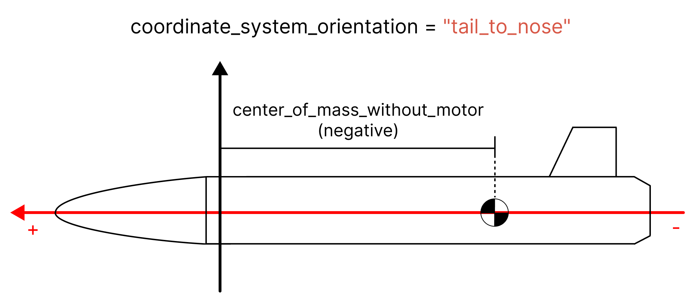
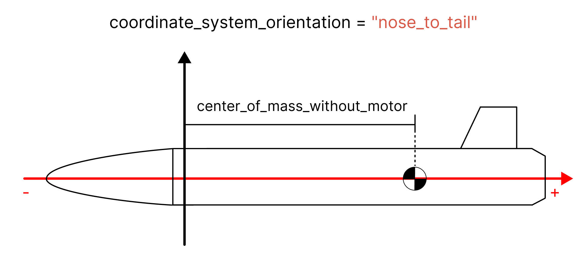
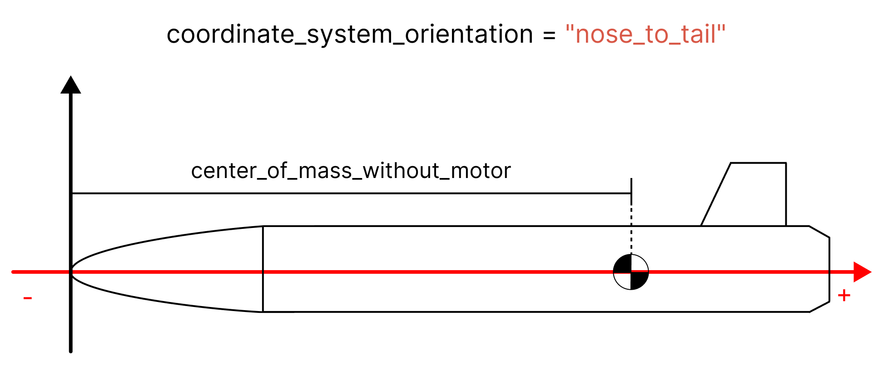
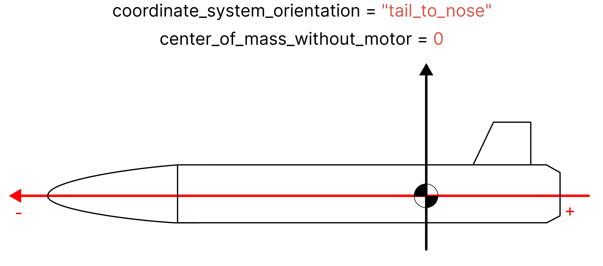
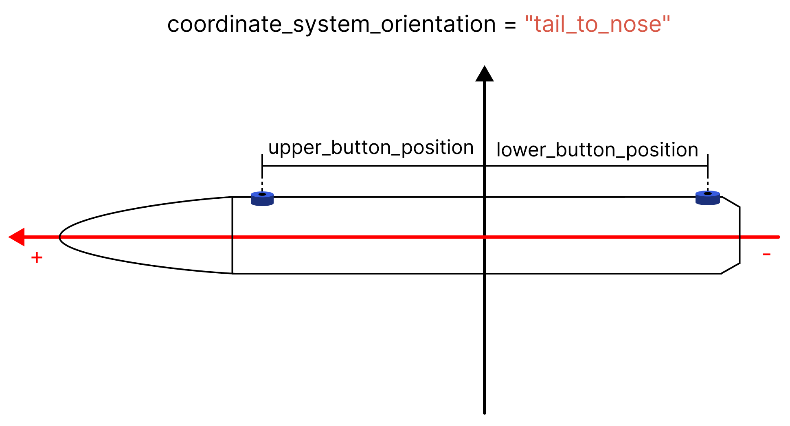
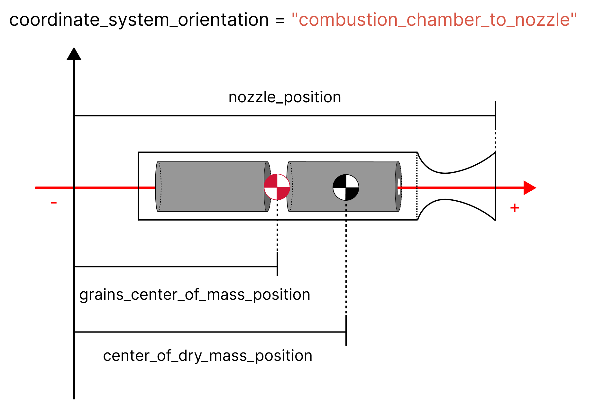
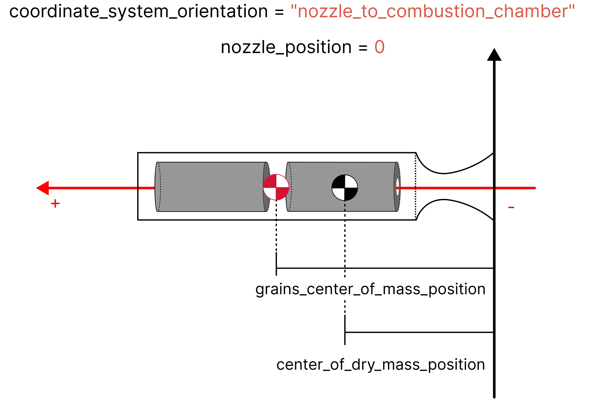

.. _positions:

Positions and Coordinate Systems
********************************

In many classes, you will need to specify a **"position"**. This must always
be treated with care, as the position is always relative to the coordinate
system which is in use. 

Essentially, in every class that uses positions, you will need to choose the 
position of the coordinate system origin. **All positions must then be relative
to this origin**. The orientation of the coordinate system is also important,
and must be specified by the ``coordinate_system_orientation`` parameter.

.. note::
    The coordinate system origin never needs to be explicitly specified, but
    all positions of that class must be relative to the same origin.

Here we go through the different classes that use positions, and how to specify
the coordinate system origin and orientation.

Rocket
======

When defining a rocket, two *position* related parameters are required:

- ``center_of_mass_without_motor``: The position of the center of mass of the
  rocket, relative to the coordinate system origin.
- ``coordinate_system_orientation``: The orientation of the coordinate system.
  Can either be ``nose_to_tail`` or ``tail_to_nose``.

.. seealso::
    
  You can find more information about these parameters in 
  :class:`rocketpy.Rocket.__init__`

Here we will go through a few examples of how to specify the coordinate system
origin and orientation.

Example with Origin at Arbitrary Point
--------------------------------------

The coordinate system origin can be at any point.
Here is an explanatory image of a rocket with the coordinate system origin at
an arbitrary point and the ``coordinate_system_orientation = tail_to_nose``:

And with ``coordinate_system_orientation = nose_to_tail``:

.. important::

  - The coordinate system origin is the point where the axes intersect. This
    point is not explicitly specified and can be chosen by the user. All 
    positions given by the user must be relative to this point.
  - The coordinate system origin does not need to be inside the rocket. It can
    be outside the rocket. 
  - When ``coordinate_system_orientation = tail_to_nose`` (the default), we have 
    that, in this example, ``center_of_mass_without_motor`` is negative.
  - When ``coordinate_system_orientation = nose_to_tail``, the 
    ``center_of_mass_without_motor`` is positive.

Example with Origin at Tip of Nose Cone
---------------------------------------

A more useful example is to have the coordinate system origin at the tip of the
nose cone. Here is an explanatory image of a rocket with the coordinate system
origin at the tip of the nose cone:

.. important::

  - The coordinate system origin is at the tip of the nose cone. This point is
    not explicitly specified and can be chosen by the user. All positions given
    by the user must be relative to this point.
  - Since the coordinate system origin is at the tip of the nose cone, the
    position of the nose cone is **zero**. 
  - We are using the ``nose_to_tail`` coordinate system orientation. This means
    that the ``center_of_mass_without_motor`` is positive.

Example with Origin at the Center of Mass
-----------------------------------------

Another useful example is to have the coordinate system origin at the center of
mass without motor of the rocket. Here is an explanatory image of a rocket with
the coordinate system origin at the center of mass without motor:

.. important::

  - The coordinate system origin is at the center of mass without motor. This
    point is not explicitly specified and can be chosen by the user. All
    positions given by the user must be relative to this point.
  - Since the coordinate system origin is at the center of mass without motor,
    the position of the ``center_of_mass_without_motor`` is **zero**.
  - We are using the ``tail_to_nose`` coordinate system orientation. This means
    that the position of the nose cone is positive.

.. _addsurface:

Adding Aerodynamic Surfaces and Motor
-------------------------------------

When adding an aerodynamic surface (i.e. nose cone, fins and tail)
or a motor to a rocket you must specify the position of the aerodynamic surface.
Here is an image showing the different positions that must be specified:

.. figure:: ../static/positions/surfacetailtonose.png
  :align: center
  :alt: Rocket coordinate system origin

.. important::

  - All positions are relative to the coordinate system origin.
  - **Motor** position is relative to the motor's coordinate system origin. In
    the above image, the motor's coordinate system origin is at the nozzle exit
    area. See :ref:`motorcsys` for more information.
  - **Nose cone** position is relative to its tip.
  - **Fins** position is relative to the point belonging to the root chord which is
    highest in the rocket coordinate system (i.e. the point closest to the nose
    cone).
  - **Tail** position is relative to the point belonging to the tail which is
    highest in the rocket coordinate system (i.e. the point closest to the nose
    cone).

With the position known, adding the aerodynamic surfaces and motor to the rocket
is done using the ``add`` methods. These methods take several parameters, but 
here we simplify the explanation by only showing the position related parameters.

.. code-block:: python
  
  rocket.add_motor(..., position=motor_position)
  rocket.add_nose(..., position=nose_position)
  rocket.add_trapezoidal_fins(..., position=fins_position)
  rocket.add_tail(..., position=tail_position)

.. seealso::
      
    You can find more information about the *add* methods in:

    - :class:`rocketpy.Rocket.add_motor`,
    - :class:`rocketpy.Rocket.add_nose`, 
    - :class:`rocketpy.Rocket.add_trapezoidal_fins`, 
    - :class:`rocketpy.Rocket.add_elliptical_fins`, and
    - :class:`rocketpy.Rocket.add_tail`.

.. _setrail:

Setting Rail Buttons
--------------------

When setting the launch rail guides, you must specify the position of the upper
and lower rail buttons. Here is an image showing the different positions that 
must be specified:

.. important::

  - All positions are relative to the coordinate system origin.
  - ``upper_button_position`` is relative to the point belonging to the
    rail button which is closest to the tip of the rocket.
  - ``lower_button_position`` position is relative to the point belonging to the
    rail button which is furthest from the tip of the rocket.
  - If the rocket has more than two rail buttons, the position any button 
    besides the upper and lower buttons is not necessary.

.. seealso::
  :class:`rocketpy.Rocket.set_rail_buttons`

.. _motorcsys:

Motors
======

When defining a motor, a few *position* related parameters are required:

- ``nozzle_position``: The position of the nozzle exit area, relative to the
  coordinate system origin.
- ``grains_center_of_mass_position``: The position of the center of mass of the
  grains, relative to the coordinate system origin. This parameter is not 
  present in the ``LiquidMotor`` class.
- ``center_of_dry_mass_position``: The position of the center of mass of the
  dry mass, relative to the coordinate system origin.
- ``coordinate_system_orientation``: The orientation of the coordinate system.
  Can either be *"nozzle_to_combustion_chamber"* or 
  *"combustion_chamber_to_nozzle"*.
  
.. seealso::
    
  You can find more information about these parameters in each of the motor
  classes constructors: 

  :class:`rocketpy.SolidMotor.__init__` 

  :class:`rocketpy.HybridMotor.__init__` 

  :class:`rocketpy.LiquidMotor.__init__` 

Here we will go through a few examples of how to specify the coordinate system
origin and orientation.

Example with Origin at Arbitrary Point
--------------------------------------

The coordinate system origin can be at any point. 
Here is an explanatory image of a motor with the coordinate system origin at
an arbitrary point and the 
``coordinate_system_orientation = nozzle_to_combustion_chamber``:

.. note::

  Liquid motors do not have the ``grains_center_of_mass_position`` parameter.

.. figure:: ../static/positions/nozzletocomb.png
  :align: center
  :alt: Rocket coordinate system origin

.. note::
    
  In this case:

  - ``nozzle_position`` is negative.
  - ``grains_center_of_mass_position`` is negative.
  - ``center_of_dry_mass_position`` is negative.

And with ``coordinate_system_orientation = combustion_chamber_to_nozzle``:

.. note::
    
  In this case:

  - ``nozzle_position`` is positive.
  - ``grains_center_of_mass_position`` is positive.
  - ``center_of_dry_mass_position`` is positive.

.. important::

  - The coordinate system origin is the point where the axes intersect. This
    point is not explicitly specified and can be chosen by the user. All 
    positions given by the user must be relative to this point.
  - The coordinate system origin does not need to be outside the motor. It can
    be inside the motor.

Example with Origin at the Nozzle Outlet
----------------------------------------

A more useful situation for motors is to have the coordinate system origin at
the nozzle outlet. Here is an explanatory image of a motor with the coordinate
system origin at the nozzle outlet and
``coordinate_system_orientation = nozzle_to_combustion_chamber``:

.. important::

  - The coordinate system origin is at the outlet of the nozzle. This point is
    not explicitly specified and can be chosen by the user. All positions given
    by the user must be relative to this point.
  - Since the coordinate system origin is at the nozzle's outlet, the
    position of the nozzle is **zero**. 
  - We are using the ``nozzle_to_combustion_chamber`` coordinate system 
    orientation. This means that ``center_of_mass_without_position`` and
    ``grains_center_of_mass_position`` are positive.

.. _Adding Tanks:

Adding Tanks
------------

When adding a tank to a motor, the coordinate system used in the motor must be
the same as the one used to define the tank position.

The tank position is defined as the position of the **geometrical center** of
the tank, relative to the motor's coordinate system origin. 

Here is an explanatory image of a motor with a tank and the coordinate system
origin at the nozzle outlet and
``coordinate_system_orientation = nozzle_to_combustion_chamber``:

.. figure:: ../static/positions/tank.png
  :align: center
  :alt: Rocket coordinate system origin

.. caution::
  The ``center_of_dry_mass_position`` is given considering the combustion
  chamber **and** all the tanks of the motor **without propellant**.

With a :doc:`Tank Object </user/motors/tanks>` defined and its position known
(as shown in the above figure), the tank can be added to the motor using the
``add_tank`` method.

.. code-block:: python

  motor.add_tank(tank, position)

.. seealso::
      
    You can find more information about the *add_tank* methods in:
  
    - :class:`rocketpy.HybridMotor.add_tank`, and
    - :class:`rocketpy.LiquidMotor.add_tank`.