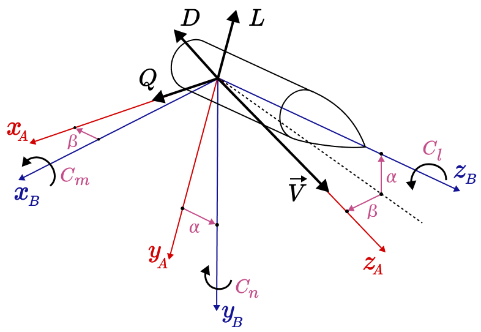

.. _genericsurfaces:

Generic Surfaces and Custom Aerodynamic Coefficients
====================================================

Generic aerodynamic surfaces can be used to model aerodynamic forces based on 
force and moment coefficients. The :class:`rocketpy.GenericSurface` receives the
coefficients as functions of the angle of attack, side slip angle, Mach number,
Reynolds number, pitch rate, yaw rate, and roll rate.

The :class:`rocketpy.LinearGenericSurface` class model aerodynamic forces based
the force and moment coefficients derivatives. The coefficients are derivatives
of the force and moment coefficients with respect to the angle of attack, side
slip angle, Mach number, Reynolds number, pitch rate, yaw rate, and roll rate.

These classes allows the user to be less dependent on the built-in aerodynamic
surfaces and to define their own aerodynamic coefficients.

Both classes base their coefficient on the definition of the aerodynamic frame
of reference.

Aerodynamic Frame
-----------------

The aerodynamic frame of reference of the rocket is defined as follows:

- The origin is at the rocket's center of dry mass (``center_of_dry_mass_position``).
- The ``z`` axis is defined along the rocket's centerline, pointing from the center of dry mass towards the nose.
- The ``x`` and ``y`` axes are perpendicular.
- The partial angle of attack (``alpha``) is defined as the angle, in the y-z 
  plane, from the velocity vector to the z axis.
- The partial side slip angle (``beta``) is defined as the angle, in the x-z
  plane, from the velocity vector to the z axis.

The following figure shows the aerodynamic frame of reference:

In the figure we define:

- :math:`\mathbf{\vec{V}}` as rocket velocity vector.
- :math:`x_B`, :math:`y_B`, and :math:`z_B` as the body axes.
- :math:`x_A`, :math:`y_A`, and :math:`z_A` as the aerodynamic axes.
- :math:`\alpha` as the partial angle of attack.
- :math:`\beta` as the side slip angle.
- :math:`L` as the lift force.
- :math:`D` as the drag force.
- :math:`Q` as the side force. 

Here we define the aerodynamic forces in the aerodynamic frame of reference as:

.. math::
   \vec{\mathbf{F}}_A=\begin{bmatrix}X_A\\Y_A\\Z_A\end{bmatrix}_A=\begin{bmatrix}Q\\-L\\-D\end{bmatrix}_A

The aerodynamic forces in the body axes coordinate system are defined as
:math:`\vec{\mathbf{F}}_B`.

.. math::
   \vec{\mathbf{F}}_B=\begin{bmatrix}X_A\\Y_A\\Z_A\end{bmatrix}_B=\mathbf{M}_{BA}\cdot\begin{bmatrix}Q\\-L\\-D\end{bmatrix}_A

Where the transformation matrix :math:`\mathbf{M}_{BA}`, which transforms the
aerodynamic forces from the aerodynamic frame of reference to the body axes
coordinate system, is defined as:

.. math::
   \mathbf{M}_{BA} = \begin{bmatrix}
      1 & 0 & 0 \\
      0 & \cos(\alpha) & -\sin(\alpha) \\
      0 & \sin(\alpha) & \cos(\alpha)
      \end{bmatrix}
      \begin{bmatrix}
      \cos(\beta) & 0 & -\sin(\beta) \\
      0 & 1 & 0 \\
      \sin(\beta) & 0 & \cos(\beta)
      \end{bmatrix}

The forces coefficients can finally be defined as:

- :math:`C_L` as the lift coefficient.
- :math:`C_Q` as the side force coefficient (or cross stream force coefficient).
- :math:`C_D` as the drag coefficient.

And the forces from the coefficients are defined as:

.. math::
   \begin{bmatrix}X_A\\Y_A\\Z_A\end{bmatrix}_B =\mathbf{M}_{BA}\cdot\overline{q}\cdot A_{ref}\cdot\begin{bmatrix}C_Q\\-C_L\\-C_D\end{bmatrix}_A 

Where:

- :math:`\bar{q}` is the dynamic pressure.
- :math:`A_{ref}` is the reference area used to calculate the coefficients.
   Commonly the rocket's cross-sectional area is used as the reference area.

The moment coefficients can be defined as:

- :math:`C_l` as the rolling moment coefficient.
- :math:`C_m` as the pitching moment coefficient.
- :math:`C_n` as the yawing moment coefficient.

And the moments from the coefficients are defined as:

.. math::
   \vec{\mathbf{M}}_B=\begin{bmatrix}M_{x_A}\\M_{y_A}\\M_{z_A}\end{bmatrix}_B =\overline{q}\cdot A_{ref}\cdot L_{ref}\cdot\begin{bmatrix}C_m\\C_n\\C_l\end{bmatrix}

Where:

- :math:`L_{ref}` is the reference length used to calculate the coefficients.
  Commonly the rocket's diameter is used as the reference length.

Aerodynamic angles
~~~~~~~~~~~~~~~~~~

The aerodynamic angles are defined in two different ways in RocketPy:

- As the angle of attack (:math:`\alpha`) and the side slip \
  angle (:math:`\beta`), which are defined in the image above. These are used \
  in the calculation of the generic surface forces and moments.
- As the total angle of attack (:math:`\alpha_{\text{tot}}`), defined as the \
  angle between the total velocity vector and the rocket's centerline. This is \
  used in the calculation of the standard aerodynamic surface forces and moments.

The partial angles are calculated as:

.. math::
   \begin{aligned}
      \alpha &= \arctan\left(\frac{V_y}{V_z}\right) \\
      \beta &= \arctan\left(\frac{V_x}{V_z}\right)
   \end{aligned}

The total angle of attack is calculated as:

.. math::
   \alpha_{\text{tot}} = \arccos\left(\frac{\mathbf{\vec{V}}\cdot\mathbf{z_B}}{||\mathbf{\vec{V}}||\cdot||\mathbf{z_B}||}\right)

.. note::
   When the simulation is done, the total angle of attack is accessed through
   the :attr:`rocketpy.Flight.angle_of_attack` attribute.
   The partial angles of attack and side slip are accessed through the
   :attr:`rocketpy.Flight.partial_angle_of_attack` and 
   :attr:`rocketpy.Flight.angle_of_sideslip` attributes, respectively.

.. _genericsurface:

Generic Surface Class
---------------------

The :class:`rocketpy.GenericSurface` class is used to define an aerodynamic
surface based on force and moment coefficients. A generic surface is defined
as follows:

.. seealso::
   For more information on class initialization, see 
   :class:`rocketpy.GenericSurface.__init__` 

.. code-block:: python

   from rocketpy import GenericSurface
   
   radius = 0.0635
   
   generic_surface = GenericSurface(
      reference_area=np.pi * radius**2,
      reference_length=2 * radius,
      coefficients={
         "cL": "cL.csv",
         "cQ": "cQ.csv",
         "cD": "cD.csv",
         "cm": "cm.csv",
         "cn": "cn.csv",
         "cl": "cl.csv",
      },
      name="Generic Surface",
   )

The ``coefficients`` argument is a dictionary containing the coefficients of the
generic surface. The keys of the dictionary are the coefficient names, and the
values are the coefficients. The possible coefficient names are:

- ``cL``: Lift coefficient.
- ``cQ``: Side force coefficient.
- ``cD``: Drag coefficient.
- ``cm``: Pitching moment coefficient.
- ``cn``: Yawing moment coefficient.
- ``cl``: Rolling moment coefficient.

Only one of the coefficients is required to be provided, but any combination of
the coefficients can be used. The coefficient values can be provided as a
single value, a callable function of seven arguments, or a path to a ``.csv``
file containing the values.

The coefficients are all functions of:

- Angle of attack (:math:`\alpha`) in radians.
- Side slip angle (:math:`\beta`) in radians.
- Mach number (:math:`Ma`).
- Reynolds number (:math:`Re`).
- Pitch rate (:math:`q`) in radians per second.
- Yaw rate (:math:`r`) in radians per second.
- Roll rate (:math:`p`) in radians per second.

.. math::
   \begin{aligned}
      C_L &= f(\alpha, \beta, Ma, Re, q, r, p) \\
      C_Q &= f(\alpha, \beta, Ma, Re, q, r, p) \\
      C_D &= f(\alpha, \beta, Ma, Re, q, r, p) \\
      C_m &= f(\alpha, \beta, Ma, Re, q, r, p) \\
      C_n &= f(\alpha, \beta, Ma, Re, q, r, p) \\
      C_l &= f(\alpha, \beta, Ma, Re, q, r, p)
   \end{aligned}

From the coefficients, the forces and moments are calculated with

.. math::
   \begin{aligned}
      L &= \overline{q}\cdot A_{ref}\cdot C_L \\
      Q &= \overline{q}\cdot A_{ref}\cdot C_Q \\
      D &= \overline{q}\cdot A_{ref}\cdot C_D \\
      M_{m} &= \overline{q}\cdot A_{ref}\cdot L_{ref}\cdot C_m \\
      M_{n} &= \overline{q}\cdot A_{ref}\cdot L_{ref}\cdot C_n \\
      M_{l} &= \overline{q}\cdot A_{ref}\cdot L_{ref}\cdot C_l
   \end{aligned}

These coefficients can be defined as a callable such as:

.. code-block:: python

   def coefficient(alpha, beta, Ma, Re, q, r, p):
      ...
      return value

In which any algorithm can be implemented to calculate the coefficient values.

Otherwise, the coefficients can be defined as a ``.csv`` file. The file must
contain a header with at least one of the following columns representing the
independent variables:

- ``alpha``: Angle of attack.
- ``beta``: Side slip angle.
- ``mach``: Mach number.
- ``reynolds``: Reynolds number.
- ``q``: Pitch rate.
- ``r``: Yaw rate.
- ``p``: Roll rate.

The last column must be the coefficient value, and must contain a header, 
though the header name can be anything.

.. important::
   Not all columns need to be present in the file, but the columns that are
   present must be named, **and ordered**, as described above.

An example of a ``.csv`` file is shown below:

.. code-block:: 

   "alpha", "mach", "coefficient"
   -0.017, 0, -0.11
   -0.017, 1, -0.127
   -0.017, 2, -0.084
   -0.017, 3, -0.061
   0.0, 0, 0.0
   0.0, 1, 0.0
   0.0, 2, 0.0
   0.0, 3, 0.0
   0.017, 0, 0.11
   0.017, 1, 0.127
   0.017, 2, 0.084
   0.017, 3, 0.061

After the definition of the ``GenericSurface`` object, it must be added to the
rocket's configuration:

.. seealso::
   For more information on how to add a generic surface to the rocket, see
   :class:`rocketpy.Rocket.add_generic_surface`

.. code-block:: python
   :emphasize-lines: 5

   from rocketpy import Rocket
   rocket = Rocket(
      ...
   )
   rocket.add_surfaces(generic_surface, position=(0,0,0))

The position of the generic surface is defined in the User Defined coordinate
System, see :ref:`rocket_axes` for more information.

.. tip::
   If defining the coefficients of the entire rocket is desired, only a single
   generic surface can be added to the rocket, positioned at the center of dry 
   mass. This will be equivalent to defining the coefficients of the entire
   rocket.

.. attention::
   If there generic surface is positioned **not** at the center of dry mass, the
   forces generated by the force coefficients (cL, cQ, cD) will generate a
   moment around the center of dry mass. This moment will be calculated and
   added to the moment generated by the moment coefficients (cm, cn, cl).

.. _lineargenericsurface:

Linear Generic Surface Class
----------------------------

The :class:`rocketpy.LinearGenericSurface` class is used to define a aerodynamic
surface based on the forces and moments coefficient derivatives. A linear generic
surface will receive the derivatives of each coefficient with respect to the
independent variables. The derivatives are defined as:

- :math:`C_{\alpha}=\frac{dC}{d\alpha}`: Coefficient derivative with respect to angle of attack.
- :math:`C_{\beta}=\frac{dC}{d\beta}`: Coefficient derivative with respect to side slip angle.
- :math:`C_{Ma}=\frac{dC}{dMa}`: Coefficient derivative with respect to Mach number.
- :math:`C_{Re}=\frac{dC}{dRe}`: Coefficient derivative with respect to Reynolds number.
- :math:`C_{q}=\frac{dC}{dq}`: Coefficient derivative with respect to pitch rate.
- :math:`C_{r}=\frac{dC}{dr}`: Coefficient derivative with respect to yaw rate.
- :math:`C_{p}=\frac{dC}{dp}`: Coefficient derivative with respect to roll rate.

A non derivative coefficient :math:`C_{0}` is also included.

Each coefficient derivative is defined as a function of all the seven 
independent variables.

The coefficients are then grouped into **forcing** coefficients:

.. math::
   \begin{aligned}
      C_{Lf} &= C_{L0} + C_{L\alpha}\cdot\alpha + C_{L\beta}\cdot\beta + C_{LMa}\cdot Ma + C_{LRe}\cdot Re \\
      C_{Qf} &= C_{Q0} + C_{Q\alpha}\cdot\alpha + C_{Q\beta}\cdot\beta + C_{QMa}\cdot Ma + C_{QRe}\cdot Re \\
      C_{Df} &= C_{D0} + C_{D\alpha}\cdot\alpha + C_{D\beta}\cdot\beta + C_{DMa}\cdot Ma + C_{DRe}\cdot Re \\
      C_{mf} &= C_{m0} + C_{m\alpha}\cdot\alpha + C_{m\beta}\cdot\beta + C_{mMa}\cdot Ma + C_{mRe}\cdot Re \\
      C_{nf} &= C_{n0} + C_{n\alpha}\cdot\alpha + C_{n\beta}\cdot\beta + C_{nMa}\cdot Ma + C_{nRe}\cdot Re \\
      C_{lf} &= C_{l0} + C_{l\alpha}\cdot\alpha + C_{l\beta}\cdot\beta + C_{lMa}\cdot Ma + C_{lRe}\cdot Re 
   \end{aligned}

And **damping** coefficients:

.. math::
   \begin{aligned}
      C_{Ld} &= C_{L_{q}}\cdot q + C_{L_{r}}\cdot r + C_{L_{p}}\cdot p \\
      C_{Qd} &= C_{Q_{q}}\cdot q + C_{Q_{r}}\cdot r + C_{Q_{p}}\cdot p \\
      C_{Dd} &= C_{D_{q}}\cdot q + C_{D_{r}}\cdot r + C_{D_{p}}\cdot p \\
      C_{md} &= C_{m_{q}}\cdot q + C_{m_{r}}\cdot r + C_{m_{p}}\cdot p \\
      C_{nd} &= C_{n_{q}}\cdot q + C_{n_{r}}\cdot r + C_{n_{p}}\cdot p \\
      C_{ld} &= C_{l_{q}}\cdot q + C_{l_{r}}\cdot r + C_{l_{p}}\cdot p 
   \end{aligned}

The forces and moments are then calculated as:

.. math::
   \begin{aligned}
      L &= \overline{q}\cdot A_{ref}\cdot C_{Lf} + \overline{q}\cdot A_{ref}\cdot \frac{L_{ref}}{2V} C_{Ld} \\
      Q &= \overline{q}\cdot A_{ref}\cdot C_{Qf} + \overline{q}\cdot A_{ref}\cdot \frac{L_{ref}}{2V} C_{Qd} \\
      D &= \overline{q}\cdot A_{ref}\cdot C_{Df} + \overline{q}\cdot A_{ref}\cdot \frac{L_{ref}}{2V} C_{Dd} \\
      M_{m} &= \overline{q}\cdot A_{ref}\cdot L_{ref}\cdot C_{mf} + \overline{q}\cdot A_{ref}\cdot L_{ref}\cdot \frac{L_{ref}}{2V} C_{md} \\
      M_{n} &= \overline{q}\cdot A_{ref}\cdot L_{ref}\cdot C_{nf} + \overline{q}\cdot A_{ref}\cdot L_{ref}\cdot \frac{L_{ref}}{2V} C_{nd} \\
      M_{l} &= \overline{q}\cdot A_{ref}\cdot L_{ref}\cdot C_{lf} + \overline{q}\cdot A_{ref}\cdot L_{ref}\cdot \frac{L_{ref}}{2V} C_{ld}
   \end{aligned}

The linear generic surface is defined very similarly to the generic surface. 
The coefficients are defined in the same way, but with the addition of the
derivative values.

An example of a linear generic surface defined with **all** the coefficients is
shown below:

.. seealso::
   For more information on class initialization, see 
   :class:`rocketpy.LinearGenericSurface.__init__`

.. code-block:: python
   
      from rocketpy import LinearGenericSurface
      linear_generic_surface = LinearGenericSurface(
         reference_area=np.pi * 0.0635**2,
         reference_length=2 * 0.0635,
         coefficients={
            "cL_0": "cL_0.csv",
            "cL_alpha": "cL_alpha.csv",
            "cL_beta": "cL_beta.csv",
            "cL_Ma": "cL_Ma.csv",
            "cL_Re": "cL_Re.csv",
            "cL_q": "cL_q.csv",
            "cL_r": "cL_r.csv",
            "cL_p": "cL_p.csv",
            "cQ_0": "cQ_0.csv",
            "cQ_alpha": "cQ_alpha.csv",
            "cQ_beta": "cQ_beta.csv",
            "cQ_Ma": "cQ_Ma.csv",
            "cQ_Re": "cQ_Re.csv",
            "cQ_q": "cQ_q.csv",
            "cQ_r": "cQ_r.csv",
            "cQ_p": "cQ_p.csv",
            "cD_0": "cD_0.csv",
            "cD_alpha": "cD_alpha.csv",
            "cD_beta": "cD_beta.csv",
            "cD_Ma": "cD_Ma.csv",
            "cD_Re": "cD_Re.csv",
            "cD_q": "cD_q.csv",
            "cD_r": "cD_r.csv",
            "cD_p": "cD_p.csv",
            "cm_0": "cm_0.csv",
            "cm_alpha": "cm_alpha.csv",
            "cm_beta": "cm_beta.csv",
            "cm_Ma": "cm_Ma.csv",
            "cm_Re": "cm_Re.csv",
            "cm_q": "cm_q.csv",
            "cm_r": "cm_r.csv",
            "cm_p": "cm_p.csv",
            "cn_0": "cn_0.csv",
            "cn_alpha": "cn_alpha.csv",
            "cn_beta": "cn_beta.csv",
            "cn_Ma": "cn_Ma.csv",
            "cn_Re": "cn_Re.csv",
            "cn_q": "cn_q.csv",
            "cn_r": "cn_r.csv",
            "cn_p": "cn_p.csv",
            "cl_0": "cl_0.csv",
            "cl_alpha": "cl_alpha.csv",
            "cl_beta": "cl_beta.csv",
            "cl_Ma": "cl_Ma.csv",
            "cl_Re": "cl_Re.csv",
            "cl_q": "cl_q.csv",
            "cl_r": "cl_r.csv",
            "cl_p": "cl_p.csv",
         },
      )
      rocket.add_surfaces(linear_generic_surface, position=(0,0,0))

