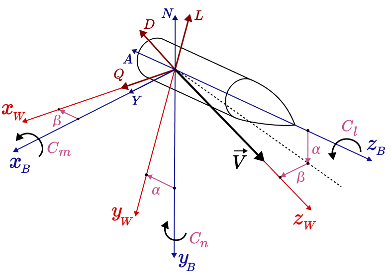

.. _genericsurfaces:

Generic Surfaces and Custom Aerodynamic Coefficients
====================================================

Generic aerodynamic surfaces can be used to model aerodynamic forces based on
force and moment coefficients. The :class:`rocketpy.GenericSurface` receives the
coefficients as functions of the angle of attack, side slip angle, Mach number,
Reynolds number, pitch rate, yaw rate, and roll rate.

The :class:`rocketpy.LinearGenericSurface` class model aerodynamic forces based
the force and moment coefficients derivatives. The coefficients are derivatives
of the force and moment coefficients with respect to the angle of attack, side
slip angle, Mach number, Reynolds number, pitch rate, yaw rate, and roll rate.

These classes allows the user to be less dependent on the built-in aerodynamic
surfaces and to define their own aerodynamic coefficients.

Wind Frame and Body Frame
-------------------------

A surface's aerodynamic force is the same physical vector written in two
coordinate frames: the **body frame**, fixed to the rocket, and the **wind
frame**, aligned with the airflow. You can provide the coefficients in either
frame; the two are related by the angle of attack and sideslip defined below.

The following figure shows the body frame (subscript :math:`B`) and the wind
frame (subscript :math:`W`):

In the figure we define:

- :math:`\mathbf{\vec{V}}` as rocket velocity vector.
- :math:`x_B`, :math:`y_B`, and :math:`z_B` as the body axes.
- :math:`x_W`, :math:`y_W`, and :math:`z_W` as the wind-frame axes.
- :math:`\alpha` as the partial angle of attack.
- :math:`\beta` as the side slip angle.
- :math:`L` as the lift force.
- :math:`D` as the drag force.
- :math:`Q` as the wind frame side force.
- :math:`N` as the normal force.
- :math:`A` as the axial force.
- :math:`Y` as the body frame side force.

Body frame
~~~~~~~~~~

The body frame is fixed to the rocket:

- The origin is at the rocket's center of dry mass (``center_of_dry_mass_position``).
- The :math:`z_B` axis lies along the rocket's centerline, pointing from the center of dry mass towards the nose.
- The :math:`x_B` and :math:`y_B` axes are perpendicular to it.

In this frame the aerodynamic force is made up of the normal force :math:`N`,
the side force :math:`Y` and the axial force :math:`A`. As in the wind frame, the
side force is the :math:`x_B` component, while the normal and axial forces enter
the :math:`y_B` and :math:`z_B` components with a negative sign:

.. math::
   \vec{\mathbf{F}}_B=\begin{bmatrix}X_B\\Y_B\\Z_B\end{bmatrix}_B=\begin{bmatrix}Y\\-N\\-A\end{bmatrix}_B

Wind frame
~~~~~~~~~~

The wind frame is aligned with the airflow: its :math:`z_W` axis runs along the
velocity vector. In this frame the aerodynamic force is the lift :math:`L`, the
drag :math:`D` and the (wind-frame) side force :math:`Q`:

.. math::
   \vec{\mathbf{F}}_W=\begin{bmatrix}X_W\\Y_W\\Z_W\end{bmatrix}_W=\begin{bmatrix}Q\\-L\\-D\end{bmatrix}_W

Relating the two frames
~~~~~~~~~~~~~~~~~~~~~~~~

The two are the same force, related by the angle-of-attack/sideslip rotation
:math:`\mathbf{M}_{BW}`, which transforms the wind frame into the body frame:

.. math::
   \vec{\mathbf{F}}_B=\mathbf{M}_{BW}\cdot\begin{bmatrix}Q\\-L\\-D\end{bmatrix}_W

where

.. math::
   \mathbf{M}_{BW} = \begin{bmatrix}
      1 & 0 & 0 \\
      0 & \cos(\alpha) & \sin(\alpha) \\
      0 & -\sin(\alpha) & \cos(\alpha)
      \end{bmatrix}
      \begin{bmatrix}
      \cos(\beta) & 0 & \sin(\beta) \\
      0 & 1 & 0 \\
      -\sin(\beta) & 0 & \cos(\beta)
      \end{bmatrix}

The force coefficients follow the same rotation. In the wind frame they are the
lift :math:`C_L`, side :math:`C_Q` and drag :math:`C_D`; in the body frame the
normal :math:`C_N`, side :math:`C_Y` and axial :math:`C_A`:

.. math::
   \begin{aligned}
      C_N &= \cos\alpha\, C_L + \sin\alpha\,(\sin\beta\, C_Q + \cos\beta\, C_D) \\
      C_Y &= \cos\beta\, C_Q - \sin\beta\, C_D \\
      C_A &= -\sin\alpha\, C_L + \cos\alpha\,(\sin\beta\, C_Q + \cos\beta\, C_D)
   \end{aligned}

At small angles these reduce to :math:`C_N \approx C_L`, :math:`C_Y \approx C_Q`
and :math:`C_A \approx C_D`.

The force itself is recovered from the coefficients with the dynamic pressure
:math:`\bar q` and the reference area :math:`A_{ref}`. From **body-frame**
coefficients the force is obtained directly, with no rotation:

.. math::
   \vec{\mathbf{F}}_B =\begin{bmatrix}Y\\-N\\-A\end{bmatrix}_B= \overline{q}\cdot A_{ref}\cdot\begin{bmatrix}C_Y\\-C_N\\-C_A\end{bmatrix}_B

while **wind-frame** coefficients are rotated into the body frame first:

.. math::
   \vec{\mathbf{F}}_B =\mathbf{M}_{BW}\cdot\overline{q}\cdot A_{ref}\cdot\begin{bmatrix}C_Q\\-C_L\\-C_D\end{bmatrix}_W

where :math:`\bar{q}` is the dynamic pressure and :math:`A_{ref}` the reference
area (commonly the rocket's cross-sectional area).

Moments
~~~~~~~

The moment coefficients are the same in both frames: the rolling moment
:math:`C_l`, the pitching moment :math:`C_m` and the yawing moment :math:`C_n`.
The moments about the body axes follow with the reference area and the reference
length :math:`L_{ref}`:

.. math::
   \vec{\mathbf{M}}_B=\begin{bmatrix}M_{x}\\M_{y}\\M_{z}\end{bmatrix}_B =\overline{q}\cdot A_{ref}\cdot L_{ref}\cdot\begin{bmatrix}C_m\\C_n\\C_l\end{bmatrix}

where :math:`L_{ref}` is the reference length (commonly the rocket's diameter).

Angles of attack and sideslip
~~~~~~~~~~~~~~~~~~~~~~~~~~~~~~~

RocketPy uses the flow angles two ways:

- the partial **angle of attack** :math:`\alpha` and **sideslip angle**
  :math:`\beta` (shown in the figure above), used by the generic-surface forces
  and moments;
- the **total angle of attack** :math:`\alpha_{\text{tot}}`, the angle between
  the total velocity vector and the rocket's centerline, used by the standard
  (Barrowman) surfaces.

The partial angles are

.. math::
   \begin{aligned}
      \alpha &= \arctan\left(\frac{V_y}{V_z}\right) \\
      \beta &= \arctan\left(\frac{V_x}{V_z}\right)
   \end{aligned}

and the total angle of attack is

.. math::
   \alpha_{\text{tot}} = \arccos\left(\frac{\mathbf{\vec{V}}\cdot\mathbf{z_B}}{||\mathbf{\vec{V}}||\cdot||\mathbf{z_B}||}\right)

.. note::
   When the simulation is done, the total angle of attack is accessed through
   the :attr:`rocketpy.Flight.angle_of_attack` attribute. The partial angles of
   attack and sideslip are accessed through the
   :attr:`rocketpy.Flight.partial_angle_of_attack` and
   :attr:`rocketpy.Flight.angle_of_sideslip` attributes, respectively.

.. _genericsurface:

Generic Surface Class
---------------------

The :class:`rocketpy.GenericSurface` class defines an aerodynamic surface
directly from its force and moment coefficients. A surface is created by giving
it a reference area and length, the coefficients, and a few optional settings:

.. seealso::
   For more information on class initialization, see
   :class:`rocketpy.GenericSurface.__init__`

.. code-block:: python

   import numpy as np
   from rocketpy import GenericSurface

   radius = 0.0635

   generic_surface = GenericSurface(
      reference_area=np.pi * radius**2,
      reference_length=2 * radius,
      coefficients={
         "cN": "cN.csv",
         "cY": "cY.csv",
         "cA": "cA.csv",
         "cm": "cm.csv",
         "cn": "cn.csv",
         "cl": "cl.csv",
      },
      center_of_pressure=(0, 0, 0),
      name="Generic Surface",
      reynolds_length=2 * radius,
      interpolation="linear",
      extrapolation="constant",
      force_convention="body",
      active_during="always",
   )

Constructor parameters
~~~~~~~~~~~~~~~~~~~~~~~~

:class:`rocketpy.GenericSurface` takes the following parameters:

- ``reference_area`` (int or float): reference area used to non-dimensionalize
  the coefficients, in :math:`m^2`. Commonly the rocket's cross-sectional area.
- ``reference_length`` (int or float): reference length, in meters, used to
  non-dimensionalize the moment coefficients and the reduced rotation rates.
  Commonly the rocket's diameter.
- ``coefficients`` (dict): the force and moment coefficients, by name (detailed
  in `Coefficients`_ below).
- ``center_of_pressure`` (tuple, optional): the point where the surface's forces
  and moments are applied, in the surface's local frame. Default ``(0, 0, 0)``.
  See `Moment reference point`_.
- ``name`` (str, optional): a name for the surface. Default
  ``"Generic Surface"``.
- ``reynolds_length`` (int or float, optional): length scale, in meters, of the
  Reynolds number fed to the coefficients. Default ``None`` (uses
  ``reference_length``).
- ``interpolation`` (str or dict, optional): how tabulated coefficients are
  interpolated between their data points. Default ``None``. See
  :ref:`generic_surface_interpolation`.
- ``extrapolation`` (str or dict, optional): how tabulated coefficients behave
  outside their tabulated range. Default ``None``. See
  :ref:`generic_surface_interpolation`.
- ``force_convention`` (str, optional): the frame the force coefficients are
  given in, ``"body"`` or ``"wind"``. Default ``None`` (inferred from the
  coefficient names).
- ``active_during`` (str or callable, optional): when the surface produces
  aerodynamic force during the flight. Default ``"always"``. See
  :ref:`active_during`.

Coefficients
~~~~~~~~~~~~~

The ``coefficients`` argument is a dictionary mapping each coefficient's name to
its value. The body-frame coefficient names are:

- ``cN``: Normal force coefficient (perpendicular to the body axis).
- ``cY``: Side force coefficient.
- ``cA``: Axial force coefficient (along the body axis).
- ``cm``: Pitching moment coefficient.
- ``cn``: Yawing moment coefficient.
- ``cl``: Rolling moment coefficient.

Alternatively, you can supply the force coefficients in the **wind frame** as
``cL`` (lift), ``cQ`` (side) and ``cD`` (drag) in place of ``cN``/``cY``/``cA``
(the moment coefficients ``cm``/``cn``/``cl`` are shared by both frames). By
default the frame is inferred from the names you pass; set ``force_convention``
(``"body"`` or ``"wind"``) to state it explicitly. Whichever frame you choose,
all nine coefficients remain available as attributes (``surface.cN``,
``surface.cL``, ...), converted on demand from the ones you provided using the
rotation described in `Relating the two frames`_ above.

Only one coefficient is required, and any combination can be provided; the ones
you omit are treated as zero.

Each coefficient is a function of the same seven independent variables:

- Angle of attack (:math:`\alpha`) in radians.
- Side slip angle (:math:`\beta`) in radians.
- Mach number (:math:`Ma`).
- Reynolds number (:math:`Re`).
- Pitch rate (:math:`q^{*}`), non-dimensional (reduced).
- Yaw rate (:math:`r^{*}`), non-dimensional (reduced).
- Roll rate (:math:`p^{*}`), non-dimensional (reduced).

.. important::
   The angular rates are the conventional **non-dimensional reduced rates**, not
   the raw body rates in rad/s:

   .. math::
      q^{*} = \frac{q \, L_{ref}}{2 V}, \quad
      r^{*} = \frac{r \, L_{ref}}{2 V}, \quad
      p^{*} = \frac{p \, L_{ref}}{2 V}

   where :math:`L_{ref}` is the surface reference length and :math:`V` the
   freestream speed. RocketPy non-dimensionalizes the body rates internally 
   before evaluating the coefficients (the factor is 0 at zero airspeed). 
   Define your tables against the reduced rates.

Once evaluated, the coefficients are turned into body-frame forces and moments
exactly as described in `Wind Frame and Body Frame`_ above (wind-frame inputs
are rotated into the body frame first).

Each coefficient value can be given three ways: a single number for a constant,
a callable function of the seven variables, or a path to a ``.csv`` file of
tabulated data.

Defining a coefficient as a callable
~~~~~~~~~~~~~~~~~~~~~~~~~~~~~~~~~~~~~~

A coefficient can be any callable that takes the seven independent variables and
returns the value:

.. code-block:: python

   def coefficient(alpha, beta, Ma, Re, q, r, p):
      ...
      return value

Any algorithm can be implemented inside to compute the coefficient.

Defining a coefficient from a CSV file
~~~~~~~~~~~~~~~~~~~~~~~~~~~~~~~~~~~~~~~~

A coefficient can also be tabulated in a ``.csv`` file. The file must have a
header naming its columns. The independent-variable columns are optional, but
those present must use these exact names:

- ``alpha``: Angle of attack.
- ``beta``: Side slip angle.
- ``mach``: Mach number.
- ``reynolds``: Reynolds number.
- ``pitch_rate``: Pitch rate.
- ``yaw_rate``: Yaw rate.
- ``roll_rate``: Roll rate.

The **last** column holds the coefficient value; it **must** have a header, but
the header name can be anything.

.. important::
   Not all independent-variable columns need to be present, but the columns that
   are present must be named exactly as above. They can be in any order.

An example ``.csv`` file, tabulated against angle of attack and Mach:

.. code-block::

   "alpha", "mach", "coefficient"
   -0.017, 0, -0.11
   -0.017, 1, -0.127
   -0.017, 2, -0.084
   -0.017, 3, -0.061
   0.0, 0, 0.0
   0.0, 1, 0.0
   0.0, 2, 0.0
   0.0, 3, 0.0
   0.017, 0, 0.11
   0.017, 1, 0.127
   0.017, 2, 0.084
   0.017, 3, 0.061

.. note::
   The ``reynolds`` axis is by default based on the reference length (the
   rocket diameter). Published rocket data often bases the Reynolds number on
   the **body length** instead, which for a slender rocket is much larger. If
   your table uses a different length, pass it as ``reynolds_length`` when
   creating the surface so the Reynolds number the simulation feeds your table
   matches the one it was built against.

Adding the surface to the rocket
~~~~~~~~~~~~~~~~~~~~~~~~~~~~~~~~~~

Once defined, the surface is added to the rocket like any other:

.. seealso::
   For more information on how to add a generic surface to the rocket, see
   :class:`rocketpy.Rocket.add_surfaces`

.. code-block:: python
   :emphasize-lines: 5

   from rocketpy import Rocket
   rocket = Rocket(
      ...
   )
   rocket.add_surfaces(generic_surface, position=(0,0,0))

The position is given in the User Defined Coordinate System; see
:ref:`rocket_axes` for more information.

.. attention::
   If the generic surface is positioned **not** at the center of dry mass, the
   forces generated by the force coefficients (``cN``, ``cY``, ``cA``) generate
   a moment about the center of dry mass. This moment is computed and added to
   the moment generated by the moment coefficients (``cm``, ``cn``, ``cl``).

.. tip::
   To describe the whole vehicle with a single set of coefficients (rather than
   one surface per component), use
   :meth:`rocketpy.Rocket.add_full_body_aerodynamics`. See
   :ref:`fullbodyaerodynamics`.

Moment reference point
~~~~~~~~~~~~~~~~~~~~~~~~

The moment coefficients :math:`C_m`, :math:`C_n` and :math:`C_l` are taken about
the surface's own reference point (its ``center_of_pressure``). When the rocket
assembles the total aerodynamic moment it transports each surface's force from
that point to the rocket's **center of dry mass**, adding the
:math:`\vec{r}_{\text{cp} \to \text{cdm}} \times \vec{F}` term, so the rocket's
reported pitch/yaw moment and static margin are about the center of dry mass.

This matters when your coefficients come from a source that uses a different
reference. A pitch-moment coefficient referenced to a point a distance :math:`d`
ahead of the surface's center of pressure must be shifted before use:

.. math::
   C_{m,\,\text{cp}} = C_{m,\,\text{ref}} + \frac{d}{L_{ref}}\, C_N

Provide the coefficient about the surface's center of pressure (or set
``center_of_pressure`` so the transport lands the moment at the intended point),
otherwise the static margin will be off by the reference-point offset.

.. _lineargenericsurface:

Linear Generic Surface Class
----------------------------

The :class:`rocketpy.LinearGenericSurface` class defines an aerodynamic surface
from the **derivatives** of its force and moment coefficients, instead of the
coefficients themselves. This is convenient when you have stability-derivative
data rather than full tables: the surface builds each coefficient by summing its
derivatives times the independent variables.

For every one of the six coefficients (``cN``, ``cY``, ``cA``, ``cm``, ``cn``,
``cl``), you provide a constant term and one derivative per independent variable:

- :math:`C_{0}`: the coefficient value at the reference condition.
- :math:`C_{\alpha}=\frac{dC}{d\alpha}`: derivative with respect to angle of attack.
- :math:`C_{\beta}=\frac{dC}{d\beta}`: derivative with respect to side slip angle.
- :math:`C_{Ma}=\frac{dC}{dMa}`: derivative with respect to Mach number.
- :math:`C_{Re}=\frac{dC}{dRe}`: derivative with respect to Reynolds number.
- :math:`C_{q}=\frac{dC}{dq}`: derivative with respect to pitch rate.
- :math:`C_{r}=\frac{dC}{dr}`: derivative with respect to yaw rate.
- :math:`C_{p}=\frac{dC}{dp}`: derivative with respect to roll rate.

Just like the plain generic surface, each of these terms is itself a function of
all seven independent variables, and may be a constant, a callable, or a
tabulated ``.csv`` file.

How the coefficients are assembled
~~~~~~~~~~~~~~~~~~~~~~~~~~~~~~~~~~~~

The derivatives are first combined into **forcing** coefficients, which depend on
the steady flow state (angles, Mach, Reynolds):

.. math::
   \begin{aligned}
      C_{Nf} &= C_{N0} + C_{N\alpha}\cdot\alpha + C_{N\beta}\cdot\beta + C_{NMa}\cdot Ma + C_{NRe}\cdot Re \\
      C_{Yf} &= C_{Y0} + C_{Y\alpha}\cdot\alpha + C_{Y\beta}\cdot\beta + C_{YMa}\cdot Ma + C_{YRe}\cdot Re \\
      C_{Af} &= C_{A0} + C_{A\alpha}\cdot\alpha + C_{A\beta}\cdot\beta + C_{AMa}\cdot Ma + C_{ARe}\cdot Re \\
      C_{mf} &= C_{m0} + C_{m\alpha}\cdot\alpha + C_{m\beta}\cdot\beta + C_{mMa}\cdot Ma + C_{mRe}\cdot Re \\
      C_{nf} &= C_{n0} + C_{n\alpha}\cdot\alpha + C_{n\beta}\cdot\beta + C_{nMa}\cdot Ma + C_{nRe}\cdot Re \\
      C_{lf} &= C_{l0} + C_{l\alpha}\cdot\alpha + C_{l\beta}\cdot\beta + C_{lMa}\cdot Ma + C_{lRe}\cdot Re
   \end{aligned}

and **damping** coefficients, which depend on the rotation rates:

.. math::
   \begin{aligned}
      C_{Nd} &= C_{N_{q}}\cdot q + C_{N_{r}}\cdot r + C_{N_{p}}\cdot p \\
      C_{Yd} &= C_{Y_{q}}\cdot q + C_{Y_{r}}\cdot r + C_{Y_{p}}\cdot p \\
      C_{Ad} &= C_{A_{q}}\cdot q + C_{A_{r}}\cdot r + C_{A_{p}}\cdot p \\
      C_{md} &= C_{m_{q}}\cdot q + C_{m_{r}}\cdot r + C_{m_{p}}\cdot p \\
      C_{nd} &= C_{n_{q}}\cdot q + C_{n_{r}}\cdot r + C_{n_{p}}\cdot p \\
      C_{ld} &= C_{l_{q}}\cdot q + C_{l_{r}}\cdot r + C_{l_{p}}\cdot p
   \end{aligned}

The body-frame forces and moments then follow, the damping terms scaled by the
reduced-rate factor :math:`\frac{L_{ref}}{2V}`:

.. math::
   \begin{aligned}
      N &= \overline{q}\cdot A_{ref}\cdot C_{Nf} + \overline{q}\cdot A_{ref}\cdot \frac{L_{ref}}{2V} C_{Nd} \\
      Y &= \overline{q}\cdot A_{ref}\cdot C_{Yf} + \overline{q}\cdot A_{ref}\cdot \frac{L_{ref}}{2V} C_{Yd} \\
      A &= \overline{q}\cdot A_{ref}\cdot C_{Af} + \overline{q}\cdot A_{ref}\cdot \frac{L_{ref}}{2V} C_{Ad} \\
      M_{m} &= \overline{q}\cdot A_{ref}\cdot L_{ref}\cdot C_{mf} + \overline{q}\cdot A_{ref}\cdot L_{ref}\cdot \frac{L_{ref}}{2V} C_{md} \\
      M_{n} &= \overline{q}\cdot A_{ref}\cdot L_{ref}\cdot C_{nf} + \overline{q}\cdot A_{ref}\cdot L_{ref}\cdot \frac{L_{ref}}{2V} C_{nd} \\
      M_{l} &= \overline{q}\cdot A_{ref}\cdot L_{ref}\cdot C_{lf} + \overline{q}\cdot A_{ref}\cdot L_{ref}\cdot \frac{L_{ref}}{2V} C_{ld}
   \end{aligned}

Defining a linear generic surface
~~~~~~~~~~~~~~~~~~~~~~~~~~~~~~~~~~~

A linear generic surface takes the **same parameters** as
:class:`rocketpy.GenericSurface`, only the
``coefficients`` dictionary is different. Each key follows the pattern
``<coefficient>_<variable>``. For example ``cN_alpha`` is
:math:`C_{N\alpha}`, ``cm_q`` is :math:`C_{m_q}`, and ``cN_0`` is the constant
term :math:`C_{N0}`. Any term you omit is zero.

.. note::
   The derivative names carry the force frame: ``cN_alpha``, ``cY_beta``, ...
   in the body frame versus ``cL_alpha``, ``cQ_beta``, ... in the wind frame.
   ``force_convention`` selects the frame just as it does for
   :class:`rocketpy.GenericSurface`.

.. seealso::
   For more information on class initialization, see
   :class:`rocketpy.LinearGenericSurface.__init__`

An example defining **all** the coefficient derivatives:

.. code-block:: python

      from rocketpy import LinearGenericSurface
      linear_generic_surface = LinearGenericSurface(
         reference_area=np.pi * 0.0635**2,
         reference_length=2 * 0.0635,
         coefficients={
            "cN_0": "cN_0.csv",
            "cN_alpha": "cN_alpha.csv",
            "cN_beta": "cN_beta.csv",
            "cN_Ma": "cN_Ma.csv",
            "cN_Re": "cN_Re.csv",
            "cN_q": "cN_q.csv",
            "cN_r": "cN_r.csv",
            "cN_p": "cN_p.csv",
            "cY_0": "cY_0.csv",
            "cY_alpha": "cY_alpha.csv",
            "cY_beta": "cY_beta.csv",
            "cY_Ma": "cY_Ma.csv",
            "cY_Re": "cY_Re.csv",
            "cY_q": "cY_q.csv",
            "cY_r": "cY_r.csv",
            "cY_p": "cY_p.csv",
            "cA_0": "cA_0.csv",
            "cA_alpha": "cA_alpha.csv",
            "cA_beta": "cA_beta.csv",
            "cA_Ma": "cA_Ma.csv",
            "cA_Re": "cA_Re.csv",
            "cA_q": "cA_q.csv",
            "cA_r": "cA_r.csv",
            "cA_p": "cA_p.csv",
            "cm_0": "cm_0.csv",
            "cm_alpha": "cm_alpha.csv",
            "cm_beta": "cm_beta.csv",
            "cm_Ma": "cm_Ma.csv",
            "cm_Re": "cm_Re.csv",
            "cm_q": "cm_q.csv",
            "cm_r": "cm_r.csv",
            "cm_p": "cm_p.csv",
            "cn_0": "cn_0.csv",
            "cn_alpha": "cn_alpha.csv",
            "cn_beta": "cn_beta.csv",
            "cn_Ma": "cn_Ma.csv",
            "cn_Re": "cn_Re.csv",
            "cn_q": "cn_q.csv",
            "cn_r": "cn_r.csv",
            "cn_p": "cn_p.csv",
            "cl_0": "cl_0.csv",
            "cl_alpha": "cl_alpha.csv",
            "cl_beta": "cl_beta.csv",
            "cl_Ma": "cl_Ma.csv",
            "cl_Re": "cl_Re.csv",
            "cl_q": "cl_q.csv",
            "cl_r": "cl_r.csv",
            "cl_p": "cl_p.csv",
         },
      )
      rocket.add_surfaces(linear_generic_surface, position=(0,0,0))

.. _generic_surface_interpolation:

Interpolation and Extrapolation of Tabulated Coefficients
---------------------------------------------------------

When a coefficient is provided as tabulated data (a ``.csv`` file or a list of
points), RocketPy stores it as a :class:`rocketpy.Function` and must decide two
things: how to **interpolate** *between* the tabulated points, and how to
**extrapolate** *outside* the tabulated range. Both :class:`rocketpy.GenericSurface`
and :class:`rocketpy.LinearGenericSurface` expose these as the ``interpolation``
and ``extrapolation`` arguments.

.. note::
   Interpolation and extrapolation only apply to **tabulated** coefficients.
   A coefficient given as a constant or a callable is evaluated directly, so
   these settings have no effect on it (a callable is assumed valid over its
   whole domain).

Each argument accepts either:

- a **single string**, applied to every coefficient of the surface; or
- a **dictionary** keyed by coefficient name, setting the method per
  coefficient. Coefficients omitted from the dictionary keep the default.

.. code-block:: python

   from rocketpy import GenericSurface

   radius = 0.0635
   generic_surface = GenericSurface(
      reference_area=np.pi * radius**2,
      reference_length=2 * radius,
      coefficients={
         "cA": "cA.csv",
         "cN": "cN.csv",
      },
      # A single method applied to every coefficient:
      extrapolation="constant",
      # ... or per coefficient (unlisted ones keep the default):
      interpolation={"cA": "linear", "cN": "akima"},
   )

Choosing an interpolation method
~~~~~~~~~~~~~~~~~~~~~~~~~~~~~~~~~~

Interpolation controls the behavior *between* tabulated points. For 1-D tables
the options are ``"linear"``, ``"akima"``, ``"spline"`` and ``"polynomial"``.

- ``"linear"`` (**default**) is the safe choice. It never overshoots and
  introduces no spurious oscillations, which matters most across the
  **transonic drag rise** (:math:`Ma \approx 0.8`--:math:`1.2`), where a spline
  will oscillate and invent non-physical wiggles in the axial coefficient
  :math:`C_A`. Prefer it for coarse tables and for anything with a sharp feature.
- ``"akima"`` gives continuous first derivatives (smoother
  :math:`C_{m_\alpha}`, cleaner stability curves) while resisting the overshoot
  of a natural cubic spline near kinks. It is the best "smooth" option for
  **dense, smooth** data.
- ``"spline"`` produces the smoothest derivatives but overshoots near sharp
  features (stall, :math:`Ma = 1`). Use it only for genuinely smooth,
  well-resolved data.

A practical rule of thumb: use ``"linear"`` against Mach (transonic kinks) and
``"akima"`` against angle of attack / sideslip when you have fine data and care
about smooth derivatives.

.. note::
   Multi-dimensional CSV tables that form a strict Cartesian grid are read with
   a :class:`scipy.interpolate.RegularGridInterpolator`. The ``interpolation``
   argument still applies: it is mapped onto the interpolator's method, with
   ``"spline"`` becoming ``"cubic"`` and ``"akima"`` becoming the
   shape-preserving ``"pchip"`` (``"linear"`` stays linear). Smooth methods need
   enough samples per axis (``"cubic"`` needs at least 4), otherwise SciPy
   raises.

Choosing an extrapolation method
~~~~~~~~~~~~~~~~~~~~~~~~~~~~~~~~~~

Extrapolation controls the behavior *outside* the tabulated range. The options
are ``"constant"``, ``"natural"`` and ``"zero"``. This choice matters more than
interpolation, because a bad one fails silently, precisely when the rocket is at
an extreme condition beyond your data.

- ``"constant"`` holds the value at the nearest edge of the data. This is the
  **default for tabulated coefficients**, and the right choice for essentially
  all of them: a rocket can briefly exceed your tabulated Mach/angle range, and
  holding the last value is bounded and physically conservative.
- ``"zero"`` returns 0 outside the range. Occasionally reasonable for force or
  moment *slopes* if you want contributions to vanish past the modeled envelope,
  but it introduces a discontinuity at the edge.
- ``"natural"`` continues the fitted curve past the data. **Avoid this for
  tabulated coefficients**: extrapolating a linear or spline fit can send
  :math:`C_A` or a moment slope to large, non-physical values right when the
  rocket is at an extreme condition.

.. tip::
   Tabulated coefficients default to ``extrapolation="constant"`` so they never
   run to non-physical values past the tabulated envelope. Override it only when
   you have a specific reason (e.g. ``"zero"`` to make a contribution vanish
   outside the modeled range).

.. seealso::
   These arguments are forwarded to each :class:`rocketpy.Function`; see
   :meth:`rocketpy.Function.set_interpolation` and
   :meth:`rocketpy.Function.set_extrapolation` for the full list of methods.

.. _active_during:

Activation Window
-----------------

By default a surface produces aerodynamic force throughout the flight. The
``active_during`` argument restricts it to part of the flight. This is useful
for a surface that only exists (or only matters) during a phase. It is accepted
by both :class:`rocketpy.GenericSurface` and
:class:`rocketpy.LinearGenericSurface`, and accepts:

- ``"always"`` (default): the surface always contributes force.
- ``"power_on"``: only while the motor is burning (up to burnout).
- ``"power_off"``: only after the motor has burned out.
- a callable ``active_during(t, flight)`` returning ``True`` when the surface is
  active at time ``t`` (in seconds) of the given :class:`rocketpy.Flight`, for
  any custom window.

.. code-block:: python

   # base drag that only applies after burnout
   base_drag = GenericSurface(
      reference_area=rocket.area,
      reference_length=2 * rocket.radius,
      coefficients={"cA": 0.4},  # axial (drag) coefficient
      active_during="power_off",
   )

This is also how a full-vehicle model captures the powered/coasting drag
difference: build one ``"power_on"`` and one ``"power_off"`` surface and add them
together (see :ref:`fullbodyaerodynamics`).

.. _fullbodyaerodynamics:

Whole-vehicle aerodynamics
--------------------------

Instead of (or in addition to) modelling each component, you can describe the
**entire rocket** with a single generic surface that already carries the whole
vehicle's coefficients, for example a set exported from CFD, a wind tunnel or
OpenRocket.

Adding a prebuilt full-vehicle model
~~~~~~~~~~~~~~~~~~~~~~~~~~~~~~~~~~~~~~

:meth:`rocketpy.Rocket.add_full_body_aerodynamics` adds such a surface (or a list
of them). Reference its coefficients to the rocket cross-section area and diameter
so it sums consistently with the rest of the vehicle:

.. code-block:: python

   surface = GenericSurface(
      reference_area=rocket.area,
      reference_length=2 * rocket.radius,
      coefficients={...},
   )
   rocket.add_full_body_aerodynamics(surface)

Because it is just another aerodynamic surface, a full-vehicle model can be
**mixed** with modelled add-on surfaces (e.g. a measured body plus modelled
canards). Pass ``overwrite=True`` to make it the rocket's **only** aerodynamics:
every existing aerodynamic surface is removed and both built-in drag curves are
cleared, so the supplied surface(s) provide the complete force set.

A rocket's drag differs between powered and coasting flight (the motor plume
lowers the base drag). To capture this, build two surfaces, set each one's
``active_during`` to ``"power_on"`` and ``"power_off"``, and pass them as a list;
each then produces force only during its phase.

Extracting a rocket's coefficients
~~~~~~~~~~~~~~~~~~~~~~~~~~~~~~~~~~~~

You can also collapses an assembled rocket into a single
stability-derivative model about its center of dry mass:

- :meth:`rocketpy.Rocket.to_coefficients` returns the coefficient curves as a
  dict split into ``"power_off"`` and ``"power_on"`` sets (only the drag differs
  between them), each mapping a coefficient name to a :class:`rocketpy.Function`
  of Mach.
- :meth:`rocketpy.Rocket.to_surface` wraps those into a ready-to-use pair of
  :class:`rocketpy.LinearGenericSurface` objects, one gated to each motor phase --
  the inverse of :meth:`~rocketpy.Rocket.add_full_body_aerodynamics`.

.. code-block:: python

   coefficients = rocket.to_coefficients()   # {"power_off": {...}, "power_on": {...}}
   surfaces = rocket.to_surface()            # [power_off surface, power_on surface]

   # a bare rocket carrying only this pair flies the same as the full model
   bare.add_full_body_aerodynamics(surfaces, overwrite=True)

.. important::
   The extracted model is a **linear summary tabulated only against Mach**: the
   derivatives are taken at zero angle of attack, zero sideslip and zero rates,
   so incidence/rate nonlinearity, Reynolds dependence and control-surface
   dependence are dropped. These are exactly the assumptions of the built-in
   Barrowman surfaces (nose cones, fins, and tails), so a rocket built only from
   those is reproduced exactly.
   See :ref:`aero_cp_stability` for the extraction math and its limitations.
