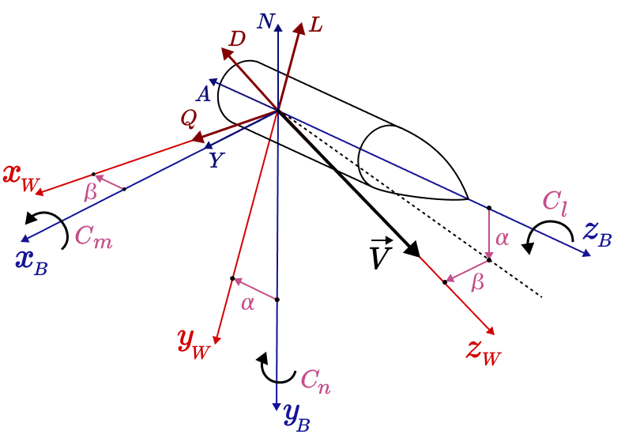

.. _genericsurfaces:

Generic Surfaces and Custom Aerodynamic Coefficients
====================================================

Generic aerodynamic surfaces can be used to model aerodynamic forces based on
force and moment coefficients. The :class:`rocketpy.GenericSurface` receives the
coefficients as functions of the angle of attack, side slip angle, Mach number,
Reynolds number, pitch rate, yaw rate, and roll rate.

The :class:`rocketpy.LinearGenericSurface` class model aerodynamic forces based
the force and moment coefficients derivatives. The coefficients are derivatives
of the force and moment coefficients with respect to the angle of attack, side
slip angle, Mach number, Reynolds number, pitch rate, yaw rate, and roll rate.

These classes allows the user to be less dependent on the built-in aerodynamic
surfaces and to define their own aerodynamic coefficients.

Wind Frame and Body Frame
-------------------------

A surface's aerodynamic force is the same physical vector written in two
coordinate frames: the **body frame**, fixed to the rocket, and the **wind
frame**, aligned with the airflow. You can provide the coefficients in either
frame; the two are related by the angle of attack and sideslip defined below.

The following figure shows the body frame (subscript :math:`B`) and the wind
frame (subscript :math:`W`):

In the figure we define:

- :math:`\mathbf{\vec{V}}` as rocket velocity vector.
- :math:`x_B`, :math:`y_B`, and :math:`z_B` as the body axes.
- :math:`x_W`, :math:`y_W`, and :math:`z_W` as the wind-frame axes.
- :math:`\alpha` as the partial angle of attack.
- :math:`\beta` as the side slip angle.
- :math:`L` as the lift force.
- :math:`D` as the drag force.
- :math:`Q` as the wind frame side force.
- :math:`N` as the normal force.
- :math:`A` as the axial force.
- :math:`Y` as the body frame side force.

Body frame
~~~~~~~~~~

The body frame is fixed to the rocket:

- The origin is at the rocket's center of dry mass (``center_of_dry_mass_position``).
- The :math:`z_B` axis lies along the rocket's centerline, pointing from the center of dry mass towards the nose.
- The :math:`x_B` and :math:`y_B` axes are perpendicular to it.

In this frame the aerodynamic force is made up of the normal force :math:`N`,
the side force :math:`Y` and the axial force :math:`A`. As in the wind frame, the
side force is the :math:`x_B` component, while the normal and axial forces enter
the :math:`y_B` and :math:`z_B` components with a negative sign:

.. math::
   \vec{\mathbf{F}}_B=\begin{bmatrix}X_B\\Y_B\\Z_B\end{bmatrix}_B=\begin{bmatrix}Y\\-N\\-A\end{bmatrix}_B

Wind frame
~~~~~~~~~~

The wind frame is aligned with the airflow: its :math:`z_W` axis runs along the
velocity vector. In this frame the aerodynamic force is the lift :math:`L`, the
drag :math:`D` and the (wind-frame) side force :math:`Q`:

.. math::
   \vec{\mathbf{F}}_W=\begin{bmatrix}X_W\\Y_W\\Z_W\end{bmatrix}_W=\begin{bmatrix}Q\\-L\\-D\end{bmatrix}_W

Relating the two frames
~~~~~~~~~~~~~~~~~~~~~~~~

The two are the same force, written along different axes. Let
:math:`\hat{\mathbf{u}} = (u_x, u_y, u_z)` be the direction of the rocket's
velocity relative to the air, in the body frame, and
:math:`h = \sqrt{u_y^2 + u_z^2}`. The three wind-frame forces act along:

- **drag**, against the velocity: :math:`-\hat{\mathbf{u}}`;
- **lift**, perpendicular to the velocity and lying in the body
  :math:`y_B z_B` plane: :math:`(0,\ -u_z,\ u_y)/h`;
- **side force**, perpendicular to both:
  :math:`(h,\ -u_x u_y/h,\ -u_x u_z/h)`.

The velocity direction follows from the angle of attack and the sideslip angle
(defined in `Angles of attack and sideslip`_ below):

.. math::
   \hat{\mathbf{u}} \parallel
   \begin{bmatrix}
      \sin\beta\cos\alpha \\ \sin\alpha\cos\beta \\ \cos\alpha\cos\beta
   \end{bmatrix}

with the sign of :math:`\cos\alpha`, so that it also holds when the rocket flies
tail first.

The force coefficients follow the same relation. In the wind frame they are the
lift :math:`C_L`, side :math:`C_Q` and drag :math:`C_D`; in the body frame the
normal :math:`C_N`, side :math:`C_Y` and axial :math:`C_A`:

.. math::
   \begin{aligned}
      C_N &= \frac{u_z}{h}\, C_L + \frac{u_x u_y}{h}\, C_Q + u_y\, C_D \\
      C_Y &= h\, C_Q - u_x\, C_D \\
      C_A &= -\frac{u_y}{h}\, C_L + \frac{u_x u_z}{h}\, C_Q + u_z\, C_D
   \end{aligned}

With no sideslip (:math:`\beta = 0`) these are the familiar
:math:`C_N = \cos\alpha\, C_L + \sin\alpha\, C_D` and
:math:`C_A = -\sin\alpha\, C_L + \cos\alpha\, C_D`; with no angle of attack
(:math:`\alpha = 0`), :math:`C_Y = \cos\beta\, C_Q - \sin\beta\, C_D` and
:math:`C_A = \sin\beta\, C_Q + \cos\beta\, C_D`.

.. note::
   The angle of attack and the sideslip angle used by RocketPy are each measured
   in one body plane. They are not the two angles of a rotation sequence, so the
   conversion is built from the velocity direction rather than by chaining a
   rotation by :math:`\alpha` and a rotation by :math:`\beta`, which would only
   be exact with one of the two angles at zero.

At small angles these reduce to :math:`C_N \approx C_L`, :math:`C_Y \approx C_Q`
and :math:`C_A \approx C_D`.

The force itself is recovered from the coefficients with the dynamic pressure
:math:`\bar q` and the reference area :math:`A_{ref}`. From **body-frame**
coefficients the force is obtained directly, with no rotation:

.. math::
   \vec{\mathbf{F}}_B =\begin{bmatrix}Y\\-N\\-A\end{bmatrix}_B= \overline{q}\cdot A_{ref}\cdot\begin{bmatrix}C_Y\\-C_N\\-C_A\end{bmatrix}_B

where :math:`\bar{q}` is the dynamic pressure and :math:`A_{ref}` the reference
area (commonly the rocket's cross-sectional area).

**Wind-frame** coefficients are first converted to the body-frame ones
with the relations above.

Moments
~~~~~~~

The moment coefficients are the same in both frames: the rolling moment
:math:`C_l`, the pitching moment :math:`C_m` and the yawing moment :math:`C_n`.
The moments about the body axes follow with the reference area and the reference
length :math:`L_{ref}`:

.. math::
   \vec{\mathbf{M}}_B=\begin{bmatrix}M_{x}\\M_{y}\\M_{z}\end{bmatrix}_B =\overline{q}\cdot A_{ref}\cdot L_{ref}\cdot\begin{bmatrix}C_m\\C_n\\C_l\end{bmatrix}

where :math:`L_{ref}` is the reference length (commonly the rocket's diameter).

Angles of attack and sideslip
~~~~~~~~~~~~~~~~~~~~~~~~~~~~~~~

RocketPy uses the flow angles two ways:

- the partial **angle of attack** :math:`\alpha` and **sideslip angle**
  :math:`\beta` (shown in the figure above), used by the generic-surface forces
  and moments;
- the **total angle of attack** :math:`\alpha_{\text{tot}}`, the angle between
  the total velocity vector and the rocket's centerline, used by the standard
  (Barrowman) surfaces.

The partial angles are

.. math::
   \begin{aligned}
      \alpha &= \arctan\left(\frac{V_y}{V_z}\right) \\
      \beta &= \arctan\left(\frac{V_x}{V_z}\right)
   \end{aligned}

and the total angle of attack is

.. math::
   \alpha_{\text{tot}} = \arccos\left(\frac{\mathbf{\vec{V}}\cdot\mathbf{z_B}}{||\mathbf{\vec{V}}||\cdot||\mathbf{z_B}||}\right)

The direction the crossflow comes from, around the rocket's axis, is the **roll
angle of the wind**:

.. math::
   \phi = \operatorname{atan2}\left(V_y,\ V_x\right)

The pair :math:`(\alpha, \beta)` and the pair
:math:`(\alpha_{\text{tot}}, \phi)` describe the same flow direction, like
the two coordinates of a point on a map given as east/north or as
distance/bearing:

.. math::
   \tan\alpha = \tan\alpha_{\text{tot}}\,\sin\phi, \qquad
   \tan\beta = \tan\alpha_{\text{tot}}\,\cos\phi

.. note::
   When the simulation is done, the total angle of attack is accessed through
   the :attr:`rocketpy.Flight.angle_of_attack` attribute. The partial angles of
   attack and sideslip are accessed through the
   :attr:`rocketpy.Flight.partial_angle_of_attack` and
   :attr:`rocketpy.Flight.angle_of_sideslip` attributes, respectively.

.. _genericsurface:

Generic Surface Class
---------------------

The :class:`rocketpy.GenericSurface` class defines an aerodynamic surface
directly from its force and moment coefficients. A surface is created by giving
it a reference area and length, the coefficients, and a few optional settings:

.. seealso::
   For more information on class initialization, see
   :class:`rocketpy.GenericSurface.__init__`

.. code-block:: python

   import numpy as np
   from rocketpy import GenericSurface

   radius = 0.0635

   generic_surface = GenericSurface(
      reference_area=np.pi * radius**2,
      reference_length=2 * radius,
      coefficients={
         "cN": "cN.csv",
         "cY": "cY.csv",
         "cA": "cA.csv",
         "cm": "cm.csv",
         "cn": "cn.csv",
         "cl": "cl.csv",
      },
      center_of_pressure=(0, 0, 0),
      name="Generic Surface",
      reynolds_length=2 * radius,
      interpolation="linear",
      extrapolation="constant",
      force_convention="body",
      active_during="always",
   )

Constructor parameters
~~~~~~~~~~~~~~~~~~~~~~~~

:class:`rocketpy.GenericSurface` takes the following parameters:

- ``reference_area`` (int or float): reference area used to non-dimensionalize
  the coefficients, in :math:`m^2`. Commonly the rocket's cross-sectional area.
- ``reference_length`` (int or float): reference length, in meters, used to
  non-dimensionalize the moment coefficients and the reduced rotation rates.
  Commonly the rocket's diameter.
- ``coefficients`` (dict): the force and moment coefficients, by name (detailed
  in `Coefficients`_ below).
- ``center_of_pressure`` (tuple or list, optional): the point where the
  surface's forces and moments are applied, as ``(x, y, z)`` in meters. It is
  measured from the position the surface is added to the rocket at, with ``z``
  along the rocket's centerline, positive toward the nose. Default
  ``(0, 0, 0)``. See `Moment reference point`_.
- ``name`` (str, optional): a name for the surface. Default
  ``"Generic Surface"``.
- ``reynolds_length`` (int or float, optional): length scale, in meters, of the
  Reynolds number fed to the coefficients. Default ``None`` (uses
  ``reference_length``).
- ``interpolation`` (str or dict, optional): how tabulated coefficients are
  interpolated between their data points. Default ``None``, which uses
  ``"linear"``. See :ref:`generic_surface_interpolation`.
- ``extrapolation`` (str or dict, optional): how tabulated coefficients behave
  outside their tabulated range. Default ``None``, which holds the value at
  the nearest end of the table (``"constant"``). See
  :ref:`generic_surface_interpolation`.
- ``force_convention`` (str, optional): the frame the force coefficients are
  given in, ``"body"`` or ``"wind"``. Default ``None`` (inferred from the
  coefficient names).
- ``active_during`` (str or callable, optional): when the surface produces
  aerodynamic force during the flight. Default ``"always"``. See
  :ref:`active_during`.

Coefficients
~~~~~~~~~~~~~

The ``coefficients`` argument is a dictionary mapping each coefficient's name to
its value. The body-frame coefficient names are:

- ``cN``: Normal force coefficient (perpendicular to the body axis).
- ``cY``: Side force coefficient.
- ``cA``: Axial force coefficient (along the body axis).
- ``cm``: Pitching moment coefficient.
- ``cn``: Yawing moment coefficient.
- ``cl``: Rolling moment coefficient.

Alternatively, you can supply the force coefficients in the **wind frame**:

- ``cL`` (lift), ``cQ`` (side) and ``cD`` (drag) take the place of ``cN``,
  ``cY`` and ``cA``.
- The moment coefficients ``cm``, ``cn`` and ``cl`` are the same in both frames.

By default the frame is inferred from the names you pass. Set
``force_convention`` to ``"body"`` or ``"wind"`` to state it explicitly.

Whichever frame you choose, all nine coefficients are available as attributes
afterwards (``surface.cN``, ``surface.cL``, ...). The ones you did not provide
are converted using the relations in `Relating the two frames`_ above.

Only one coefficient is required, and any combination can be provided; the ones
you omit are treated as zero.

Damping can be added to any of them with a rate derivative such as ``cm_q``
(see :ref:`generic_surface_damping`).

.. _coefficient_variables:

Each coefficient is a function of the same seven independent variables. When
you give a coefficient, you name the variables it uses with these names:

.. list-table::
   :header-rows: 1
   :widths: 22 78

   * - Name
     - Variable
   * - ``alpha``
     - Angle of attack (:math:`\alpha`), in radians.
   * - ``beta``
     - Side slip angle (:math:`\beta`), in radians.
   * - ``mach``
     - Mach number (:math:`Ma`).
   * - ``reynolds``
     - Reynolds number (:math:`Re`).
   * - ``pitch_rate``
     - Pitch rate (:math:`q^{*}`), non-dimensional (reduced).
   * - ``yaw_rate``
     - Yaw rate (:math:`r^{*}`), non-dimensional (reduced).
   * - ``roll_rate``
     - Roll rate (:math:`p^{*}`), non-dimensional (reduced).

The angles can also be given in other forms. RocketPy converts them for you:

.. list-table::
   :header-rows: 1
   :widths: 22 78

   * - Name
     - Variable
   * - ``alpha_deg``
     - Angle of attack, in degrees.
   * - ``beta_deg``
     - Side slip angle, in degrees.
   * - ``alpha_total``
     - Total angle of attack (:math:`\alpha_{\text{tot}}`), in radians: the
       angle between the rocket's axis and the air. See :ref:`totalangle`.
   * - ``alpha_total_deg``
     - Total angle of attack, in degrees.
   * - ``phi``
     - Roll angle of the wind (:math:`\phi`), in radians: the direction around
       the body the air comes from. See :ref:`totalangle`.
   * - ``phi_deg``
     - Roll angle of the wind, in degrees.

These are all the accepted names. A coefficient cannot use the same angle under
two names, such as ``alpha`` and ``alpha_deg`` together. A
:class:`rocketpy.ControllableGenericSurface` adds the names of its own control
variables.

.. important::
   The angular rates are the conventional **non-dimensional reduced rates**, not
   the raw body rates in rad/s:

   .. math::
      q^{*} = \frac{q \, L_{ref}}{2 V}, \quad
      r^{*} = \frac{r \, L_{ref}}{2 V}, \quad
      p^{*} = \frac{p \, L_{ref}}{2 V}

   where :math:`L_{ref}` is the surface reference length and :math:`V` the
   freestream speed. RocketPy non-dimensionalizes the body rates internally 
   before evaluating the coefficients (the factor is 0 at zero airspeed). 
   Define your tables against the reduced rates.

Once evaluated, the coefficients are turned into body-frame forces and moments
exactly as described in `Wind Frame and Body Frame`_ above (wind-frame inputs
are converted to the body frame first).

Each coefficient value can be given in any of these forms:

.. list-table::
   :header-rows: 1
   :widths: 30 70

   * - Form
     - Example
   * - a number (constant)
     - ``"cA": 0.4``
   * - a function
     - ``"cN": lambda alpha, mach: 2 * alpha``
   * - a ``.csv`` file with a header
     - ``"cN": "cN.csv"``
   * - a list or numpy array of data points
     - ``"cA": ([[0, 0.4], [1, 0.6]], ["mach"])``
   * - values on a regular grid
     - ``"cN": ({"alpha": alphas, "mach": machs}, values)``
   * - a :class:`rocketpy.Function`
     - ``"cA": Function(points, "mach", "cA")``
   * - one file for several coefficients
     - ``GenericSurface.from_csv("aero.csv", area, length)``
   * - any of the above with its variables named
     - ``"cN": (source, ["alpha", "mach"])``

Every coefficient must say which of the seven variables it uses. A function says
it through the names of its arguments, a ``.csv`` file through its header and a
:class:`rocketpy.Function` through the names of its inputs. When the source does
not carry names (a list of points, a ``.csv`` file without a header, a function
whose arguments are named otherwise), give the coefficient as a pair: the source,
then the list of its variables in order, as in the last two rows above.

Angles in degrees
^^^^^^^^^^^^^^^^^

The angles are in radians. If your data is in degrees, as most wind tunnel
reports and aerodynamics programs give it, add ``_deg`` to the name of the
variable: ``alpha_deg``, ``beta_deg``, ``alpha_total_deg`` or ``phi_deg``. This
works wherever a variable is named: the header of a ``.csv`` file, the list of
variables given with a table, the grid form, the input of a
:class:`rocketpy.Function` and the argument of a function:

.. code-block:: python

   coefficients = {
       "cN": "cN_rasaero.csv",  # header: alpha_deg, mach, cN
       "cm": (moment_points, ["alpha_deg", "mach"]),
       "cA": lambda alpha_deg, mach: 0.4 + 0.002 * alpha_deg**2,
   }

RocketPy converts the angle before reading the source, so nothing else changes.
A table whose values of an angle given in radians go beyond what such an angle
can be (about 3.14) raises a warning, since it almost surely is in degrees.

.. note::
   This is about the angle a table is tabulated against. A *slope* given per
   degree, such as a ``cN_alpha`` of a :class:`rocketpy.LinearGenericSurface` in
   1/deg, must be multiplied by ``180 / pi`` to give it per radian.

.. important::
   RocketPy never guesses the variable of a table. A one-column table given
   without a name raises an error, so that a drag curve tabulated against Mach
   can never be read against the angle of attack by mistake.

Defining a coefficient as a callable
~~~~~~~~~~~~~~~~~~~~~~~~~~~~~~~~~~~~~~

A coefficient can be any function that returns its value. Name its arguments
after the variables it uses, in any order, and leave out the ones it does not
use:

.. code-block:: python

   def normal_force_coefficient(alpha, mach):
      return (2 + 0.5 * mach) * alpha

The accepted argument names are all the ones listed in
:ref:`the tables above <coefficient_variables>`, including the angles in
degrees and the total angle of attack:

.. code-block:: python

   def axial_force_coefficient(alpha_total_deg, mach):
      return 0.4 + 0.1 * mach + 0.002 * alpha_total_deg**2

A function that takes the seven main variables (``alpha``, ``beta``, ``mach``,
``reynolds``, ``pitch_rate``, ``yaw_rate`` and ``roll_rate``), in that order,
may name its arguments freely:

.. code-block:: python

   def coefficient(alpha, beta, Ma, Re, q, r, p):
      ...
      return value

Any algorithm can be implemented inside to compute the coefficient. Arguments
with a default value are not counted as variables, so a function can carry the
constants of your model, and ``functools.partial`` can set them:

.. code-block:: python

   def normal_force_coefficient(alpha, mach, slope=2.0):
      return (slope + 0.5 * mach) * alpha

   coefficients = {"cN": functools.partial(normal_force_coefficient, slope=2.4)}

Defining a coefficient from a CSV file
~~~~~~~~~~~~~~~~~~~~~~~~~~~~~~~~~~~~~~~~

A coefficient can also be tabulated in a ``.csv`` file. The file must have a
header naming its columns. The independent-variable columns are optional, but
those present must be named after the variables:

- ``alpha``: Angle of attack (``alpha_deg`` for degrees).
- ``beta``: Side slip angle (``beta_deg`` for degrees).
- ``alpha_total`` and ``phi``: total angle of attack and roll angle of the
  wind (``alpha_total_deg``, ``phi_deg`` for degrees), see :ref:`totalangle`.
- ``mach``: Mach number.
- ``reynolds``: Reynolds number.
- ``pitch_rate``: Pitch rate (reduced).
- ``yaw_rate``: Yaw rate (reduced).
- ``roll_rate``: Roll rate (reduced).

The **last** column holds the coefficient value; it **must** have a header, but
the header name can be anything. Spaces after the commas and quotes around the
names are fine.

.. important::
   Not all independent-variable columns need to be present, but the columns that
   are present must be named as above. They can be in any order.

An example ``.csv`` file, tabulated against angle of attack and Mach:

.. code-block::

   "alpha", "mach", "coefficient"
   -0.017, 0, -0.11
   -0.017, 1, -0.127
   -0.017, 2, -0.084
   -0.017, 3, -0.061
   0.0, 0, 0.0
   0.0, 1, 0.0
   0.0, 2, 0.0
   0.0, 3, 0.0
   0.017, 0, 0.11
   0.017, 1, 0.127
   0.017, 2, 0.084
   0.017, 3, 0.061

.. note::
   The ``reynolds`` axis is by default based on the reference length (the
   rocket diameter). Published rocket data often bases the Reynolds number on
   the **body length** instead, which for a slender rocket is much larger. If
   your table uses a different length, pass it as ``reynolds_length`` when
   creating the surface so the Reynolds number the simulation feeds your table
   matches the one it was built against.

.. _totalangle:

Coefficients against the total angle of attack
~~~~~~~~~~~~~~~~~~~~~~~~~~~~~~~~~~~~~~~~~~~~~~~~

Most aerodynamic data for rockets (wind tunnel reports, CFD sweeps, programs
such as RASAero) gives the normal force, the axial force and
the pitch moment against the Mach number and the **total** angle of attack, which
is never negative. To use such data as it is, name its variable ``alpha_total``
(or ``alpha_total_deg``). No other option is needed:

.. code-block:: python

   surface = GenericSurface(
      reference_area=rocket.area,
      reference_length=2 * rocket.radius,
      coefficients={
         "cN": "cN_vs_total_angle.csv",   # header: alpha_total_deg, mach, cN
         "cm": "cm_vs_total_angle.csv",   # header: alpha_total_deg, mach, cm
         "cA": lambda alpha_total, mach: 0.4 + 0.1 * mach + alpha_total**2,
      },
   )

What a coefficient given against ``alpha_total`` means depends on the
coefficient:

- ``cN`` (normal force) and ``cm`` (pitch moment) act in the plane that holds
  the rocket's axis and the wind. RocketPy splits them between the pitch and the
  yaw plane, :math:`C_N\sin\phi` and :math:`-C_N\cos\phi` (and the same for
  the moment), so the force always pushes along the crossflow whatever direction
  the wind comes from.
- ``cL`` (lift) works the same way, in the wind frame. With the drag ``cD`` it
  gives the normal force in that plane and the axial force.
- ``cA`` (axial force), ``cD`` (drag) and ``cl`` (roll moment) have no direction
  across the axis and are used as they are. This also holds for the rocket's
  ``power_off_drag`` and ``power_on_drag``.

Three rules apply to a ``cN``, ``cL`` or ``cm`` given against ``alpha_total``:

- It must be zero at zero total angle (see the note below).
- Leave out ``cY``, ``cQ`` and ``cn``. The part in the other plane comes from
  the split, and there is no side force or yaw moment in the plane of the wind.
- It cannot also depend on ``alpha`` or ``beta``.

A coefficient that depends on the direction the wind comes from around the
body can take the roll angle of the wind ``phi`` as well. It is then used as
given, so write the split yourself:

.. code-block:: python

   def strength(alpha_total, phi):
      return 2 * alpha_total * (1 + 0.1 * np.cos(4 * phi))

   coefficients = {
      "cN": lambda alpha_total, phi: strength(alpha_total, phi) * np.sin(phi),
      "cY": lambda alpha_total, phi: -strength(alpha_total, phi) * np.cos(phi),
   }

Data against the total angle of attack is known in the literature as the
*aeroballistic* frame. The built-in nose cone, tail and fin sets work this way
internally.

.. note::
   At zero total angle of attack there is no crossflow and its direction is not
   defined, so ``cN``, ``cL`` and ``cm`` must be zero there, as they are for any rocket
   with rotational symmetry. RocketPy checks this when the surface is built and
   raises an error otherwise. A table must therefore start at 0 degrees: a table
   whose first row is at 2 degrees holds that value all the way down to zero,
   which would make the force flip sign across zero angle and the stability
   slope meaningless.

Several coefficients from one file
~~~~~~~~~~~~~~~~~~~~~~~~~~~~~~~~~~~~

Aerodynamic data usually comes as one table with a column per variable and a
column per coefficient:

.. code-block::

   alpha_deg, mach, cN,     cA,   cm
   -2,        0.3,  -0.085, 0.42,  0.260
   0,         0.3,   0.000, 0.42,  0.000
   2,         0.3,   0.085, 0.42, -0.260

:meth:`rocketpy.GenericSurface.from_csv` builds the surface from such a file in
one step. Every coefficient is read against all the variable columns:

.. code-block:: python

   surface = GenericSurface.from_csv(
      "aero.csv",
      reference_area=rocket.area,
      reference_length=2 * rocket.radius,
   )

Any other argument of the class (``center_of_pressure``, ``name``,
``active_during``, ...) can be passed along. The same method exists on
:class:`rocketpy.LinearGenericSurface`, with derivative columns such as
``cN_alpha`` and ``cm_q``, and on :class:`rocketpy.ControllableGenericSurface`,
where a control can be one of the variable columns.

A file written by another program has its own column names. Translate them with
``columns``; the columns you do not list are ignored:

.. code-block:: python

   power_off = GenericSurface.from_csv(
      "export.csv",
      reference_area=rocket.area,
      reference_length=2 * rocket.radius,
      columns={
         "Mach": "mach",
         "Alpha": "alpha_deg",
         "CN": "cN",
         "CA Power-Off": "cA",
      },
      active_during="power_off",
   )

.. warning::
   RocketPy's ``alpha`` is measured in one plane and takes both signs. Many
   programs tabulate against the *total* angle of attack, which is never
   negative. Name that column ``alpha_total`` (or ``alpha_total_deg``), see
   `Coefficients against the total angle of attack`_. Read as ``alpha``, such a table would give no restoring force when
   the rocket pitches the other way; RocketPy warns when a table looks like this.

.. note::
   Programs often report the center of pressure as a position instead of a
   pitch moment coefficient. With :math:`x_{cp}` measured from the point the
   surface is placed at, positive toward the nose, the moment coefficient about
   that point is :math:`C_m = C_N \, x_{cp} / L_{ref}`.

.. _generic_surface_damping:

Adding damping to tabulated coefficients
~~~~~~~~~~~~~~~~~~~~~~~~~~~~~~~~~~~~~~~~~~

Aerodynamic data often comes in two parts: the coefficients as tables against
the angle of attack and the Mach number, and the damping as a few separate
numbers, such as the pitch damping :math:`C_{m_q}`. To use both, give the
damping as a **rate derivative** next to the coefficient it belongs to:

.. code-block:: python

   surface = GenericSurface(
      reference_area=rocket.area,
      reference_length=2 * rocket.radius,
      coefficients={
         "cN": "cN.csv",            # header: alpha_deg, mach, cN
         "cm": "cm.csv",            # header: alpha_deg, mach, cm
         "cm_q": -800,              # pitch damping
         "cn_r": -800,              # yaw damping
         "cl_p": "cl_p_vs_mach.csv" # roll damping against Mach
      },
   )

The name of a rate derivative is the name of the coefficient followed by the
rate it multiplies:

.. list-table::
   :header-rows: 1
   :widths: 22 78

   * - Suffix
     - Rate
   * - ``_p``
     - Roll rate, as in ``cl_p``.
   * - ``_q``
     - Pitch rate, as in ``cm_q`` and ``cN_q``.
   * - ``_r``
     - Yaw rate, as in ``cn_r`` and ``cY_r``.

Each derivative is multiplied by its reduced rate and added to the coefficient,
for example :math:`C_m = C_m(\alpha, Ma) + C_{m_q}\, q^{*}`. Some rules:

- A derivative that opposes the motion, as damping does, is a **negative**
  number.
- The rates are the reduced rates (see the note in `Coefficients`_), so the
  derivatives are per unit of :math:`q L_{ref} / (2V)`, not per rad/s.
- A derivative can be a number or depend on any variable, most often the Mach
  number. A table with one unnamed column is read against Mach.
- The derivatives are in the body frame: ``cN_q``, ``cY_r`` and ``cA_q`` exist,
  ``cL_q`` does not. The moment derivatives are the same in both frames, so
  ``cm_q`` can be used with ``cL`` and ``cD``.
- Each plane takes its own derivative. For a rocket that behaves the same in
  every plane, give ``cn_r`` equal to ``cm_q`` (and ``cY_r`` equal to
  ``cN_q``). This also holds for data against ``alpha_total``.
- A coefficient that already depends on a rate, through a ``pitch_rate`` column
  for example, cannot take the derivative for that rate too.

Only the rate derivatives are accepted. A slope against the angle, such as
``cm_alpha``, belongs to a :class:`rocketpy.LinearGenericSurface`.

Adding the surface to the rocket
~~~~~~~~~~~~~~~~~~~~~~~~~~~~~~~~~~

Once defined, the surface is added to the rocket like any other:

.. seealso::
   For more information on how to add a generic surface to the rocket, see
   :class:`rocketpy.Rocket.add_surfaces`

.. code-block:: python
   :emphasize-lines: 5

   from rocketpy import Rocket
   rocket = Rocket(
      ...
   )
   rocket.add_surfaces(generic_surface, position=(0,0,0))

The position is given in the User Defined Coordinate System; see
:ref:`rocket_axes` for more information.

.. attention::
   If the generic surface is positioned **not** at the center of dry mass, the
   forces generated by the force coefficients (``cN``, ``cY``, ``cA``) generate
   a moment about the center of dry mass. This moment is computed and added to
   the moment generated by the moment coefficients (``cm``, ``cn``, ``cl``).

.. tip::
   To describe the whole vehicle with a single set of coefficients (rather than
   one surface per component), use
   :meth:`rocketpy.Rocket.add_full_body_aerodynamics`. See
   :ref:`fullbodyaerodynamics`.

Moment reference point
~~~~~~~~~~~~~~~~~~~~~~~~

The moment coefficients :math:`C_m`, :math:`C_n` and :math:`C_l` are taken about
the surface's own reference point (its ``center_of_pressure``). When the rocket
assembles the total aerodynamic moment it transports each surface's force from
that point to the rocket's **center of dry mass**, adding the
:math:`\vec{r}_{\text{cp} \to \text{cdm}} \times \vec{F}` term, so the rocket's
reported pitch/yaw moment and static margin are about the center of dry mass.

This matters when your coefficients come from a source that uses a different
reference. A pitch-moment coefficient referenced to a point a distance :math:`d`
ahead of the surface's center of pressure must be shifted before use:

.. math::
   C_{m,\,\text{cp}} = C_{m,\,\text{ref}} + \frac{d}{L_{ref}}\, C_N

Provide the coefficient about the surface's center of pressure (or set
``center_of_pressure`` so the transport lands the moment at the intended point),
otherwise the static margin will be off by the reference-point offset.

.. _lineargenericsurface:

Linear Generic Surface Class
----------------------------

The :class:`rocketpy.LinearGenericSurface` class defines an aerodynamic surface
from the **derivatives** of its force and moment coefficients, instead of the
coefficients themselves. This is convenient when you have stability-derivative
data rather than full tables: the surface builds each coefficient by summing its
derivatives times the independent variables.

For every one of the six coefficients (``cN``, ``cY``, ``cA``, ``cm``, ``cn``,
``cl``), you provide a constant term and one derivative per angle and per
rotation rate:

- :math:`C_{0}`: the coefficient value at zero angle of attack, zero sideslip
  and zero rates.
- :math:`C_{\alpha}=\frac{dC}{d\alpha}`: derivative with respect to angle of attack.
- :math:`C_{\beta}=\frac{dC}{d\beta}`: derivative with respect to side slip angle.
- :math:`C_{q}=\frac{dC}{dq}`: derivative with respect to pitch rate.
- :math:`C_{r}=\frac{dC}{dr}`: derivative with respect to yaw rate.
- :math:`C_{p}=\frac{dC}{dp}`: derivative with respect to roll rate.

Just like the plain generic surface, each of these terms may itself depend on
the Mach number, the Reynolds number or any other of the seven independent
variables, and may be a constant, a callable, or a tabulated ``.csv`` file.
There is no separate Mach or Reynolds derivative: a normal-force slope that
changes with Mach is given as ``cN_alpha`` tabulated against Mach.

How the coefficients are assembled
~~~~~~~~~~~~~~~~~~~~~~~~~~~~~~~~~~~~

Each coefficient is the sum of a **forcing** part, which follows the angle of
attack and the sideslip angle:

.. math::
   \begin{aligned}
      C_{Nf} &= C_{N0} + C_{N\alpha}\cdot\alpha + C_{N\beta}\cdot\beta \\
      C_{Yf} &= C_{Y0} + C_{Y\alpha}\cdot\alpha + C_{Y\beta}\cdot\beta \\
      C_{Af} &= C_{A0} + C_{A\alpha}\cdot\alpha + C_{A\beta}\cdot\beta \\
      C_{mf} &= C_{m0} + C_{m\alpha}\cdot\alpha + C_{m\beta}\cdot\beta \\
      C_{nf} &= C_{n0} + C_{n\alpha}\cdot\alpha + C_{n\beta}\cdot\beta \\
      C_{lf} &= C_{l0} + C_{l\alpha}\cdot\alpha + C_{l\beta}\cdot\beta
   \end{aligned}

and a **damping** part, which follows the non-dimensional rotation rates
:math:`p^{*}` (roll), :math:`q^{*}` (pitch) and :math:`r^{*}` (yaw) defined in
`Coefficients`_ above:

.. math::
   \begin{aligned}
      C_{Nd} &= C_{N_{p}}\cdot p^{*} + C_{N_{q}}\cdot q^{*} + C_{N_{r}}\cdot r^{*} \\
      C_{Yd} &= C_{Y_{p}}\cdot p^{*} + C_{Y_{q}}\cdot q^{*} + C_{Y_{r}}\cdot r^{*} \\
      C_{Ad} &= C_{A_{p}}\cdot p^{*} + C_{A_{q}}\cdot q^{*} + C_{A_{r}}\cdot r^{*} \\
      C_{md} &= C_{m_{p}}\cdot p^{*} + C_{m_{q}}\cdot q^{*} + C_{m_{r}}\cdot r^{*} \\
      C_{nd} &= C_{n_{p}}\cdot p^{*} + C_{n_{q}}\cdot q^{*} + C_{n_{r}}\cdot r^{*} \\
      C_{ld} &= C_{l_{p}}\cdot p^{*} + C_{l_{q}}\cdot q^{*} + C_{l_{r}}\cdot r^{*}
   \end{aligned}

so that, for example, :math:`C_m = C_{mf} + C_{md}`. The two parts are added: a
derivative that opposes the motion, such as the pitch damping :math:`C_{m_q}` of
a stable rocket, is a negative number.

Every derivative may itself vary with the Mach number, the Reynolds number or any
other of the seven variables, exactly like the coefficients of a
:class:`rocketpy.GenericSurface`.

The body-frame forces and moments then follow as for any generic surface:

.. math::
   \begin{aligned}
      N &= \overline{q}\cdot A_{ref}\cdot C_N &\qquad M_m &= \overline{q}\cdot A_{ref}\cdot L_{ref}\cdot C_m \\
      Y &= \overline{q}\cdot A_{ref}\cdot C_Y &\qquad M_n &= \overline{q}\cdot A_{ref}\cdot L_{ref}\cdot C_n \\
      A &= \overline{q}\cdot A_{ref}\cdot C_A &\qquad M_l &= \overline{q}\cdot A_{ref}\cdot L_{ref}\cdot C_l
   \end{aligned}

After the surface is created, the whole coefficients are available as
``surface.cN``, ``surface.cm`` and so on, and the two parts as ``surface.cNf`` and
``surface.cNd``, ``surface.cmf`` and ``surface.cmd`` and so on. All of them are
functions of the seven variables.

Defining a linear generic surface
~~~~~~~~~~~~~~~~~~~~~~~~~~~~~~~~~~~

A linear generic surface takes the **same parameters** as
:class:`rocketpy.GenericSurface`, plus ``axisymmetric`` (see
:ref:`lineargenericsurface_axisymmetric`). Only the ``coefficients`` dictionary
is different. Each key follows the pattern
``<coefficient>_<variable>``. For example ``cN_alpha`` is
:math:`C_{N\alpha}`, ``cm_q`` is :math:`C_{m_q}`, and ``cN_0`` is the constant
term :math:`C_{N0}`. Any term you omit is zero.

.. note::
   The derivative names carry the force frame: ``cN_alpha``, ``cY_beta``, ...
   in the body frame versus ``cL_alpha``, ``cQ_beta``, ... in the wind frame.
   ``force_convention`` selects the frame just as it does for
   :class:`rocketpy.GenericSurface`.

.. seealso::
   For more information on class initialization, see
   :class:`rocketpy.LinearGenericSurface.__init__`

An example defining **all** the coefficient derivatives:

.. code-block:: python

      from rocketpy import LinearGenericSurface
      linear_generic_surface = LinearGenericSurface(
         reference_area=np.pi * 0.0635**2,
         reference_length=2 * 0.0635,
         coefficients={
            "cN_0": "cN_0.csv",
            "cN_alpha": "cN_alpha.csv",
            "cN_beta": "cN_beta.csv",
            "cN_q": "cN_q.csv",
            "cN_r": "cN_r.csv",
            "cN_p": "cN_p.csv",
            "cY_0": "cY_0.csv",
            "cY_alpha": "cY_alpha.csv",
            "cY_beta": "cY_beta.csv",
            "cY_q": "cY_q.csv",
            "cY_r": "cY_r.csv",
            "cY_p": "cY_p.csv",
            "cA_0": "cA_0.csv",
            "cA_alpha": "cA_alpha.csv",
            "cA_beta": "cA_beta.csv",
            "cA_q": "cA_q.csv",
            "cA_r": "cA_r.csv",
            "cA_p": "cA_p.csv",
            "cm_0": "cm_0.csv",
            "cm_alpha": "cm_alpha.csv",
            "cm_beta": "cm_beta.csv",
            "cm_q": "cm_q.csv",
            "cm_r": "cm_r.csv",
            "cm_p": "cm_p.csv",
            "cn_0": "cn_0.csv",
            "cn_alpha": "cn_alpha.csv",
            "cn_beta": "cn_beta.csv",
            "cn_q": "cn_q.csv",
            "cn_r": "cn_r.csv",
            "cn_p": "cn_p.csv",
            "cl_0": "cl_0.csv",
            "cl_alpha": "cl_alpha.csv",
            "cl_beta": "cl_beta.csv",
            "cl_q": "cl_q.csv",
            "cl_r": "cl_r.csv",
            "cl_p": "cl_p.csv",
         },
      )
      rocket.add_surfaces(linear_generic_surface, position=(0,0,0))

.. _lineargenericsurface_axisymmetric:

Writing an axisymmetric rocket with derivatives
~~~~~~~~~~~~~~~~~~~~~~~~~~~~~~~~~~~~~~~~~~~~~~~

.. note::
   This section is only about :class:`rocketpy.LinearGenericSurface`, where
   each plane has its own derivatives. A :class:`rocketpy.GenericSurface` whose
   ``cN`` and ``cm`` are given against ``alpha_total`` is already axisymmetric:
   the same data is used in every plane, with nothing more to write (see
   :ref:`totalangle`).

Stability derivatives are usually reported for one plane only: the normal
force slope :math:`C_{N\alpha}`, the pitch moment slope :math:`C_{m\alpha}`
and the pitch damping :math:`C_{m_q}`. A linear generic surface has separate
derivatives for the yaw plane, and a plane without derivatives produces no
force.

For a rocket that behaves the same in every plane (evenly spaced fins, no
canards on a single axis), give the pitch-plane derivatives and pass
``axisymmetric=True``. The yaw-plane ones are filled in for you:

.. code-block:: python

   rocket_aero = LinearGenericSurface(
      reference_area=rocket.area,
      reference_length=2 * rocket.radius,
      coefficients={
         "cA_0": 0.5,
         "cN_alpha": 12.0,
         "cm_alpha": -30.0,
         "cN_q": 40.0,
         "cm_q": -800.0,
         "cl_p": -9.0,
      },
      axisymmetric=True,
   )
   rocket.add_full_body_aerodynamics(rocket_aero)
   assert rocket.is_axisymmetric

With ``axisymmetric=True``:

- Do not give any yaw-plane derivative (``cY_*``, ``cQ_*`` or ``cn_*``).
- Do not give a sideways force or moment at zero angle (``cN_0``, ``cm_0``,
  ``cN_p``, ``cm_p``): it would point in one direction.
- A pitch-plane derivative may depend on ``mach``, ``reynolds``, the rates and
  ``alpha_total``, but not on ``alpha``, ``beta`` or ``phi``, which single out
  one plane.
- The axial and roll derivatives are used as given.

Writing both planes yourself
^^^^^^^^^^^^^^^^^^^^^^^^^^^^

Without ``axisymmetric=True`` you give both planes. For an axisymmetric rocket,
the yaw derivatives are the pitch ones with two sign changes, which come from
the directions of the body axes:

.. math::
   \begin{aligned}
      C_{Y\beta} &= -C_{N\alpha} &\qquad C_{Y_r} &= C_{N_q} \\
      C_{n\beta} &= -C_{m\alpha} &\qquad C_{n_r} &= C_{m_q}
   \end{aligned}

The same rocket as above, written for both planes:

.. code-block:: python

   rocket_aero = LinearGenericSurface(
      reference_area=rocket.area,
      reference_length=2 * rocket.radius,
      coefficients={
         "cA_0": 0.5,
         "cN_alpha": 12.0, "cY_beta": -12.0,
         "cm_alpha": -30.0, "cn_beta": 30.0,
         "cN_q": 40.0, "cY_r": 40.0,
         "cm_q": -800.0, "cn_r": -800.0,
         "cl_p": -9.0,
      },
   )

``rocket.is_axisymmetric`` tells you whether the signs are right: it is
``False`` for a rocket written with ``cY_beta = +12``.

.. note::
   A linear surface treats the angle of attack and the sideslip angle
   separately, so with both at once it differs slightly from a rocket that
   responds to the total angle of attack (under a tenth of a percent at 3
   degrees in each plane). For data against the total angle of attack, use a
   :class:`rocketpy.GenericSurface` (see :ref:`totalangle`).

.. _generic_surface_interpolation:

Interpolation and Extrapolation of Tabulated Coefficients
---------------------------------------------------------

When a coefficient is provided as tabulated data (a ``.csv`` file or a list of
points), RocketPy stores it as a :class:`rocketpy.Function` and must decide two
things: how to **interpolate** *between* the tabulated points, and how to
**extrapolate** *outside* the tabulated range. Both :class:`rocketpy.GenericSurface`
and :class:`rocketpy.LinearGenericSurface` expose these as the ``interpolation``
and ``extrapolation`` arguments.

.. note::
   Interpolation and extrapolation only apply to **tabulated** coefficients.
   A coefficient given as a constant or a callable is evaluated directly, so
   these settings have no effect on it (a callable is assumed valid over its
   whole domain).

Each argument accepts either:

- a **single string**, applied to every coefficient of the surface; or
- a **dictionary** keyed by coefficient name, setting the method per
  coefficient. Coefficients omitted from the dictionary keep the default.

.. code-block:: python

   from rocketpy import GenericSurface

   radius = 0.0635
   generic_surface = GenericSurface(
      reference_area=np.pi * radius**2,
      reference_length=2 * radius,
      coefficients={
         "cA": "cA.csv",
         "cN": "cN.csv",
      },
      # A single method applied to every coefficient:
      extrapolation="constant",
      # ... or per coefficient (unlisted ones keep the default):
      interpolation={"cA": "linear", "cN": "akima"},
   )

Choosing an interpolation method
~~~~~~~~~~~~~~~~~~~~~~~~~~~~~~~~~~

Interpolation controls the behavior *between* tabulated points. For 1-D tables
the options are ``"linear"``, ``"akima"``, ``"spline"`` and ``"polynomial"``.

- ``"linear"`` (**default**) is the safe choice. It never overshoots and
  introduces no spurious oscillations, which matters most across the
  **transonic drag rise** (:math:`Ma \approx 0.8`--:math:`1.2`), where a spline
  will oscillate and invent non-physical wiggles in the axial coefficient
  :math:`C_A`. Prefer it for coarse tables and for anything with a sharp feature.
- ``"akima"`` gives continuous first derivatives (smoother
  :math:`C_{m_\alpha}`, cleaner stability curves) while resisting the overshoot
  of a natural cubic spline near kinks. It is the best "smooth" option for
  **dense, smooth** data.
- ``"spline"`` produces the smoothest derivatives but overshoots near sharp
  features (stall, :math:`Ma = 1`). Use it only for genuinely smooth,
  well-resolved data.

A practical rule of thumb: use ``"linear"`` against Mach (transonic kinks) and
``"akima"`` against angle of attack / sideslip when you have fine data and care
about smooth derivatives.

.. note::
   A table over two or more variables that holds every combination of their
   values (in a file, a list or an array) is interpolated on that regular
   grid. The ``interpolation`` argument still applies: ``"spline"`` becomes the
   grid method ``"cubic"`` and ``"akima"`` the shape-preserving ``"pchip"``
   (``"linear"`` stays linear). The smooth methods need at least 4 values of
   each variable; with fewer, ``"linear"`` is used and a warning says so.

Choosing an extrapolation method
~~~~~~~~~~~~~~~~~~~~~~~~~~~~~~~~~~

Extrapolation controls the behavior *outside* the tabulated range. The options
are ``"constant"``, ``"natural"`` and ``"zero"``. This choice matters more than
interpolation, because a bad one fails silently, precisely when the rocket is at
an extreme condition beyond your data.

- ``"constant"`` holds the value at the nearest edge of the data. This is the
  **default for tabulated coefficients**, and the right choice for essentially
  all of them: a rocket can briefly exceed your tabulated Mach/angle range, and
  holding the last value is bounded and physically conservative.
- ``"zero"`` returns 0 outside the range. Occasionally reasonable for force or
  moment *slopes* if you want contributions to vanish past the modeled envelope,
  but it introduces a discontinuity at the edge.
- ``"natural"`` continues the fitted curve past the data. **Avoid this for
  tabulated coefficients**: extrapolating a linear or spline fit can send
  :math:`C_A` or a moment slope to large, non-physical values right when the
  rocket is at an extreme condition.

.. tip::
   Tabulated coefficients default to ``extrapolation="constant"`` so they never
   run to non-physical values past the tabulated envelope. Override it only when
   you have a specific reason (e.g. ``"zero"`` to make a contribution vanish
   outside the modeled range).

.. seealso::
   These arguments are forwarded to each :class:`rocketpy.Function`; see
   :meth:`rocketpy.Function.set_interpolation` and
   :meth:`rocketpy.Function.set_extrapolation` for the full list of methods.

.. _active_during:

Activation Window
-----------------

By default a surface produces aerodynamic force throughout the flight. The
``active_during`` argument restricts it to part of the flight. This is useful
for a surface that only exists (or only matters) during a phase. It is accepted
by both :class:`rocketpy.GenericSurface` and
:class:`rocketpy.LinearGenericSurface`, and accepts:

- ``"always"`` (default): the surface always contributes force.
- ``"power_on"``: only while the motor is burning (up to burnout).
- ``"power_off"``: only after the motor has burned out.
- a callable ``active_during(t, flight)`` returning ``True`` when the surface is
  active at time ``t`` (in seconds) of the given :class:`rocketpy.Flight`, for
  any custom window.

.. code-block:: python

   # base drag that only applies after burnout
   base_drag = GenericSurface(
      reference_area=rocket.area,
      reference_length=2 * rocket.radius,
      coefficients={"cA": 0.4},  # axial (drag) coefficient
      active_during="power_off",
   )

This is also how a full-vehicle model captures the powered/coasting drag
difference: build one ``"power_on"`` and one ``"power_off"`` surface and add them
together (see :ref:`fullbodyaerodynamics`).

The flight switches such surfaces on and off by time. The stability analysis
(``aerodynamic_center``, the margins, the dynamic stability numbers) describes
one phase at a time: the coasting rocket by default, or the powered one after
``rocket.stability_phase = "power_on"``. A warning says so whenever a surface is
left out. :meth:`rocketpy.Rocket.to_coefficients` lumps each phase with its own
surfaces regardless of that setting.

.. _fullbodyaerodynamics:

Whole-vehicle aerodynamics
--------------------------

Instead of (or in addition to) modelling each component, you can describe the
**entire rocket** with a single generic surface that already carries the whole
vehicle's coefficients, for example a set exported from CFD, a wind tunnel or
OpenRocket.

Adding a prebuilt full-vehicle model
~~~~~~~~~~~~~~~~~~~~~~~~~~~~~~~~~~~~~~

:meth:`rocketpy.Rocket.add_full_body_aerodynamics` adds such a surface (or a list
of them). Reference its coefficients to the rocket cross-section area and diameter
so it sums consistently with the rest of the vehicle:

.. code-block:: python

   surface = GenericSurface(
      reference_area=rocket.area,
      reference_length=2 * rocket.radius,
      coefficients={...},
   )
   rocket.add_full_body_aerodynamics(surface)

Because it is just another aerodynamic surface, a full-vehicle model can be
**mixed** with modelled add-on surfaces (e.g. a measured body plus modelled
canards). Pass ``overwrite=True`` to make it the rocket's **only** aerodynamics:
every existing aerodynamic surface is removed and both built-in drag curves are
cleared, so the supplied surface(s) provide the complete force set.

A rocket's drag differs between powered and coasting flight (the motor plume
lowers the base drag). To capture this, build two surfaces, set each one's
``active_during`` to ``"power_on"`` and ``"power_off"``, and pass them as a list;
each then produces force only during its phase.

Extracting a rocket's coefficients
~~~~~~~~~~~~~~~~~~~~~~~~~~~~~~~~~~~~

You can also collapses an assembled rocket into a single
stability-derivative model about its center of dry mass:

- :meth:`rocketpy.Rocket.to_coefficients` returns the coefficient curves as a
  dict split into ``"power_off"`` and ``"power_on"`` sets, each mapping a
  coefficient name to a :class:`rocketpy.Function` of Mach. Every one of the 36
  derivatives of the linear model that is not zero is kept, so canted fins keep
  their roll forcing ``cl_0`` and a rocket that is not axisymmetric keeps the
  terms that couple its pitch and yaw planes.
- :meth:`rocketpy.Rocket.to_surface` wraps those into a ready-to-use pair of
  :class:`rocketpy.LinearGenericSurface` objects, one gated to each motor phase --
  the inverse of :meth:`~rocketpy.Rocket.add_full_body_aerodynamics`.

.. note::
   The slopes a generic surface reports for the stability analysis (its
   ``cN_alpha``, ``cm_alpha``, ``cY_beta``, ``cn_beta`` and the center of
   pressure built from them) are taken at zero angle of attack and sideslip,
   zero rotation rates, Reynolds number 0 and, for a controllable surface,
   zero control. A table that changes with the Reynolds number is therefore
   linearized at its low-Reynolds edge; the flight itself always reads the
   table at the actual Reynolds number.

Both take ``model="table"`` to keep the curves instead of the slopes: the six
coefficients are then read on a grid of angle of attack, sideslip and Mach
(``angles`` and ``machs`` set the grid, by default every 2 degrees up to 30 and
every 0.05 up to Mach 3) and the surfaces are :class:`rocketpy.GenericSurface`
objects. A rocket that behaves the same in every plane is swept over the total
angle of attack only, which is exact for the built-in surfaces at any angle.
The damping is carried by the same rate terms as the linear model, read at
zero angle; pass ``rates=False`` to leave it out and get the rocket as a wind
tunnel sees it, held still.

.. code-block:: python

   coefficients = rocket.to_coefficients()   # {"power_off": {...}, "power_on": {...}}
   surfaces = rocket.to_surface()            # [power_off surface, power_on surface]

   # a bare rocket carrying only this pair flies the same as the full model
   bare.add_full_body_aerodynamics(surfaces, overwrite=True)

.. important::
   By default the extracted model is a **linear summary tabulated only against
   Mach**: the derivatives are taken at zero angle of attack, zero sideslip and
   zero rates, at zero Reynolds number and with every control held where it is.
   These are exactly the assumptions of the built-in Barrowman surfaces (nose
   cones, fins, and tails), so a rocket built only from those is reproduced
   exactly.
   See :ref:`aero_cp_stability` for the extraction math and its limitations.

For a rocket carrying a generic surface that depends on more than that, three
optional arguments of both methods keep the dependence:

.. code-block:: python

   import numpy as np

   coefficients = rocket.to_coefficients(
       model="table",
       # read the coefficients at these Reynolds numbers (based on the
       # rocket's diameter); they gain "reynolds" as an input
       reynolds=[1e5, 1e6, 1e7],
       # keep a control of a ControllableGenericSurface as an input
       controls={"deflection": np.radians([-10, 0, 10])},
       # read the damping at every angle of the table, not only at zero
       rates="at_each_angle",
   )
   cN = coefficients["power_off"]["cN"]
   cN(0.05, 0.0, 0.6, 1e6, 0.1)   # alpha, beta, mach, reynolds, deflection

- ``reynolds`` also takes a single number, which sets the Reynolds number the
  coefficients are read at without adding an input. It works with both models.
- ``controls`` works with both models in ``to_coefficients``. In
  ``to_surface`` it needs ``model="table"``, and the surfaces returned are
  :class:`rocketpy.ControllableGenericSurface` objects with those controls.
  When two surfaces of the rocket use the same control name, each is kept as
  its own input, named ``<surface name>_<control name>``.
- ``rates="at_each_angle"`` needs ``model="table"``.

Each value listed multiplies the number of points computed, and
``controls`` and ``rates="at_each_angle"`` make an axisymmetric rocket be
swept over both angles, so keep the lists short and pass a coarser ``angles``
when it takes too long.
