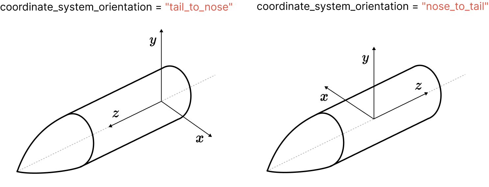
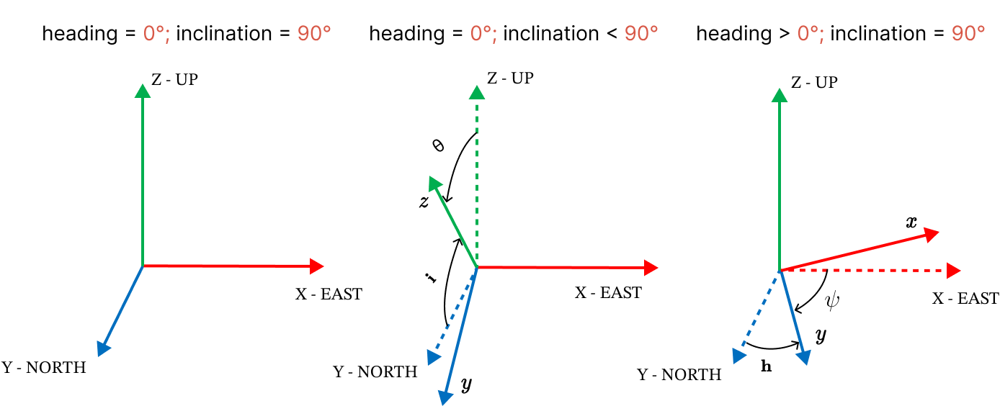

Rocket Class Axes Definitions
=============================

The Rocket class have two differente coordinate systems:

1. **User Defined Coordinate System**: Used for geometrical inputs of the 
   aerodynamic surfaces and motor.
2. **Body Axes Coordinate System**: Used inside the simulation to assess the 
   governing equations of motion.

All inputs from the user's coordinate system are converted to the body axes
coordinate system for use during the simulation.

1. User Defined Coordinate System
---------------------------------

Two things are set by the user in the user input coordinate system:

1. **Coordinate System Origin**: The origin of the coordinate system is set at 
   any point along the rocket's center line. This point can be arbitrary chosen
   and is not explicitly defined. All inputs must be given in relation to this
   point.
2. **Direction of Center Axis**: Is specified in the ``coordinate_system_orientation``
   argument of the class constructor :class:`rocketpy.Rocket.__init__`. This
   argument defines the direction of the axis that follows the rocket's center
   line. Can be either "nose_to_tail" or "tail_to_nose".

.. seealso:: 
     
    See `Positions and Coordinate Systems <positions.rst>`_ for more
    information on how this is used in the definitions of the rocket's
    aerodynamic surfaces and motor.

The ``x`` and ``y`` axes are defined in the plane perpendicular to the center axis and
the ``z`` axis is defined along the center axis. Depending on the choice of
``coordinate_system_orientation``, the X axis and Y axis can be inverted.

The following figure shows the two posibilities for the user input coordinate system:

.. note::

    When ``coordinate_system_orientation`` is set to ``"tail_to_nose"``, the direction
    of the ``x``, ``y`` and ``z`` axis of the **User Defined Coordinate System** is
    the same as the **Body Axes Coordinate System**. The orgin of the coordinate
    system may still be different.

Angular Position Inputs
~~~~~~~~~~~~~~~~~~~~~~~

Angular position inputs (``angular_position``) refers to roll angle position
of that surface along the rocket's tube. The roll angle is defined as the angle
from the ``y`` axis to the surface. Currently, only :class:`rocketpy.RailButtons`
use this input.  

The following figure shows the roll angle
definition for both ``coordinate_system_orientation`` options:

.. figure:: ../../static/rocket/angularpos.png
  :align: center
  :alt: Angular position

.. note::

   The positive direction of the roll angle is defined as the direction that
   rotates the surface in the positive direction of the ``z`` axis.

2. Body Axes Coordinate System
------------------------------

The body axes coordinate system is used inside the simulation to assess the
governing equations of motion. The body axes coordinate system is defined as follows:

- The origin is at the rocket's center of dry mass (``center_of_dry_mass_position``).
- The ``z`` axis is defined along the rocket's center line, pointing from the
  center of dry mass towards the nose.
- The ``x`` and ``y`` axes are perpendicular 

3. Relation to Flight Coordinates
---------------------------------

The ``Flight`` class uses a coordinate system defined as follows:

- The origin is at the launch rail.
- The ``Z`` axis is positive upwards.
- The ``X`` axis is position eastwards.
- The ``Y`` axis is positive northwards.

The following figure shows the rotational relationship between the
**Body Axes Coordinate System** and the **Flight Coordinate System**:

In the figure, *θᵢ* is ``90° - inclination`` and *θₕ* is the heading of the 
launch rail.

.. note::
   
   If the lauch rail ``heading`` is set to **0°** and ``rail_inclination`` to **90°**,
   the **Body Axes Coordinate System** is aligned with the **Flight Coordinate System**.